# MSVC编译KDChart过程

## 一、下载KDChart源文件

[GitHub源文件](https://github.com/KDAB/KDChart/tree/master)


## 查看文件夹里的INSTALL.txt，可以看到需要CMake编译。

中文版

```bash
以下是使用 CMake 构建系统安装 KD Chart 的说明。
需要 CMake 3.3 或更高版本。

Qt 版本支持：
 * KD Chart 2.5.0 及以下版本需要 Qt4
 * KD Chart 2.5.1 至 2.7.2 版本需要 Qt4 到 Qt5.15
 * KD Chart 2.8.x 移除了 Qt4 支持（即仅支持 Qt5）
 * KD Chart 3.0 及以上版本需要 Qt5.15.0 到 Qt6.x
   （如果需要旧版 Qt5 支持，请联系 info@kdab.com）

另请注意，使用 Qt6 构建需要支持 C++17 的编译器，
而使用 Qt5 构建支持 C++11 即可。

请查看 CMakeLists.txt 文件顶部的注释，
了解可传递给 cmake 的可用配置选项。

安装目录在 Windows 上默认为 c:\KDAB\KDChart-<version>，
在非 Windows 系统上默认为 /usr/local/KDAB/KDChart-<version>。 你可以通过向 cmake 传递选项 -DCMAKE_INSTALL_PREFIX=/install/path 来更改此位置。

1) 从 KD Chart 安装的顶级目录创建一个构建目录：

     mkdir build

   然后进入该构建目录：

     cd build

2) 现在根据构建类型运行以下 'cmake' 命令之一：
     cmake -DCMAKE_BUILD_TYPE=Debug ..
     cmake -DCMAKE_BUILD_TYPE=Release ..
     cmake -DKDChart_STATIC=True -DCMAKE_BUILD_TYPE=Debug ..
     cmake -DKDChart_STATIC=True -DCMAKE_BUILD_TYPE=Release ..

   若要指定安装位置，可参考以下示例：
     cmake -DCMAKE_BUILD_TYPE=Debug -DCMAKE_INSTALL_PREFIX=C:/kdchart ..
     cmake -DCMAKE_BUILD_TYPE=Debug -DCMAKE_INSTALL_PREFIX=/opt/kdchart ..

3) Unix

   设置 LD_LIBRARY_PATH 指向 KD Chart 安装的 lib 目录。

   如果你还没有设置 LD_LIBRARY_PATH，可在终端中运行：
    % LD_LIBRARY_PATH=/path/to/kdchart/lib:$LD_LIBRARY_PATH
    % export LD_LIBRARY_PATH

   必须将上述命令添加到你的 .bashrc 或类似文件中才能永久生效。当然，你也可以在使用 KD Reports 构建软件之前在 shell 中运行这些命令，但这种情况下设置仅在当前 shell 中有效。

4) MacOS

   操作步骤同上，但使用 DYLD_LIBRARY_PATH 代替 LD_LIBRARY_PATH

5) Windows

   若要运行可执行文件，将 KD Chart dll 文件所在路径（kdchart\bin）添加到 PATH 环境变量中。
   例如：set PATH=\path\to\kdchart\bin;%PATH%

   若要进行开发，将 KD Chart lib 文件所在路径（kdchart\lib）添加到 LIB 环境变量中。
   例如：set LIB=\path\to\kdchart\lib;%LIB%

6) 输入以下命令构建所有内容：

   从 KD Chart 顶级目录运行：

   % make    # Unix, Mac
   % nmake   # Windows

7) （可选）安装 KD Chart：

   从 KD Reports 顶级目录运行：

   % make install   # Unix, Mac
   % nmake install  # Windows

   这会将必要的文件复制到安装路径的子目录中：
   对于 Unix/Linux、Mac：/usr/local/KDAB/KDChart-VERSION/
   对于 Windows：C:\KDAB\KDChart-VERSION\

8) 查看示例应用程序。它们将帮助你开始使用 KD Chart。

== 测试 ==
若要构建测试工具，请向 CMake 传递 -DKDChart_TESTS=true 参数，如下所示：
  % cmake -DKDChart_TESTS=true

然后运行 'make test' 来执行单元测试。

== 使用 ==
在你的 CMake 项目中添加以下内容

    find_package(KDChart CONFIG REQUIRED)

如果使用 Qt6，则添加

    find_package(KDChart-qt6 CONFIG REQUIRED)

并链接到导入目标 KDChart::kdchart。
这就是你需要做的全部操作（导入目标还会包含头文件目录）

你可能还需要根据 KDChart 的安装位置设置 CMAKE_PREFIX_PATH 环境变量。

```

## 二、下载安装CMake

> 注意：
>
> 如果使用**Qt6.x 编译**，可以不用安装，Qt6自带CMake，还不用配置！（直接看 [Qt6.x 编译KDChart ](https://blog.csdn.net/qq_47355554/article/details/134024545?spm=1011.2415.3001.5331)`）


[https://cmake.org/download/](https://cmake.org/download/)


## 三、编译

### 1.填写源文件目录和build文件夹目录

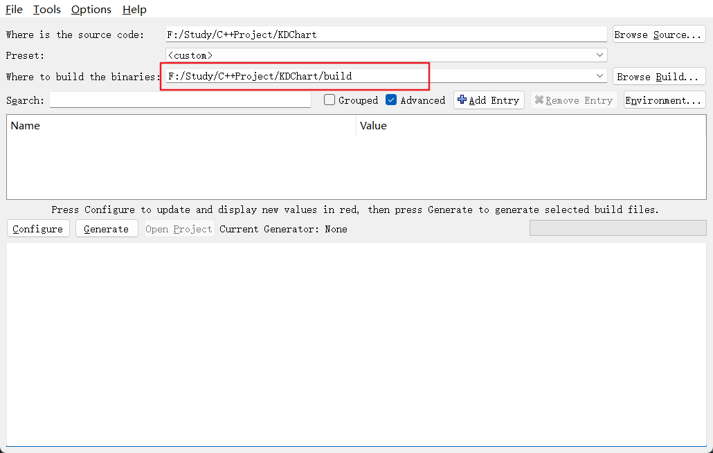

### 2.Configure配置项目工程

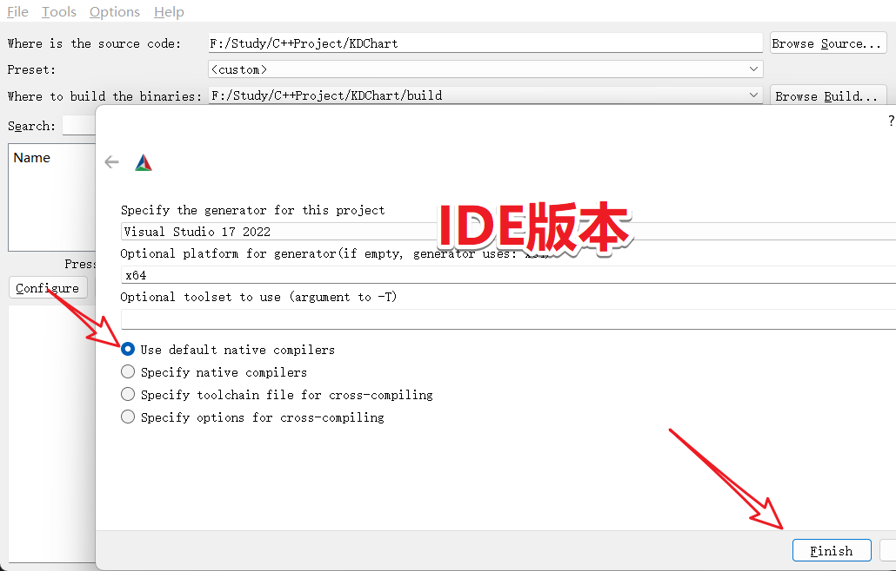


### 3.等待报错

#### 1.Could not find a package configuration file provided by "Qt6" 

##### 移除KDChart_QT6选择

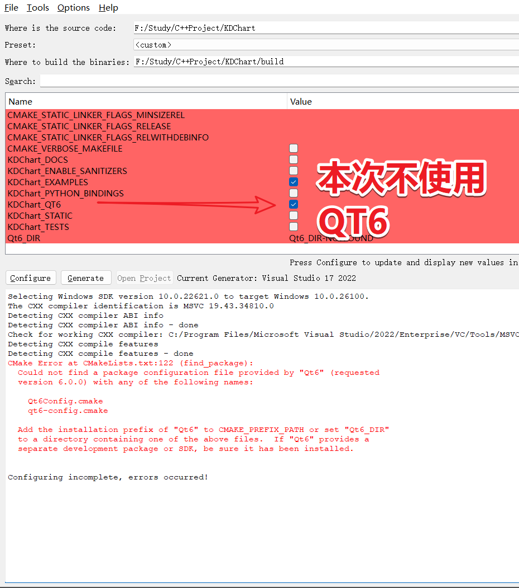

##### 自定义输出目录(注意C盘有权限问题)

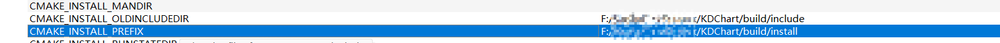

##### 根据需求可以构建例子

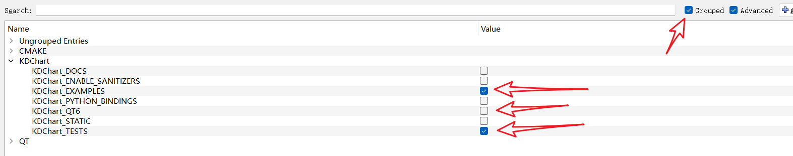


> 
>
> 记得此次点击`Configure`


#### 2. string no output variable specified 未指定输出变量

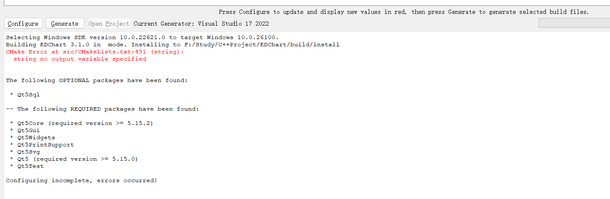

##### src/CMakeList.txt 491行

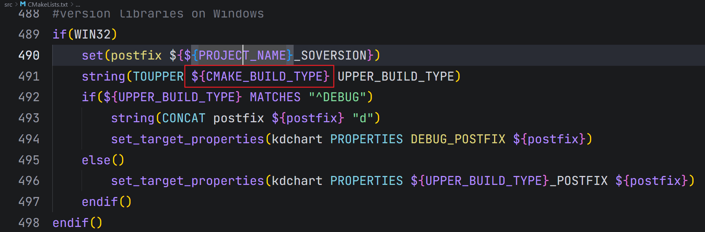

> 情况一：CMAKE 里面找 `CMAKE_BUILD_TYPE`
>
> 情况二：如果没有找到 `Add Entry`

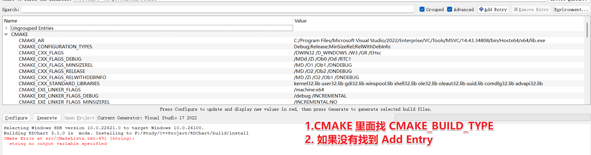

##### 没有找到则添加

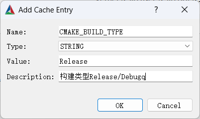

##### 输入需要构建模式

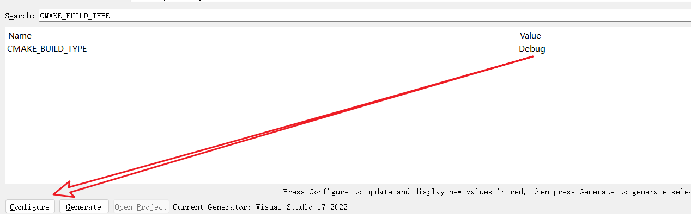


> 
>
> 记得此次点击`Configure`

##### 还有错看：

[1.KDChart3.0编译过程-使用QT5.15及QT6.x编译](https://blog.csdn.net/qq_47355554/article/details/134024545?spm=1011.2415.3001.5331)

[2.KDChart2.8编译过程-使用VS+CMake-MSVC2017](https://blog.csdn.net/qq_47355554/article/details/134194275?spm=1011.2415.3001.5331)


### 4.生成

#### 1. 配置Generate

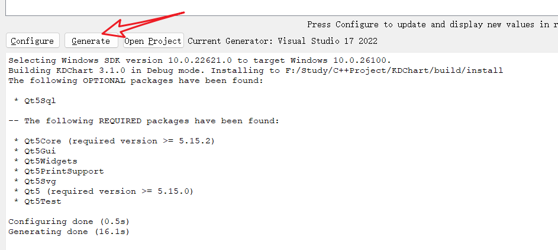


#### 2. 打开.sln

> 或者 使用`Open Project` 

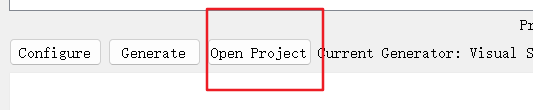

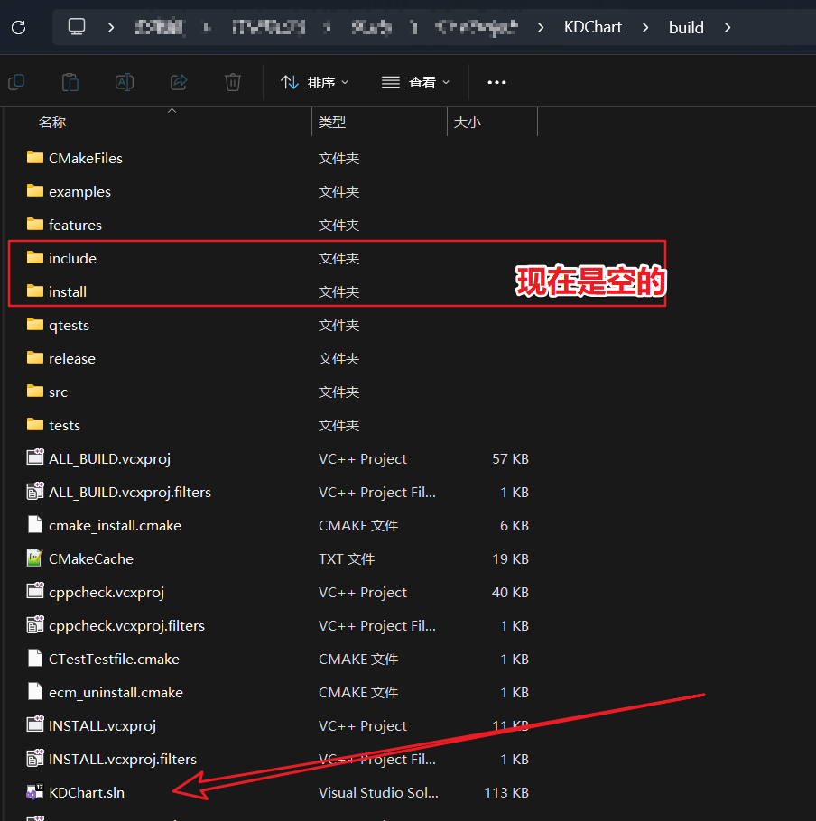

#####  右键ALL_BUILD->生成

> 堆空间不足错误：多生成几次，或者查

#####  “EntryDialog::~EntryDialog”: 不能定义编译器生成的特殊成员函数(必须首先在类中声明)

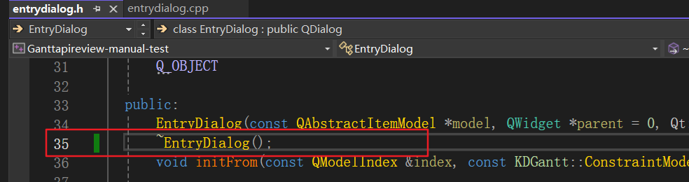

> 添加声明


##### 常量中有换行符

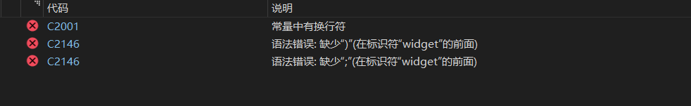

> 使用SmartCharsetConverter批量转换
>
> 一般不会出现这种情况，我的是因为使用AI添加的中文注释

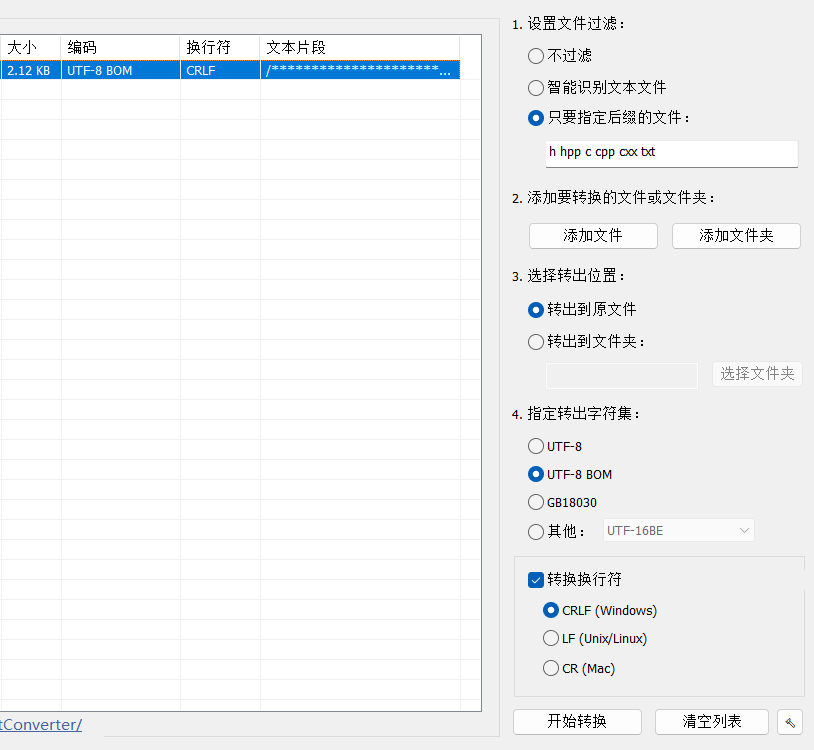


#### 3.ALL_BUILD生成没问题，右键INSTALL->生成

##### NSTALL失败

> CMake Error at src/cmake_install.cmake:36 (file):
>   file INSTALL cannot find
>   /build/src/KDChart/kdgantt.h": No error.

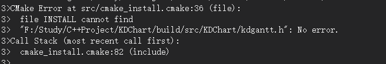

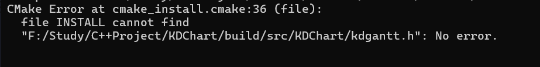

> error MSB3073: 命令“setlocal
> error MSB3073: E:\WorkTool\CMake-4.0.0\bin\cmake.exe -DBUILD_TYPE=Debug -P cmake_install.cmake
> error MSB3073: if %errorlevel% neq 0 goto :cmEnd
> error MSB3073: :cmEnd
> error MSB3073: endlocal & call :cmErrorLevel %errorlevel% & goto :cmDone
> error MSB3073: :cmErrorLevel
> error MSB3073: exit /b %1
> error MSB3073: :cmDone
> error MSB3073: if %errorlevel% neq 0 goto :VCEnd
> error MSB3073: :VCEnd”已退出，代码为 1。

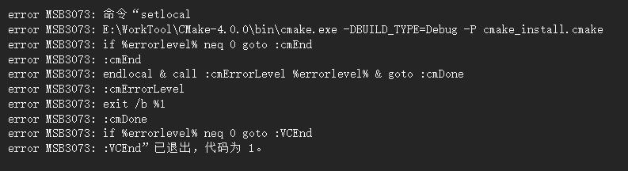

###### 解决方案在src/CMakeLists.txt 的 196 行 添加

```cmake
# Adding the following line of code will solve the “file INSTALL cannot find build/src/KDChart/kdgantt.h” problem.
configure_file("${CMAKE_CURRENT_BINARY_DIR}/KDChart/KDGantt" "${CMAKE_CURRENT_BINARY_DIR}/KDChart/kdgantt.h" COPYONLY)
```

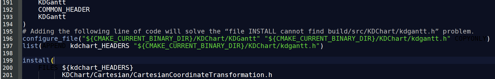

> 
>
> 保存后，直接右键INSTALL->生成
>
> 


---


写文章截止时间是2025-07-30 22:00:00

[最新解决方案请查看](https://github.com/KDAB/KDChart/issues/80)

---


### 5.测试

> [这最后有测试例子教程](https://blog.csdn.net/qq_47355554/article/details/134024545?spm=1011.2415.3001.5331)

在build/bin/Debug挑一个

使用 windeployqt.exe  xxxx.exe 打包一下库

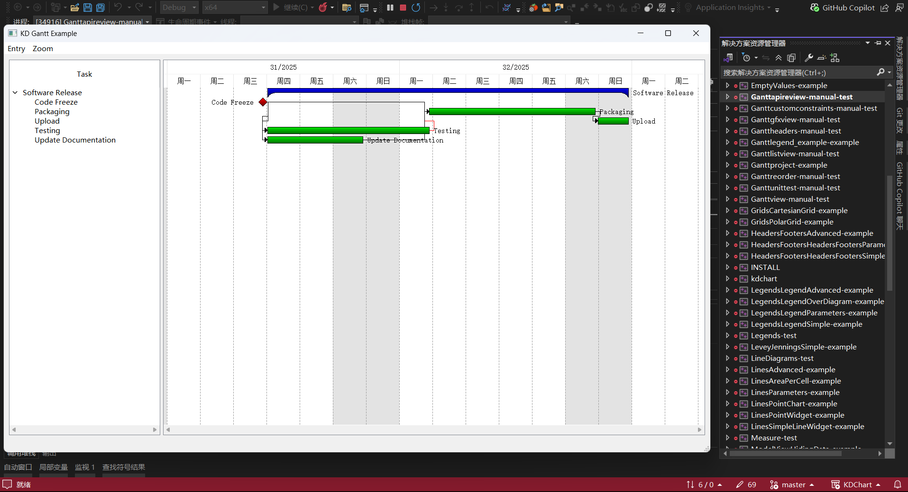


