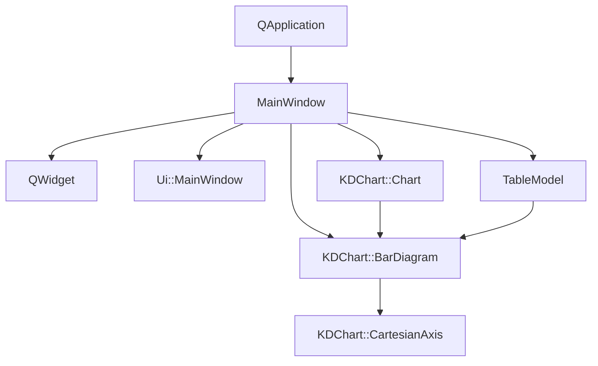

# 坐标轴配置示例 (Axis/Chart)

## 项目概述
本示例展示了KDChart库中坐标轴的高级配置功能，通过创建多位置（上、下、左、右）坐标轴并自定义其样式、标题和刻度属性，实现了复杂的数据可视化效果。示例重点演示了坐标轴的差异化配置、多坐标轴共存以及动态属性调整等核心特性。

## 文件结构
```
Axis/Chart/
├── BarChart.qrc         # 资源文件，包含CSV数据
├── CMakeLists.txt       # 项目构建配置
├── README.md            # 项目说明文档
├── barSimple.csv        # 示例数据文件
├── main.cpp             # 应用程序入口
├── mainwindow.cpp       # 主窗口实现
├── mainwindow.h         # 主窗口类定义
└── mainwindow.ui        # UI界面设计文件
```

## 类功能说明
### MainWindow类
- **核心功能**：作为应用程序主窗口，整合图表组件、数据模型和UI交互元素
- **关键属性**：
  - `m_chart`: KDChart::Chart对象，管理图表坐标系和绘制区域
  - `m_model`: TableModel对象，存储和管理图表数据
  - `m_lines`: KDChart::BarDiagram对象，负责柱状图数据可视化
- **主要方法**：
  - 构造函数：初始化UI、创建图表、配置坐标轴属性、加载数据

## 代码执行逻辑
1. **应用程序初始化**：`main()`函数创建QApplication实例，初始化Qt框架
2. **主窗口创建**：实例化MainWindow对象，触发其构造函数
3. **UI组件初始化**：调用`setupUi()`加载界面布局
4. **图表配置**：创建Chart对象和布局管理器，设置全局样式
5. **数据加载**：通过TableModel从CSV文件加载示例数据
6. **坐标轴定制**：创建上、下、左、右四个坐标轴，设置位置、标题、文本样式和刻度属性
7. **组件整合**：将坐标轴和图表添加到布局，显示主窗口
8. **事件循环启动**：调用`app.exec()`启动Qt事件循环，等待用户交互

## 类关系图


## 函数执行逻辑图
```mermaid
graph LR
    main[main()] -->|创建| app[QApplication]
    main -->|创建| window[MainWindow]
    window -->|初始化| setupUi[setupUi()]
    window -->|创建| chart[KDChart::Chart]
    window -->|加载| data[TableModel::loadFromCSV()]
    window -->|创建| diagram[KDChart::BarDiagram]
    diagram -->|关联| data
    diagram -->|创建| axes[四个CartesianAxis对象]
    axes -->|配置| styles[标题、颜色、刻度样式]
    chart -->|添加| diagram
    window -->|显示| show[show()]
    main -->|启动| exec[app.exec()]
```

## Qt 5.15.2升级说明
- **主要变更点**：
  - 检查KDChart::CartesianAxis坐标系计算逻辑在新版本中的兼容性
  - 验证QHBoxLayout在高DPI环境下的布局计算精度
  - 更新TextAttributes类的字体渲染API调用
- **TODO项**：
  - `// TODO: Qt5.15.2升级 检查KDChart::Chart在Qt5.15.2中的坐标系管理API变化`
  - `// TODO: Qt5.15.2升级 验证QWidget::setLayout()在高DPI环境下的布局行为`
  - `// TODO: Qt5.15.2升级 检查KDChart::CartesianAxis在Qt5.15.2中的坐标系计算逻辑变化`
  - `// TODO: Qt5.15.2升级 验证QHBoxLayout在高DPI环境下的布局计算精度`
  - `// TODO: Qt5.15.2升级 检查TextAttributes类的字体渲染API是否有变更`
  - `// TODO: Qt5.15.2升级 验证QApplication构造函数在Qt5.15.2中的参数要求变化`
  - `// TODO: Qt5.15.2升级 检查QApplication::exec()的事件循环行为是否有调整`

## C++17升级说明
- **主要调整点**：
  - 使用std::unique_ptr管理动态创建的图表组件，避免内存泄漏
  - 采用结构化绑定优化多变量属性配置代码
  - 使用std::filesystem::path处理文件路径
  - 考虑使用if constexpr优化条件编译代码块
- **TODO项**：
  - `// TODO: C++17升级 使用std::unique_ptr管理m_chart和m_lines动态对象`
  - `// TODO: C++17升级 考虑将m_model改为constexpr初始化（若数据固定）`
  - `// TODO: C++17升级 使用std::unique_ptr管理所有动态创建的图表组件对象`
  - `// TODO: C++17升级 使用结构化绑定优化多变量属性配置代码`
  - `// TODO: C++17升级 考虑使用std::filesystem::path处理CSV文件路径`
  - `// TODO: C++17升级 可使用if constexpr优化条件编译代码块`
  - `// TODO: C++17升级 考虑使用[[maybe_unused]]属性标记未使用的命令行参数`
  - `// TODO: C++17升级 可使用constexpr优化可能的常量表达式（如固定窗口尺寸等）`