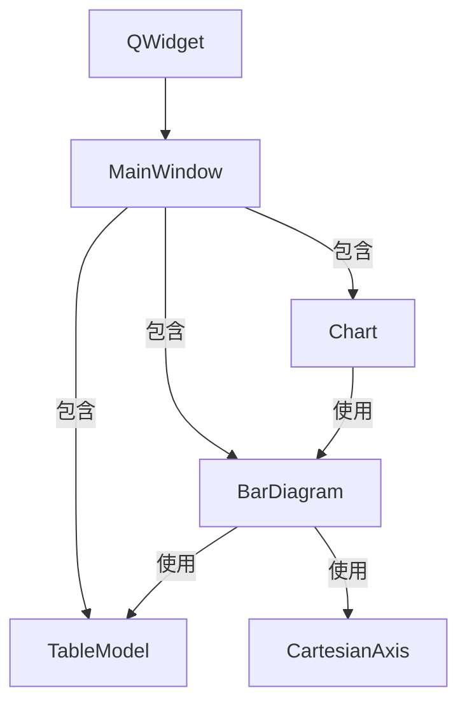
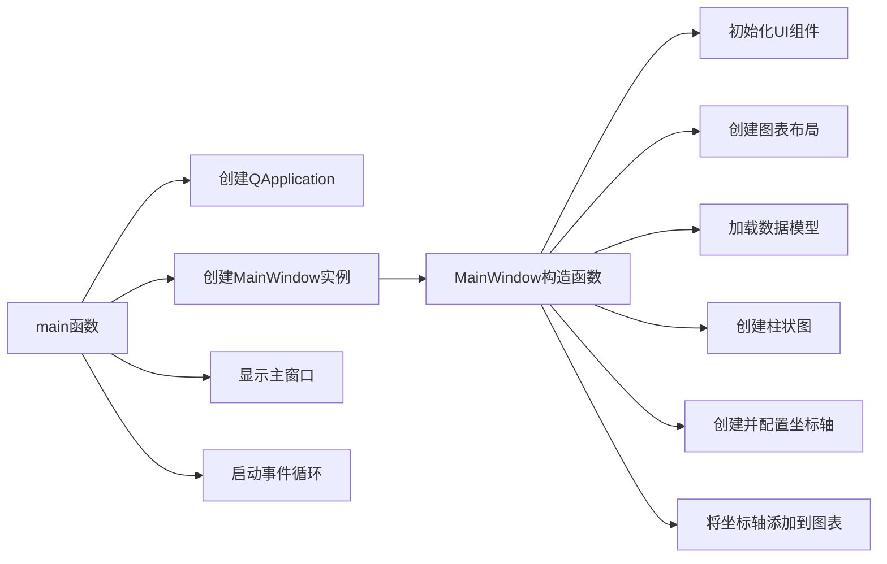

# 坐标轴配置示例工程说明

## 工程概述
该工程展示了如何在KD Chart库中配置和自定义图表的坐标轴，包括设置坐标轴标题、标签、刻度线样式和位置等。

## 文件结构
- `main.cpp`: 应用程序入口文件，创建主窗口并运行事件循环
- `mainwindow.h`: 主窗口类头文件，定义了MainWindow类及其成员变量
- `mainwindow.cpp`: 主窗口类实现文件，包含图表和坐标轴的配置逻辑
- `mainwindow.ui`: UI设计文件，定义了窗口布局
- `CMakeLists.txt`: 构建配置文件
- `data`: 数据文件目录，包含图表使用的示例数据
- `BarChart.qrc`: 资源文件，包含项目所需的资源
- `barSimple.csv`: CSV数据文件，包含图表的示例数据

## 功能说明
1. 创建柱状图并配置多个坐标轴（顶部、左侧、右侧、底部）
2. 自定义坐标轴标题的颜色、字体大小和旋转角度
3. 设置坐标轴标签的文本、颜色和旋转角度
4. 配置刻度线的样式和颜色
5. 支持标签的缩短版本显示
6. 从CSV文件加载图表数据
7. 配置图表全局边距

## 代码结构
### MainWindow类
- **成员变量**:
  - `m_chart`: 图表对象，用于显示和管理图表
  - `m_model`: 数据模型，存储图表使用的数据
  - `m_lines`: 柱状图对象，负责绘制柱状图

- **构造函数**:
  - 初始化UI组件
  - 创建图表布局和图表对象
  - 加载数据模型
  - 创建和配置柱状图
  - 创建并自定义多个坐标轴
  - 将坐标轴添加到图表

## 类关系图

## 执行逻辑
1. 程序启动，执行`main`函数
2. 创建`QApplication`对象和`MainWindow`对象
3. 显示主窗口
4. 在`MainWindow`构造函数中:
   - 初始化UI
   - 创建图表和布局
   - 加载数据
   - 配置柱状图
   - 创建和自定义坐标轴
   - 将坐标轴添加到图表
5. 运行应用程序事件循环

## 函数执行流程图

## 版本升级说明
### Qt 5.15.2兼容性
该工程使用的Qt API在5.15.2版本中兼容，无需修改。代码中未使用任何已废弃的Qt API，所有功能均可在Qt 5.15.2环境下正常运行。

### C++17兼容性
代码使用的C++特性与C++17标准兼容，已采用的C++17特性包括:
1. 使用`auto`关键字进行类型推导
2. 空指针使用`nullptr`而非`NULL`

可以考虑进一步使用以下C++17新特性进行优化:
1. 使用结构化绑定简化变量声明
2. 使用`std::optional`处理可能为空的值
3. 使用`std::string_view`提高字符串处理效率

## 优化建议
1. 添加更多坐标轴样式配置选项
2. 实现坐标轴动态更新功能
3. 添加保存图表为图片的功能
4. 增加坐标轴范围自动调整功能