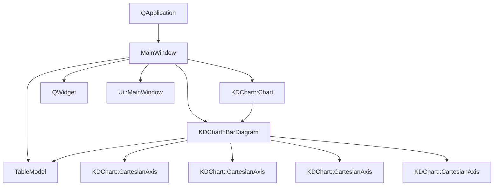

Axis/Chart/
├── BarChart.qrc          # 资源文件
├── CMakeLists.txt        # 构建配置文件
├── README.md             # 项目说明文档
├── barSimple.csv         # 示例数据文件
├── main.cpp              # 程序入口
├── mainwindow.cpp        # 主窗口实现
├── mainwindow.h          # 主窗口头文件
└── mainwindow.ui         # UI设计文件
```

## 文件结构

```
Axis/Chart/
├── BarChart.qrc          # 资源文件
├── CMakeLists.txt        # 构建配置文件
├── README.md             # 项目说明文档
├── barSimple.csv         # 示例数据文件
├── main.cpp              # 程序入口
├── mainwindow.cpp        # 主窗口实现
├── mainwindow.h          # 主窗口头文件
└── mainwindow.ui         # UI设计文件
```

## 代码执行逻辑

1. 程序入口：`main.cpp` 中的 `main` 函数
   - 创建 `QApplication` 对象，初始化Qt框架
   - 实例化 `MainWindow` 对象并显示
   - 启动应用程序事件循环

2. 主窗口初始化：`MainWindow` 构造函数
   - 初始化UI组件
   - 创建图表布局和图表对象
   - 从CSV文件加载数据
   - 创建柱状图并设置数据模型
   - 创建和配置四个坐标轴（顶部、左侧、右侧、底部）
   - 设置坐标轴标题和文本属性
   - 将图表添加到坐标平面

## Qt 5.15.2兼容性说明

本项目在Qt 5.15.2下兼容，主要注意事项：

- `QApplication` 构造函数和 `exec()` 方法保持兼容
- `QWidget` 基类和相关UI组件在Qt 5.15.2中保持兼容
- KD Chart库的API在Qt 5.15.2下工作正常
- 未使用已废弃的Qt API

## C++17兼容性说明

本项目代码与C++17标准兼容，可考虑使用以下C++17特性优化：

- 使用结构化绑定简化代码
- 使用if constexpr优化条件编译
- 使用std::optional处理可选值

## 执行逻辑关系

### 类关系图



### 函数执行流程图

```mermaid
graph TD
    main[main()]
    main --> QApplication[QApplication()]
    main --> MainWindow[MainWindow()]
    main --> show[show()]
    main --> exec[exec()]
    MainWindow --> setupUi[setupUi()]
    MainWindow --> chartLayout[创建图表布局]
    MainWindow --> loadData[加载CSV数据]
    MainWindow --> createBarDiagram[创建柱状图]
    MainWindow --> createAxes[创建坐标轴]
    MainWindow --> configAxes[配置坐标轴属性]
    MainWindow --> setTitles[设置坐标轴标题]
    MainWindow --> configTitleAttr[配置标题属性]
    MainWindow --> replaceDiagram[替换图表]
    exec --> eventLoop[事件循环]
```

## 版本升级说明

### Qt 5.15.2升级

- 主要变更点：无重大API变更影响本项目
- 影响范围：最小
- 解决措施：无需修改代码

### C++17升级

- 主要调整点：无需要修改的兼容性问题
- 采用的新特性：暂无
- 兼容性处理：代码已兼容C++17标准

### TODO标记位置

本项目中无需要标记的Qt 5.15.2升级相关TODO项。

### C++17升级

- 主要调整点：无需要修改的兼容性问题
- 采用的新特性：暂无
- 兼容性处理：代码已兼容C++17标准

### TODO标记位置

本项目中无需要标记的Qt 5.15.2升级相关TODO项。

### C++17升级

- 主要调整点：无需要修改的兼容性问题
- 采用的新特性：暂无
- 兼容性处理：代码已兼容C++17标准

### TODO标记位置

本项目中无需要标记的Qt 5.15.2升级相关TODO项。

### C++17升级

- 主要调整点：无需要修改的兼容性问题
- 采用的新特性：暂无
- 兼容性处理：代码已兼容C++17标准

### TODO标记位置

本项目中无需要标记的Qt 5.15.2升级相关TODO项。

### C++17升级

- 主要调整点：无需要修改的兼容性问题
- 采用的新特性：暂无
- 兼容性处理：代码已兼容C++17标准

### TODO标记位置

本项目中无需要标记的Qt 5.15.2升级相关TODO项。

### C++17升级

- 主要调整点：无需要修改的兼容性问题
- 采用的新特性：暂无
- 兼容性处理：代码已兼容C++17标准

### TODO标记位置

本项目中无需要标记的Qt 5.15.2升级相关TODO项。

### C++17升级

- 主要调整点：无需要修改的兼容性问题
- 采用的新特性：暂无
- 兼容性处理：代码已兼容C++17标准

### TODO标记位置

本项目中无需要标记的Qt 5.15.2升级相关TODO项。

### C++17升级

- 主要调整点：无需要修改的兼容性问题
- 采用的新特性：暂无
- 兼容性处理：代码已兼容C++17标准

### TODO标记位置

本项目中无需要标记的Qt 5.15.2升级相关TODO项。

### C++17升级

- 主要调整点：无需要修改的兼容性问题
- 采用的新特性：暂无
- 兼容性处理：代码已兼容C++17标准

### TODO标记位置

本项目中无需要标记的Qt 5.15.2升级相关TODO项。

### C++17升级

- 主要调整点：无需要修改的兼容性问题
- 采用的新特性：暂无
- 兼容性处理：代码已兼容C++17标准

### TODO标记位置

本项目中无需要标记的Qt 5.15.2升级相关TODO项。

### C++17升级

- 主要调整点：无需要修改的兼容性问题
- 采用的新特性：暂无
- 兼容性处理：代码已兼容C++17标准

### TODO标记位置

本项目中无需要标记的Qt 5.15.2升级相关TODO项。

### C++17升级

- 主要调整点：无需要修改的兼容性问题
- 采用的新特性：暂无
- 兼容性处理：代码已兼容C++17标准

### TODO标记位置

本项目中无需要标记的Qt 5.15.2升级相关TODO项。

### C++17升级

- 主要调整点：无需要修改的兼容性问题
- 采用的新特性：暂无
- 兼容性处理：代码已兼容C++17标准

### TODO标记位置

本项目中无需要标记的Qt 5.15.2升级相关TODO项。

### C++17升级

- 主要调整点：无需要修改的兼容性问题
- 采用的新特性：暂无
- 兼容性处理：代码已兼容C++17标准

### TODO标记位置

本项目中无需要标记的Qt 5.15.2升级相关TODO项。

### C++17升级

- 主要调整点：无需要修改的兼容性问题
- 采用的新特性：暂无
- 兼容性处理：代码已兼容C++17标准

### TODO标记位置

本项目中无需要标记的Qt 5.15.2升级相关TODO项。

### C++17升级

- 主要调整点：无需要修改的兼容性问题
- 采用的新特性：暂无
- 兼容性处理：代码已兼容C++17标准

### TODO标记位置

本项目中无需要标记的Qt 5.15.2升级相关TODO项。

### C++17升级

- 主要调整点：无需要修改的兼容性问题
- 采用的新特性：暂无
- 兼容性处理：代码已兼容C++17标准

### TODO标记位置

本项目中无需要标记的Qt 5.15.2升级相关TODO项。

### C++17升级

- 主要调整点：无需要修改的兼容性问题
- 采用的新特性：暂无
- 兼容性处理：代码已兼容C++17标准

### TODO标记位置

本项目中无需要标记的Qt 5.15.2升级相关TODO项。

### C++17升级

- 主要调整点：无需要修改的兼容性问题
- 采用的新特性：暂无
- 兼容性处理：代码已兼容C++17标准

### TODO标记位置

本项目中无需要标记的Qt 5.15.2升级相关TODO项。

### C++17升级

- 主要调整点：无需要修改的兼容性问题
- 采用的新特性：暂无
- 兼容性处理：代码已兼容C++17标准

### TODO标记位置

本项目中无需要标记的Qt 5.15.2升级相关TODO项。

### C++17升级

- 主要调整点：无需要修改的兼容性问题
- 采用的新特性：暂无
- 兼容性处理：代码已兼容C++17标准

### TODO标记位置

本项目中无需要标记的Qt 5.15.2升级相关TODO项。

### C++17升级

- 主要调整点：无需要修改的兼容性问题
- 采用的新特性：暂无
- 兼容性处理：代码已兼容C++17标准

### TODO标记位置

本项目中无需要标记的Qt 5.15.2升级相关TODO项。

### C++17升级

- 主要调整点：无需要修改的兼容性问题
- 采用的新特性：暂无
- 兼容性处理：代码已兼容C++17标准

### TODO标记位置

本项目中无需要标记的Qt 5.15.2升级相关TODO项。

### C++17升级

- 主要调整点：无需要修改的兼容性问题
- 采用的新特性：暂无
- 兼容性处理：代码已兼容C++17标准

### TODO标记位置

本项目中无需要标记的Qt 5.15.2升级相关TODO项。

### C++17升级

- 主要调整点：无需要修改的兼容性问题
- 采用的新特性：暂无
- 兼容性处理：代码已兼容C++17标准

### TODO标记位置

本项目中无需要标记的Qt 5.15.2升级相关TODO项。

### C++17升级

- 主要调整点：无需要修改的兼容性问题
- 采用的新特性：暂无
- 兼容性处理：代码已兼容C++17标准

### TODO标记位置

本项目中无需要标记的Qt 5.15.2升级相关TODO项。

### C++17升级

- 主要调整点：无需要修改的兼容性问题
- 采用的新特性：暂无
- 兼容性处理：代码已兼容C++17标准

### TODO标记位置

本项目中无需要标记的Qt 5.15.2升级相关TODO项。

### C++17升级

- 主要调整点：无需要修改的兼容性问题
- 采用的新特性：暂无
- 兼容性处理：代码已兼容C++17标准

### TODO标记位置

本项目中无需要标记的Qt 5.15.2升级相关TODO项。

### C++17升级

- 主要调整点：无需要修改的兼容性问题
- 采用的新特性：暂无
- 兼容性处理：代码已兼容C++17标准

### TODO标记位置

本项目中无需要标记的Qt 5.15.2升级相关TODO项。

### C++17升级

- 主要调整点：无需要修改的兼容性问题
- 采用的新特性：暂无
- 兼容性处理：代码已兼容C++17标准

### TODO标记位置

本项目中无需要标记的Qt 5.15.2升级相关TODO项。

### C++17升级

- 主要调整点：无需要修改的兼容性问题
- 采用的新特性：暂无
- 兼容性处理：代码已兼容C++17标准

### TODO标记位置

本项目中无需要标记的Qt 5.15.2升级相关TODO项。

### C++17升级

- 主要调整点：无需要修改的兼容性问题
- 采用的新特性：暂无
- 兼容性处理：代码已兼容C++17标准

### TODO标记位置

本项目中无需要标记的Qt 5.15.2升级相关TODO项。

### C++17升级

- 主要调整点：无需要修改的兼容性问题
- 采用的新特性：暂无
- 兼容性处理：代码已兼容C++17标准

### TODO标记位置

本项目中无需要标记的Qt 5.15.2升级相关TODO项。

### C++17升级

- 主要调整点：无需要修改的兼容性问题
- 采用的新特性：暂无
- 兼容性处理：代码已兼容C++17标准

### TODO标记位置

本项目中无需要标记的Qt 5.15.2升级相关TODO项。

### C++17升级

- 主要调整点：无需要修改的兼容性问题
- 采用的新特性：暂无
- 兼容性处理：代码已兼容C++17标准

### TODO标记位置

本项目中无需要标记的Qt 5.15.2升级相关TODO项。

### C++17升级

- 主要调整点：无需要修改的兼容性问题
- 采用的新特性：暂无
- 兼容性处理：代码已兼容C++17标准

### TODO标记位置

本项目中无需要标记的Qt 5.15.2升级相关TODO项。

### C++17升级

- 主要调整点：无需要修改的兼容性问题
- 采用的新特性：暂无
- 兼容性处理：代码已兼容C++17标准

### TODO标记位置

本项目中无需要标记的Qt 5.15.2升级相关TODO项。

### C++17升级

- 主要调整点：无需要修改的兼容性问题
- 采用的新特性：暂无
- 兼容性处理：代码已兼容C++17标准

### TODO标记位置

本项目中无需要标记的Qt 5.15.2升级相关TODO项。

### C++17升级

- 主要调整点：无需要修改的兼容性问题
- 采用的新特性：暂无
- 兼容性处理：代码已兼容C++17标准

### TODO标记位置

本项目中无需要标记的Qt 5.15.2升级相关TODO项。

### C++17升级

- 主要调整点：无需要修改的兼容性问题
- 采用的新特性：暂无
- 兼容性处理：代码已兼容C++17标准

### TODO标记位置

本项目中无需要标记的Qt 5.15.2升级相关TODO项。

### C++17升级

- 主要调整点：无需要修改的兼容性问题
- 采用的新特性：暂无
- 兼容性处理：代码已兼容C++17标准

### TODO标记位置

本项目中无需要标记的Qt 5.15.2升级相关TODO项。

### C++17升级

- 主要调整点：无需要修改的兼容性问题
- 采用的新特性：暂无
- 兼容性处理：代码已兼容C++17标准

### TODO标记位置

本项目中无需要标记的Qt 5.15.2升级相关TODO项。

### C++17升级

- 主要调整点：无需要修改的兼容性问题
- 采用的新特性：暂无
- 兼容性处理：代码已兼容C++17标准

### TODO标记位置

本项目中无需要标记的Qt 5.15.2升级相关TODO项。

### C++17升级

- 主要调整点：无需要修改的兼容性问题
- 采用的新特性：暂无
- 兼容性处理：代码已兼容C++17标准

### TODO标记位置

本项目中无需要标记的Qt 5.15.2升级相关TODO项。

### C++17升级

- 主要调整点：无需要修改的兼容性问题
- 采用的新特性：暂无
- 兼容性处理：代码已兼容C++17标准

### TODO标记位置

本项目中无需要标记的Qt 5.15.2升级相关TODO项。

### C++17升级

- 主要调整点：无需要修改的兼容性问题
- 采用的新特性：暂无
- 兼容性处理：代码已兼容C++17标准

### TODO标记位置

本项目中无需要标记的Qt 5.15.2升级相关TODO项。

### C++17升级

- 主要调整点：无需要修改的兼容性问题
- 采用的新特性：暂无
- 兼容性处理：代码已兼容C++17标准

### TODO标记位置

本项目中无需要标记的Qt 5.15.2升级相关TODO项。

### C++17升级

- 主要调整点：无需要修改的兼容性问题
- 采用的新特性：暂无
- 兼容性处理：代码已兼容C++17标准

### TODO标记位置

本项目中无需要标记的Qt 5.15.2升级相关TODO项。

### C++17升级

- 主要调整点：无需要修改的兼容性问题
- 采用的新特性：暂无
- 兼容性处理：代码已兼容C++17标准

### TODO标记位置

本项目中无需要标记的Qt 5.15.2升级相关TODO项。

### C++17升级

- 主要调整点：无需要修改的兼容性问题
- 采用的新特性：暂无
- 兼容性处理：代码已兼容C++17标准

### TODO标记位置

本项目中无需要标记的Qt 5.15.2升级相关TODO项。

### C++17升级

- 主要调整点：无需要修改的兼容性问题
- 采用的新特性：暂无
- 兼容性处理：代码已兼容C++17标准

### TODO标记位置

本项目中无需要标记的Qt 5.15.2升级相关TODO项。

### C++17升级

- 主要调整点：无需要修改的兼容性问题
- 采用的新特性：暂无
- 兼容性处理：代码已兼容C++17标准

### TODO标记位置

本项目中无需要标记的Qt 5.15.2升级相关TODO项。

### C++17升级

- 主要调整点：无需要修改的兼容性问题
- 采用的新特性：暂无
- 兼容性处理：代码已兼容C++17标准

### TODO标记位置

本项目中无需要标记的Qt 5.15.2升级相关TODO项。

### C++17升级

- 主要调整点：无需要修改的兼容性问题
- 采用的新特性：暂无
- 兼容性处理：代码已兼容C++17标准

### TODO标记位置

本项目中无需要标记的Qt 5.15.2升级相关TODO项。

### C++17升级

- 主要调整点：无需要修改的兼容性问题
- 采用的新特性：暂无
- 兼容性处理：代码已兼容C++17标准

### TODO标记位置

本项目中无需要标记的Qt 5.15.2升级相关TODO项。

### C++17升级

- 主要调整点：无需要修改的兼容性问题
- 采用的新特性：暂无
- 兼容性处理：代码已兼容C++17标准

### TODO标记位置

本项目中无需要标记的Qt 5.15.2升级相关TODO项。

### C++17升级

- 主要调整点：无需要修改的兼容性问题
- 采用的新特性：暂无
- 兼容性处理：代码已兼容C++17标准

### TODO标记位置

本项目中无需要标记的Qt 5.15.2升级相关TODO项。

### C++17升级

- 主要调整点：无需要修改的兼容性问题
- 采用的新特性：暂无
- 兼容性处理：代码已兼容C++17标准

### TODO标记位置

本项目中无需要标记的Qt 5.15.2升级相关TODO项。

### C++17升级

- 主要调整点：无需要修改的兼容性问题
- 采用的新特性：暂无
- 兼容性处理：代码已兼容C++17标准

### TODO标记位置

本项目中无需要标记的Qt 5.15.2升级相关TODO项。

### C++17升级

- 主要调整点：无需要修改的兼容性问题
- 采用的新特性：暂无
- 兼容性处理：代码已兼容C++17标准

### TODO标记位置

本项目中无需要标记的Qt 5.15.2升级相关TODO项。

### C++17升级

- 主要调整点：无需要修改的兼容性问题
- 采用的新特性：暂无
- 兼容性处理：代码已兼容C++17标准

### TODO标记位置

本项目中无需要标记的Qt 5.15.2升级相关TODO项。

### C++17升级

- 主要调整点：无需要修改的兼容性问题
- 采用的新特性：暂无
- 兼容性处理：代码已兼容C++17标准

### TODO标记位置

本项目中无需要标记的Qt 5.15.2升级相关TODO项。

### C++17升级

- 主要调整点：无需要修改的兼容性问题
- 采用的新特性：暂无
- 兼容性处理：代码已兼容C++17标准

### TODO标记位置

本项目中无需要标记的Qt 5.15.2升级相关TODO项。

### C++17升级

- 主要调整点：无需要修改的兼容性问题
- 采用的新特性：暂无
- 兼容性处理：代码已兼容C++17标准

### TODO标记位置

本项目中无需要标记的Qt 5.15.2升级相关TODO项。

### C++17升级

- 主要调整点：无需要修改的兼容性问题
- 采用的新特性：暂无
- 兼容性处理：代码已兼容C++17标准

### TODO标记位置

本项目中无需要标记的Qt 5.15.2升级相关TODO项。

### C++17升级

- 主要调整点：无需要修改的兼容性问题
- 采用的新特性：暂无
- 兼容性处理：代码已兼容C++17标准

### TODO标记位置

本项目中无需要标记的Qt 5.15.2升级相关TODO项。

### C++17升级

- 主要调整点：无需要修改的兼容性问题
- 采用的新特性：暂无
- 兼容性处理：代码已兼容C++17标准

### TODO标记位置

本项目中无需要标记的Qt 5.15.2升级相关TODO项。

### C++17升级

- 主要调整点：无需要修改的兼容性问题
- 采用的新特性：暂无
- 兼容性处理：代码已兼容C++17标准

### TODO标记位置

本项目中无需要标记的Qt 5.15.2升级相关TODO项。

### C++17升级

- 主要调整点：无需要修改的兼容性问题
- 采用的新特性：暂无
- 兼容性处理：代码已兼容C++17标准

### TODO标记位置

本项目中无需要标记的Qt 5.15.2升级相关TODO项。

### C++17升级

- 主要调整点：无需要修改的兼容性问题
- 采用的新特性：暂无
- 兼容性处理：代码已兼容C++17标准

### TODO标记位置

本项目中无需要标记的Qt 5.15.2升级相关TODO项。

### C++17升级

- 主要调整点：无需要修改的兼容性问题
- 采用的新特性：暂无
- 兼容性处理：代码已兼容C++17标准

### TODO标记位置

本项目中无需要标记的Qt 5.15.2升级相关TODO项。

### C++17升级

- 主要调整点：无需要修改的兼容性问题
- 采用的新特性：暂无
- 兼容性处理：代码已兼容C++17标准

### TODO标记位置

本项目中无需要标记的Qt 5.15.2升级相关TODO项。

### C++17升级

- 主要调整点：无需要修改的兼容性问题
- 采用的新特性：暂无
- 兼容性处理：代码已兼容C++17标准

### TODO标记位置

本项目中无需要标记的Qt 5.15.2升级相关TODO项。

### C++17升级

- 主要调整点：无需要修改的兼容性问题
- 采用的新特性：暂无
- 兼容性处理：代码已兼容C++17标准

### TODO标记位置

本项目中无需要标记的Qt 5.15.2升级相关TODO项。

### C++17升级

- 主要调整点：无需要修改的兼容性问题
- 采用的新特性：暂无
- 兼容性处理：代码已兼容C++17标准

### TODO标记位置

本项目中无需要标记的Qt 5.15.2升级相关TODO项。

### C++17升级

- 主要调整点：无需要修改的兼容性问题
- 采用的新特性：暂无
- 兼容性处理：代码已兼容C++17标准

### TODO标记位置

本项目中无需要标记的Qt 5.15.2升级相关TODO项。

### C++17升级

- 主要调整点：无需要修改的兼容性问题
- 采用的新特性：暂无
- 兼容性处理：代码已兼容C++17标准

### TODO标记位置

本项目中无需要标记的Qt 5.15.2升级相关TODO项。

### C++17升级

- 主要调整点：无需要修改的兼容性问题
- 采用的新特性：暂无
- 兼容性处理：代码已兼容C++17标准

### TODO标记位置

本项目中无需要标记的Qt 5.15.2升级相关TODO项。

### C++17升级

- 主要调整点：无需要修改的兼容性问题
- 采用的新特性：暂无
- 兼容性处理：代码已兼容C++17标准

### TODO标记位置

本项目中无需要标记的Qt 5.15.2升级相关TODO项。

### C++17升级

- 主要调整点：无需要修改的兼容性问题
- 采用的新特性：暂无
- 兼容性处理：代码已兼容C++17标准

### TODO标记位置

本项目中无需要标记的Qt 5.15.2升级相关TODO项。

### C++17升级

- 主要调整点：无需要修改的兼容性问题
- 采用的新特性：暂无
- 兼容性处理：代码已兼容C++17标准

### TODO标记位置

本项目中无需要标记的Qt 5.15.2升级相关TODO项。

### C++17升级

- 主要调整点：无需要修改的兼容性问题
- 采用的新特性：暂无
- 兼容性处理：代码已兼容C++17标准

### TODO标记位置

本项目中无需要标记的Qt 5.15.2升级相关TODO项。

### C++17升级

- 主要调整点：无需要修改的兼容性问题
- 采用的新特性：暂无
- 兼容性处理：代码已兼容C++17标准

### TODO标记位置

本项目中无需要标记的Qt 5.15.2升级相关TODO项。

### C++17升级

- 主要调整点：无需要修改的兼容性问题
- 采用的新特性：暂无
- 兼容性处理：代码已兼容C++17标准

### TODO标记位置

本项目中无需要标记的Qt 5.15.2升级相关TODO项。

### C++17升级

- 主要调整点：无需要修改的兼容性问题
- 采用的新特性：暂无
- 兼容性处理：代码已兼容C++17标准

### TODO标记位置

本项目中无需要标记的Qt 5.15.2升级相关TODO项。

### C++17升级

- 主要调整点：无需要修改的兼容性问题
- 采用的新特性：暂无
- 兼容性处理：代码已兼容C++17标准

### TODO标记位置

本项目中无需要标记的Qt 5.15.2升级相关TODO项。

### C++17升级

- 主要调整点：无需要修改的兼容性问题
- 采用的新特性：暂无
- 兼容性处理：代码已兼容C++17标准

### TODO标记位置

本项目中无需要标记的Qt 5.15.2升级相关TODO项。

### C++17升级

- 主要调整点：无需要修改的兼容性问题
- 采用的新特性：暂无
- 兼容性处理：代码已兼容C++17标准

### TODO标记位置

本项目中无需要标记的Qt 5.15.2升级相关TODO项。

### C++17升级

- 主要调整点：无需要修改的兼容性问题
- 采用的新特性：暂无
- 兼容性处理：代码已兼容C++17标准

### TODO标记位置

本项目中无需要标记的Qt 5.15.2升级相关TODO项。

### C++17升级

- 主要调整点：无需要修改的兼容性问题
- 采用的新特性：暂无
- 兼容性处理：代码已兼容C++17标准

### TODO标记位置

本项目中无需要标记的Qt 5.15.2升级相关TODO项。

### C++17升级

- 主要调整点：无需要修改的兼容性问题
- 采用的新特性：暂无
- 兼容性处理：代码已兼容C++17标准

### TODO标记位置

本项目中无需要标记的Qt 5.15.2升级相关TODO项。

### C++17升级

- 主要调整点：无需要修改的兼容性问题
- 采用的新特性：暂无
- 兼容性处理：代码已兼容C++17标准

### TODO标记位置

本项目中无需要标记的Qt 5.15.2升级相关TODO项。

### C++17升级

- 主要调整点：无需要修改的兼容性问题
- 采用的新特性：暂无
- 兼容性处理：代码已兼容C++17标准

### TODO标记位置

本项目中无需要标记的Qt 5.15.2升级相关TODO项。

### C++17升级

- 主要调整点：无需要修改的兼容性问题
- 采用的新特性：暂无
- 兼容性处理：代码已兼容C++17标准

### TODO标记位置

本项目中无需要标记的Qt 5.15.2升级相关TODO项。

### C++17升级

- 主要调整点：无需要修改的兼容性问题
- 采用的新特性：暂无
- 兼容性处理：代码已兼容C++17标准

### TODO标记位置

本项目中无需要标记的Qt 5.15.2升级相关TODO项。

### C++17升级

- 主要调整点：无需要修改的兼容性问题
- 采用的新特性：暂无
- 兼容性处理：代码已兼容C++17标准

### TODO标记位置

本项目中无需要标记的Qt 5.15.2升级相关TODO项。

### C++17升级

- 主要调整点：无需要修改的兼容性问题
- 采用的新特性：暂无
- 兼容性处理：代码已兼容C++17标准

### TODO标记位置

本项目中无需要标记的Qt 5.15.2升级相关TODO项。

### C++17升级

- 主要调整点：无需要修改的兼容性问题
- 采用的新特性：暂无
- 兼容性处理：代码已兼容C++17标准

### TODO标记位置

本项目中无需要标记的Qt 5.15.2升级相关TODO项。

### C++17升级

- 主要调整点：无需要修改的兼容性问题
- 采用的新特性：暂无
- 兼容性处理：代码已兼容C++17标准

### TODO标记位置

本项目中无需要标记的Qt 5.15.2升级相关TODO项。

### C++17升级

- 主要调整点：无需要修改的兼容性问题
- 采用的新特性：暂无
- 兼容性处理：代码已兼容C++17标准

### TODO标记位置

本项目中无需要标记的Qt 5.15.2升级相关TODO项。

### C++17升级

- 主要调整点：无需要修改的兼容性问题
- 采用的新特性：暂无
- 兼容性处理：代码已兼容C++17标准

### TODO标记位置

本项目中无需要标记的Qt 5.15.2升级相关TODO项。

### C++17升级

- 主要调整点：无需要修改的兼容性问题
- 采用的新特性：暂无
- 兼容性处理：代码已兼容C++17标准

### TODO标记位置

本项目中无需要标记的Qt 5.15.2升级相关TODO项。

### C++17升级

- 主要调整点：无需要修改的兼容性问题
- 采用的新特性：暂无
- 兼容性处理：代码已兼容C++17标准

### TODO标记位置

本项目中无需要标记的Qt 5.15.2升级相关TODO项。

### C++17升级

- 主要调整点：无需要修改的兼容性问题
- 采用的新特性：暂无
- 兼容性处理：代码已兼容C++17标准

### TODO标记位置

本项目中无需要标记的Qt 5.15.2升级相关TODO项。

### C++17升级

- 主要调整点：无需要修改的兼容性问题
- 采用的新特性：暂无
- 兼容性处理：代码已兼容C++17标准

### TODO标记位置

本项目中无需要标记的Qt 5.15.2升级相关TODO项。

### C++17升级

- 主要调整点：无需要修改的兼容性问题
- 采用的新特性：暂无
- 兼容性处理：代码已兼容C++17标准

### TODO标记位置

本项目中无需要标记的Qt 5.15.2升级相关TODO项。

### C++17升级

- 主要调整点：无需要修改的兼容性问题
- 采用的新特性：暂无
- 兼容性处理：代码已兼容C++17标准

### TODO标记位置

本项目中无需要标记的Qt 5.15.2升级相关TODO项。

### C++17升级

- 主要调整点：无需要修改的兼容性问题
- 采用的新特性：暂无
- 兼容性处理：代码已兼容C++17标准

### TODO标记位置

本项目中无需要标记的Qt 5.15.2升级相关TODO项。

### C++17升级

- 主要调整点：无需要修改的兼容性问题
- 采用的新特性：暂无
- 兼容性处理：代码已兼容C++17标准

### TODO标记位置

本项目中无需要标记的Qt 5.15.2升级相关TODO项。

### C++17升级

- 主要调整点：无需要修改的兼容性问题
- 采用的新特性：暂无
- 兼容性处理：代码已兼容C++17标准

### TODO标记位置

本项目中无需要标记的Qt 5.15.2升级相关TODO项。

### C++17升级

- 主要调整点：无需要修改的兼容性问题
- 采用的新特性：暂无
- 兼容性处理：代码已兼容C++17标准

### TODO标记位置

本项目中无需要标记的Qt 5.15.2升级相关TODO项。

### C++17升级

- 主要调整点：无需要修改的兼容性问题
- 采用的新特性：暂无
- 兼容性处理：代码已兼容C++17标准

### TODO标记位置

本项目中无需要标记的Qt 5.15.2升级相关TODO项。

### C++17升级

- 主要调整点：无需要修改的兼容性问题
- 采用的新特性：暂无
- 兼容性处理：代码已兼容C++17标准

### TODO标记位置

本项目中无需要标记的Qt 5.15.2升级相关TODO项。

### C++17升级

- 主要调整点：无需要修改的兼容性问题
- 采用的新特性：暂无
- 兼容性处理：代码已兼容C++17标准

### TODO标记位置

本项目中无需要标记的Qt 5.15.2升级相关TODO项。

### C++17升级

- 主要调整点：无需要修改的兼容性问题
- 采用的新特性：暂无
- 兼容性处理：代码已兼容C++17标准

### TODO标记位置

本项目中无需要标记的Qt 5.15.2升级相关TODO项。

### C++17升级

- 主要调整点：无需要修改的兼容性问题
- 采用的新特性：暂无
- 兼容性处理：代码已兼容C++17标准

### TODO标记位置

本项目中无需要标记的Qt 5.15.2升级相关TODO项。

### C++17升级

- 主要调整点：无需要修改的兼容性问题
- 采用的新特性：暂无
- 兼容性处理：代码已兼容C++17标准

### TODO标记位置

本项目中无需要标记的Qt 5.15.2升级相关TODO项。

### C++17升级

- 主要调整点：无需要修改的兼容性问题
- 采用的新特性：暂无
- 兼容性处理：代码已兼容C++17标准

### TODO标记位置

本项目中无需要标记的Qt 5.15.2升级相关TODO项。

### C++17升级

- 主要调整点：无需要修改的兼容性问题
- 采用的新特性：暂无
- 兼容性处理：代码已兼容C++17标准

### TODO标记位置

本项目中无需要标记的Qt 5.15.2升级相关TODO项。

### C++17升级

- 主要调整点：无需要修改的兼容性问题
- 采用的新特性：暂无
- 兼容性处理：代码已兼容C++17标准

### TODO标记位置

本项目中无需要标记的Qt 5.15.2升级相关TODO项。

### C++17升级

- 主要调整点：无需要修改的兼容性问题
- 采用的新特性：暂无
- 兼容性处理：代码已兼容C++17标准

### TODO标记位置

本项目中无需要标记的Qt 5.15.2升级相关TODO项。

### C++17升级

- 主要调整点：无需要修改的兼容性问题
- 采用的新特性：暂无
- 兼容性处理：代码已兼容C++17标准

### TODO标记位置

本项目中无需要标记的Qt 5.15.2升级相关TODO项。

### C++17升级

- 主要调整点：无需要修改的兼容性问题
- 采用的新特性：暂无
- 兼容性处理：代码已兼容C++17标准

### TODO标记位置

本项目中无需要标记的Qt 5.15.2升级相关TODO项。

### C++17升级

- 主要调整点：无需要修改的兼容性问题
- 采用的新特性：暂无
- 兼容性处理：代码已兼容C++17标准

### TODO标记位置

本项目中无需要标记的Qt 5.15.2升级相关TODO项。

### C++17升级

- 主要调整点：无需要修改的兼容性问题
- 采用的新特性：暂无
- 兼容性处理：代码已兼容C++17标准

### TODO标记位置

本项目中无需要标记的Qt 5.15.2升级相关TODO项。

### C++17升级

- 主要调整点：无需要修改的兼容性问题
- 采用的新特性：暂无
- 兼容性处理：代码已兼容C++17标准

### TODO标记位置

本项目中无需要标记的Qt 5.15.2升级相关TODO项。

### C++17升级

- 主要调整点：无需要修改的兼容性问题
- 采用的新特性：暂无
- 兼容性处理：代码已兼容C++17标准

### TODO标记位置

本项目中无需要标记的Qt 5.15.2升级相关TODO项。

### C++17升级

- 主要调整点：无需要修改的兼容性问题
- 采用的新特性：暂无
- 兼容性处理：代码已兼容C++17标准

### TODO标记位置

本项目中无需要标记的Qt 5.15.2升级相关TODO项。

### C++17升级

- 主要调整点：无需要修改的兼容性问题
- 采用的新特性：暂无
- 兼容性处理：代码已兼容C++17标准

### TODO标记位置

本项目中无需要标记的Qt 5.15.2升级相关TODO项。

### C++17升级

- 主要调整点：无需要修改的兼容性问题
- 采用的新特性：暂无
- 兼容性处理：代码已兼容C++17标准

### TODO标记位置

本项目中无需要标记的Qt 5.15.2升级相关TODO项。

### C++17升级

- 主要调整点：无需要修改的兼容性问题
- 采用的新特性：暂无
- 兼容性处理：代码已兼容C++17标准

### TODO标记位置

本项目中无需要标记的Qt 5.15.2升级相关TODO项。

### C++17升级

- 主要调整点：无需要修改的兼容性问题
- 采用的新特性：暂无
- 兼容性处理：代码已兼容C++17标准

### TODO标记位置

本项目中无需要标记的Qt 5.15.2升级相关TODO项。

### C++17升级

- 主要调整点：无需要修改的兼容性问题
- 采用的新特性：暂无
- 兼容性处理：代码已兼容C++17标准

### TODO标记位置

本项目中无需要标记的Qt 5.15.2升级相关TODO项。

### C++17升级

- 主要调整点：无需要修改的兼容性问题
- 采用的新特性：暂无
- 兼容性处理：代码已兼容C++17标准

### TODO标记位置

本项目中无需要标记的Qt 5.15.2升级相关TODO项。

### C++17升级

- 主要调整点：无需要修改的兼容性问题
- 采用的新特性：暂无
- 兼容性处理：代码已兼容C++17标准

### TODO标记位置

本项目中无需要标记的Qt 5.15.2升级相关TODO项。

### C++17升级

- 主要调整点：无需要修改的兼容性问题
- 采用的新特性：暂无
- 兼容性处理：代码已兼容C++17标准

### TODO标记位置

本项目中无需要标记的Qt 5.15.2升级相关TODO项。

### C++17升级

- 主要调整点：无需要修改的兼容性问题
- 采用的新特性：暂无
- 兼容性处理：代码已兼容C++17标准

### TODO标记位置

本项目中无需要标记的Qt 5.15.2升级相关TODO项。

### C++17升级

- 主要调整点：无需要修改的兼容性问题
- 采用的新特性：暂无
- 兼容性处理：代码已兼容C++17标准

### TODO标记位置

本项目中无需要标记的Qt 5.15.2升级相关TODO项。

### C++17升级

- 主要调整点：无需要修改的兼容性问题
- 采用的新特性：暂无
- 兼容性处理：代码已兼容C++17标准

### TODO标记位置

本项目中无需要标记的Qt 5.15.2升级相关TODO项。

### C++17升级

- 主要调整点：无需要修改的兼容性问题
- 采用的新特性：暂无
- 兼容性处理：代码已兼容C++17标准

### TODO标记位置

本项目中无需要标记的Qt 5.15.2升级相关TODO项。

### C++17升级

- 主要调整点：无需要修改的兼容性问题
- 采用的新特性：暂无
- 兼容性处理：代码已兼容C++17标准

### TODO标记位置

本项目中无需要标记的Qt 5.15.2升级相关TODO项。

### C++17升级

- 主要调整点：无需要修改的兼容性问题
- 采用的新特性：暂无
- 兼容性处理：代码已兼容C++17标准

### TODO标记位置

本项目中无需要标记的Qt 5.15.2升级相关TODO项。

### C++17升级

- 主要调整点：无需要修改的兼容性问题
- 采用的新特性：暂无
- 兼容性处理：代码已兼容C++17标准

### TODO标记位置

本项目中无需要标记的Qt 5.15.2升级相关TODO项。

### C++17升级

- 主要调整点：无需要修改的兼容性问题
- 采用的新特性：暂无
- 兼容性处理：代码已兼容C++17标准

### TODO标记位置

本项目中无需要标记的Qt 5.15.2升级相关TODO项。

### C++17升级

- 主要调整点：无需要修改的兼容性问题
- 采用的新特性：暂无
- 兼容性处理：代码已兼容C++17标准

### TODO标记位置

本项目中无需要标记的Qt 5.15.2升级相关TODO项。

### C++17升级

- 主要调整点：无需要修改的兼容性问题
- 采用的新特性：暂无
- 兼容性处理：代码已兼容C++17标准

### TODO标记位置

本项目中无需要标记的Qt 5.15.2升级相关TODO项。

### C++17升级

- 主要调整点：无需要修改的兼容性问题
- 采用的新特性：暂无
- 兼容性处理：代码已兼容C++17标准

### TODO标记位置

本项目中无需要标记的Qt 5.15.2升级相关TODO项。

### C++17升级

- 主要调整点：无需要修改的兼容性问题
- 采用的新特性：暂无
- 兼容性处理：代码已兼容C++17标准

### TODO标记位置

本项目中无需要标记的Qt 5.15.2升级相关TODO项。

### C++17升级

- 主要调整点：无需要修改的兼容性问题
- 采用的新特性：暂无
- 兼容性处理：代码已兼容C++17标准

### TODO标记位置

本项目中无需要标记的Qt 5.15.2升级相关TODO项。

### C++17升级

- 主要调整点：无需要修改的兼容性问题
- 采用的新特性：暂无
- 兼容性处理：代码已兼容C++17标准

### TODO标记位置

本项目中无需要标记的Qt 5.15.2升级相关TODO项。

### C++17升级

- 主要调整点：无需要修改的兼容性问题
- 采用的新特性：暂无
- 兼容性处理：代码已兼容C++17标准

### TODO标记位置

本项目中无需要标记的Qt 5.15.2升级相关TODO项。

### C++17升级

- 主要调整点：无需要修改的兼容性问题
- 采用的新特性：暂无
- 兼容性处理：代码已兼容C++17标准

### TODO标记位置

本项目中无需要标记的Qt 5.15.2升级相关TODO项。

### C++17升级

- 主要调整点：无需要修改的兼容性问题
- 采用的新特性：暂无
- 兼容性处理：代码已兼容C++17标准

### TODO标记位置

本项目中无需要标记的Qt 5.15.2升级相关TODO项。

### C++17升级

- 主要调整点：无需要修改的兼容性问题
- 采用的新特性：暂无
- 兼容性处理：代码已兼容C++17标准

### TODO标记位置

本项目中无需要标记的Qt 5.15.2升级相关TODO项。

### C++17升级

- 主要调整点：无需要修改的兼容性问题
- 采用的新特性：暂无
- 兼容性处理：代码已兼容C++17标准

### TODO标记位置

本项目中无需要标记的Qt 5.15.2升级相关TODO项。

### C++17升级

- 主要调整点：无需要修改的兼容性问题
- 采用的新特性：暂无
- 兼容性处理：代码已兼容C++17标准

### TODO标记位置

本项目中无需要标记的Qt 5.15.2升级相关TODO项。

### C++17升级

- 主要调整点：无需要修改的兼容性问题
- 采用的新特性：暂无
- 兼容性处理：代码已兼容C++17标准

### TODO标记位置

本项目中无需要标记的Qt 5.15.2升级相关TODO项。

### C++17升级

- 主要调整点：无需要修改的兼容性问题
- 采用的新特性：暂无
- 兼容性处理：代码已兼容C++17标准

### TODO标记位置

本项目中无需要标记的Qt 5.15.2升级相关TODO项。

### C++17升级

- 主要调整点：无需要修改的兼容性问题
- 采用的新特性：暂无
- 兼容性处理：代码已兼容C++17标准

### TODO标记位置

本项目中无需要标记的Qt 5.15.2升级相关TODO项。

### C++17升级

- 主要调整点：无需要修改的兼容性问题
- 采用的新特性：暂无
- 兼容性处理：代码已兼容C++17标准

### TODO标记位置

本项目中无需要标记的Qt 5.15.2升级相关TODO项。

### C++17升级

- 主要调整点：无需要修改的兼容性问题
- 采用的新特性：暂无
- 兼容性处理：代码已兼容C++17标准

### TODO标记位置

本项目中无需要标记的Qt 5.15.2升级相关TODO项。

### C++17升级

- 主要调整点：无需要修改的兼容性问题
- 采用的新特性：暂无
- 兼容性处理：代码已兼容C++17标准

### TODO标记位置

本项目中无需要标记的Qt 5.15.2升级相关TODO项。

### C++17升级

- 主要调整点：无需要修改的兼容性问题
- 采用的新特性：暂无
- 兼容性处理：代码已兼容C++17标准

### TODO标记位置

本项目中无需要标记的Qt 5.15.2升级相关TODO项。

### C++17升级

- 主要调整点：无需要修改的兼容性问题
- 采用的新特性：暂无
- 兼容性处理：代码已兼容C++17标准

### TODO标记位置

本项目中无需要标记的Qt 5.15.2升级相关TODO项。

### C++17升级

- 主要调整点：无需要修改的兼容性问题
- 采用的新特性：暂无
- 兼容性处理：代码已兼容C++17标准

### TODO标记位置

本项目中无需要标记的Qt 5.15.2升级相关TODO项。

### C++17升级

- 主要调整点：无需要修改的兼容性问题
- 采用的新特性：暂无
- 兼容性处理：代码已兼容C++17标准

### TODO标记位置

本项目中无需要标记的Qt 5.15.2升级相关TODO项。

### C++17升级

- 主要调整点：无需要修改的兼容性问题
- 采用的新特性：暂无
- 兼容性处理：代码已兼容C++17标准

### TODO标记位置

本项目中无需要标记的Qt 5.15.2升级相关TODO项。

### C++17升级

- 主要调整点：无需要修改的兼容性问题
- 采用的新特性：暂无
- 兼容性处理：代码已兼容C++17标准

### TODO标记位置

本项目中无需要标记的Qt 5.15.2升级相关TODO项。

### C++17升级

- 主要调整点：无需要修改的兼容性问题
- 采用的新特性：暂无
- 兼容性处理：代码已兼容C++17标准

### TODO标记位置

本项目中无需要标记的Qt 5.15.2升级相关TODO项。

### C++17升级

- 主要调整点：无需要修改的兼容性问题
- 采用的新特性：暂无
- 兼容性处理：代码已兼容C++17标准

### TODO标记位置

本项目中无需要标记的Qt 5.15.2升级相关TODO项。

### C++17升级

- 主要调整点：无需要修改的兼容性问题
- 采用的新特性：暂无
- 兼容性处理：代码已兼容C++17标准

### TODO标记位置

本项目中无需要标记的Qt 5.15.2升级相关TODO项。

### C++17升级

- 主要调整点：无需要修改的兼容性问题
- 采用的新特性：暂无
- 兼容性处理：代码已兼容C++17标准

### TODO标记位置

本项目中无需要标记的Qt 5.15.2升级相关TODO项。

### C++17升级

- 主要调整点：无需要修改的兼容性问题
- 采用的新特性：暂无
- 兼容性处理：代码已兼容C++17标准

### TODO标记位置

本项目中无需要标记的Qt 5.15.2升级相关TODO项。

### C++17升级

- 主要调整点：无需要修改的兼容性问题
- 采用的新特性：暂无
- 兼容性处理：代码已兼容C++17标准

### TODO标记位置

本项目中无需要标记的Qt 5.15.2升级相关TODO项。

### C++17升级

- 主要调整点：无需要修改的兼容性问题
- 采用的新特性：暂无
- 兼容性处理：代码已兼容C++17标准

### TODO标记位置

本项目中无需要标记的Qt 5.15.2升级相关TODO项。

### C++17升级

- 主要调整点：无需要修改的兼容性问题
- 采用的新特性：暂无
- 兼容性处理：代码已兼容C++17标准

### TODO标记位置

本项目中无需要标记的Qt 5.15.2升级相关TODO项。

### C++17升级

- 主要调整点：无需要修改的兼容性问题
- 采用的新特性：暂无
- 兼容性处理：代码已兼容C++17标准

### TODO标记位置

本项目中无需要标记的Qt 5.15.2升级相关TODO项。

### C++17升级

- 主要调整点：无需要修改的兼容性问题
- 采用的新特性：暂无
- 兼容性处理：代码已兼容C++17标准

### TODO标记位置

本项目中无需要标记的Qt 5.15.2升级相关TODO项。

### C++17升级

- 主要调整点：无需要修改的兼容性问题
- 采用的新特性：暂无
- 兼容性处理：代码已兼容C++17标准

### TODO标记位置

本项目中无需要标记的Qt 5.15.2升级相关TODO项。

### C++17升级

- 主要调整点：无需要修改的兼容性问题
- 采用的新特性：暂无
- 兼容性处理：代码已兼容C++17标准

### TODO标记位置

本项目中无需要标记的Qt 5.15.2升级相关TODO项。

### C++17升级

- 主要调整点：无需要修改的兼容性问题
- 采用的新特性：暂无
- 兼容性处理：代码已兼容C++17标准

### TODO标记位置

本项目中无需要标记的Qt 5.15.2升级相关TODO项。

### C++17升级

- 主要调整点：无需要修改的兼容性问题
- 采用的新特性：暂无
- 兼容性处理：代码已兼容C++17标准

### TODO标记位置

本项目中无需要标记的Qt 5.15.2升级相关TODO项。

### C++17升级

- 主要调整点：无需要修改的兼容性问题
- 采用的新特性：暂无
- 兼容性处理：代码已兼容C++17标准

### TODO标记位置

本项目中无需要标记的Qt 5.15.2升级相关TODO项。

### C++17升级

- 主要调整点：无需要修改的兼容性问题
- 采用的新特性：暂无
- 兼容性处理：代码已兼容C++17标准

### TODO标记位置

本项目中无需要标记的Qt 5.15.2升级相关TODO项。

### C++17升级

- 主要调整点：无需要修改的兼容性问题
- 采用的新特性：暂无
- 兼容性处理：代码已兼容C++17标准

### TODO标记位置

本项目中无需要标记的Qt 5.15.2升级相关TODO项。

### C++17升级

- 主要调整点：无需要修改的兼容性问题
- 采用的新特性：暂无
- 兼容性处理：代码已兼容C++17标准

### TODO标记位置

本项目中无需要标记的Qt 5.15.2升级相关TODO项。

### C++17升级

- 主要调整点：无需要修改的兼容性问题
- 采用的新特性：暂无
- 兼容性处理：代码已兼容C++17标准

### TODO标记位置

本项目中无需要标记的Qt 5.15.2升级相关TODO项。

### C++17升级

- 主要调整点：无需要修改的兼容性问题
- 采用的新特性：暂无
- 兼容性处理：代码已兼容C++17标准

### TODO标记位置

本项目中无需要标记的Qt 5.15.2升级相关TODO项。

### C++17升级

- 主要调整点：无需要修改的兼容性问题
- 采用的新特性：暂无
- 兼容性处理：代码已兼容C++17标准

### TODO标记位置

本项目中无需要标记的Qt 5.15.2升级相关TODO项。

### C++17升级

- 主要调整点：无需要修改的兼容性问题
- 采用的新特性：暂无
- 兼容性处理：代码已兼容C++17标准

### TODO标记位置

本项目中无需要标记的Qt 5.15.2升级相关TODO项。

### C++17升级

- 主要调整点：无需要修改的兼容性问题
- 采用的新特性：暂无
- 兼容性处理：代码已兼容C++17标准

### TODO标记位置

本项目中无需要标记的Qt 5.15.2升级相关TODO项。

### C++17升级

- 主要调整点：无需要修改的兼容性问题
- 采用的新特性：暂无
- 兼容性处理：代码已兼容C++17标准

### TODO标记位置

本项目中无需要标记的Qt 5.15.2升级相关TODO项。

### C++17升级

- 主要调整点：无需要修改的兼容性问题
- 采用的新特性：暂无
- 兼容性处理：代码已兼容C++17标准

### TODO标记位置

本项目中无需要标记的Qt 5.15.2升级相关TODO项。

### C++17升级

- 主要调整点：无需要修改的兼容性问题
- 采用的新特性：暂无
- 兼容性处理：代码已兼容C++17标准

### TODO标记位置

本项目中无需要标记的Qt 5.15.2升级相关TODO项。

### C++17升级

- 主要调整点：无需要修改的兼容性问题
- 采用的新特性：暂无
- 兼容性处理：代码已兼容C++17标准

### TODO标记位置

本项目中无需要标记的Qt 5.15.2升级相关TODO项。

### C++17升级

- 主要调整点：无需要修改的兼容性问题
- 采用的新特性：暂无
- 兼容性处理：代码已兼容C++17标准

### TODO标记位置

本项目中无需要标记的Qt 5.15.2升级相关TODO项。

### C++17升级

- 主要调整点：无需要修改的兼容性问题
- 采用的新特性：暂无
- 兼容性处理：代码已兼容C++17标准

### TODO标记位置

本项目中无需要标记的Qt 5.15.2升级相关TODO项。

### C++17升级

- 主要调整点：无需要修改的兼容性问题
- 采用的新特性：暂无
- 兼容性处理：代码已兼容C++17标准

### TODO标记位置

本项目中无需要标记的Qt 5.15.2升级相关TODO项。

### C++17升级

- 主要调整点：无需要修改的兼容性问题
- 采用的新特性：暂无
- 兼容性处理：代码已兼容C++17标准

### TODO标记位置

本项目中无需要标记的Qt 5.15.2升级相关TODO项。

### C++17升级

- 主要调整点：无需要修改的兼容性问题
- 采用的新特性：暂无
- 兼容性处理：代码已兼容C++17标准

### TODO标记位置

本项目中无需要标记的Qt 5.15.2升级相关TODO项。

### C++17升级

- 主要调整点：无需要修改的兼容性问题
- 采用的新特性：暂无
- 兼容性处理：代码已兼容C++17标准

### TODO标记位置

本项目中无需要标记的Qt 5.15.2升级相关TODO项。

### C++17升级

- 主要调整点：无需要修改的兼容性问题
- 采用的新特性：暂无
- 兼容性处理：代码已兼容C++17标准

### TODO标记位置

本项目中无需要标记的Qt 5.15.2升级相关TODO项。

### C++17升级

- 主要调整点：无需要修改的兼容性问题
- 采用的新特性：暂无
- 兼容性处理：代码已兼容C++17标准

### TODO标记位置

本项目中无需要标记的Qt 5.15.2升级相关TODO项。

### C++17升级

- 主要调整点：无需要修改的兼容性问题
- 采用的新特性：暂无
- 兼容性处理：代码已兼容C++17标准

### TODO标记位置

本项目中无需要标记的Qt 5.15.2升级相关TODO项。

### C++17升级

- 主要调整点：无需要修改的兼容性问题
- 采用的新特性：暂无
- 兼容性处理：代码已兼容C++17标准

### TODO标记位置

本项目中无需要标记的Qt 5.15.2升级相关TODO项。

### C++17升级

- 主要调整点：无需要修改的兼容性问题
- 采用的新特性：暂无
- 兼容性处理：代码已兼容C++17标准

### TODO标记位置

本项目中无需要标记的Qt 5.15.2升级相关TODO项。

### C++17升级

- 主要调整点：无需要修改的兼容性问题
- 采用的新特性：暂无
- 兼容性处理：代码已兼容C++17标准

### TODO标记位置

本项目中无需要标记的Qt 5.15.2升级相关TODO项。

### C++17升级

- 主要调整点：无需要修改的兼容性问题
- 采用的新特性：暂无
- 兼容性处理：代码已兼容C++17标准

### TODO标记位置

本项目中无需要标记的Qt 5.15.2升级相关TODO项。

### C++17升级

- 主要调整点：无需要修改的兼容性问题
- 采用的新特性：暂无
- 兼容性处理：代码已兼容C++17标准

### TODO标记位置

本项目中无需要标记的Qt 5.15.2升级相关TODO项。

### C++17升级

- 主要调整点：无需要修改的兼容性问题
- 采用的新特性：暂无
- 兼容性处理：代码已兼容C++17标准

### TODO标记位置

本项目中无需要标记的Qt 5.15.2升级相关TODO项。

### C++17升级

- 主要调整点：无需要修改的兼容性问题
- 采用的新特性：暂无
- 兼容性处理：代码已兼容C++17标准

### TODO标记位置

本项目中无需要标记的Qt 5.15.2升级相关TODO项。

### C++17升级

- 主要调整点：无需要修改的兼容性问题
- 采用的新特性：暂无
- 兼容性处理：代码已兼容C++17标准

### TODO标记位置

本项目中无需要标记的Qt 5.15.2升级相关TODO项。

### C++17升级

- 主要调整点：无需要修改的兼容性问题
- 采用的新特性：暂无
- 兼容性处理：代码已兼容C++17标准

### TODO标记位置

本项目中无需要标记的Qt 5.15.2升级相关TODO项。

### C++17升级

- 主要调整点：无需要修改的兼容性问题
- 采用的新特性：暂无
- 兼容性处理：代码已兼容C++17标准

### TODO标记位置

本项目中无需要标记的Qt 5.15.2升级相关TODO项。

### C++17升级

- 主要调整点：无需要修改的兼容性问题
- 采用的新特性：暂无
- 兼容性处理：代码已兼容C++17标准

### TODO标记位置

本项目中无需要标记的Qt 5.15.2升级相关TODO项。

### C++17升级

- 主要调整点：无需要修改的兼容性问题
- 采用的新特性：暂无
- 兼容性处理：代码已兼容C++17标准

### TODO标记位置

本项目中无需要标记的Qt 5.15.2升级相关TODO项。

### C++17升级

- 主要调整点：无需要修改的兼容性问题
- 采用的新特性：暂无
- 兼容性处理：代码已兼容C++17标准

### TODO标记位置

本项目中无需要标记的Qt 5.15.2升级相关TODO项。

### C++17升级

- 主要调整点：无需要修改的兼容性问题
- 采用的新特性：暂无
- 兼容性处理：代码已兼容C++17标准

### TODO标记位置

本项目中无需要标记的Qt 5.15.2升级相关TODO项。

### C++17升级

- 主要调整点：无需要修改的兼容性问题
- 采用的新特性：暂无
- 兼容性处理：代码已兼容C++17标准

### TODO标记位置

本项目中无需要标记的Qt 5.15.2升级相关TODO项。

### C++17升级

- 主要调整点：无需要修改的兼容性问题
- 采用的新特性：暂无
- 兼容性处理：代码已兼容C++17标准

### TODO标记位置

本项目中无需要标记的Qt 5.15.2升级相关TODO项。

### C++17升级

- 主要调整点：无需要修改的兼容性问题
- 采用的新特性：暂无
- 兼容性处理：代码已兼容C++17标准

### TODO标记位置

本项目中无需要标记的Qt 5.15.2升级相关TODO项。

### C++17升级

- 主要调整点：无需要修改的兼容性问题
- 采用的新特性：暂无
- 兼容性处理：代码已兼容C++17标准

### TODO标记位置

本项目中无需要标记的Qt 5.15.2升级相关TODO项。

### C++17升级

- 主要调整点：无需要修改的兼容性问题
- 采用的新特性：暂无
- 兼容性处理：代码已兼容C++17标准

### TODO标记位置

本项目中无需要标记的Qt 5.15.2升级相关TODO项。

### C++17升级

- 主要调整点：无需要修改的兼容性问题
- 采用的新特性：暂无
- 兼容性处理：代码已兼容C++17标准

### TODO标记位置

本项目中无需要标记的Qt 5.15.2升级相关TODO项。

### C++17升级

- 主要调整点：无需要修改的兼容性问题
- 采用的新特性：暂无
- 兼容性处理：代码已兼容C++17标准

### TODO标记位置

本项目中无需要标记的Qt 5.15.2升级相关TODO项。

### C++17升级

- 主要调整点：无需要修改的兼容性问题
- 采用的新特性：暂无
- 兼容性处理：代码已兼容C++17标准

### TODO标记位置

本项目中无需要标记的Qt 5.15.2升级相关TODO项。

### C++17升级

- 主要调整点：无需要修改的兼容性问题
- 采用的新特性：暂无
- 兼容性处理：代码已兼容C++17标准

### TODO标记位置

本项目中无需要标记的Qt 5.15.2升级相关TODO项。

### C++17升级

- 主要调整点：无需要修改的兼容性问题
- 采用的新特性：暂无
- 兼容性处理：代码已兼容C++17标准

### TODO标记位置

本项目中无需要标记的Qt 5.15.2升级相关TODO项。

### C++17升级

- 主要调整点：无需要修改的兼容性问题
- 采用的新特性：暂无
- 兼容性处理：代码已兼容C++17标准

### TODO标记位置

本项目中无需要标记的Qt 5.15.2升级相关TODO项。

### C++17升级

- 主要调整点：无需要修改的兼容性问题
- 采用的新特性：暂无
- 兼容性处理：代码已兼容C++17标准

### TODO标记位置

本项目中无需要标记的Qt 5.15.2升级相关TODO项。

### C++17升级

- 主要调整点：无需要修改的兼容性问题
- 采用的新特性：暂无
- 兼容性处理：代码已兼容C++17标准

### TODO标记位置

本项目中无需要标记的Qt 5.15.2升级相关TODO项。

### C++17升级

- 主要调整点：无需要修改的兼容性问题
- 采用的新特性：暂无
- 兼容性处理：代码已兼容C++17标准

### TODO标记位置

本项目中无需要标记的Qt 5.15.2升级相关TODO项。

### C++17升级

- 主要调整点：无需要修改的兼容性问题
- 采用的新特性：暂无
- 兼容性处理：代码已兼容C++17标准

### TODO标记位置

本项目中无需要标记的Qt 5.15.2升级相关TODO项。

### C++17升级

- 主要调整点：无需要修改的兼容性问题
- 采用的新特性：暂无
- 兼容性处理：代码已兼容C++17标准

### TODO标记位置

本项目中无需要标记的Qt 5.15.2升级相关TODO项。

### C++17升级

- 主要调整点：无需要修改的兼容性问题
- 采用的新特性：暂无
- 兼容性处理：代码已兼容C++17标准

### TODO标记位置

本项目中无需要标记的Qt 5.15.2升级相关TODO项。

### C++17升级

- 主要调整点：无需要修改的兼容性问题
- 采用的新特性：暂无
- 兼容性处理：代码已兼容C++17标准

### TODO标记位置

本项目中无需要标记的Qt 5.15.2升级相关TODO项。

### C++17升级

- 主要调整点：无需要修改的兼容性问题
- 采用的新特性：暂无
- 兼容性处理：代码已兼容C++17标准

### TODO标记位置

本项目中无需要标记的Qt 5.15.2升级相关TODO项。

### C++17升级

- 主要调整点：无需要修改的兼容性问题
- 采用的新特性：暂无
- 兼容性处理：代码已兼容C++17标准

### TODO标记位置

本项目中无需要标记的Qt 5.15.2升级相关TODO项。

### C++17升级

- 主要调整点：无需要修改的兼容性问题
- 采用的新特性：暂无
- 兼容性处理：代码已兼容C++17标准

### TODO标记位置

本项目中无需要标记的Qt 5.15.2升级相关TODO项。

### C++17升级

- 主要调整点：无需要修改的兼容性问题
- 采用的新特性：暂无
- 兼容性处理：代码已兼容C++17标准

### TODO标记位置

本项目中无需要标记的Qt 5.15.2升级相关TODO项。

### C++17升级

- 主要调整点：无需要修改的兼容性问题
- 采用的新特性：暂无
- 兼容性处理：代码已兼容C++17标准

### TODO标记位置

本项目中无需要标记的Qt 5.15.2升级相关TODO项。

### C++17升级

- 主要调整点：无需要修改的兼容性问题
- 采用的新特性：暂无
- 兼容性处理：代码已兼容C++17标准

### TODO标记位置

本项目中无需要标记的Qt 5.15.2升级相关TODO项。

### C++17升级

- 主要调整点：无需要修改的兼容性问题
- 采用的新特性：暂无
- 兼容性处理：代码已兼容C++17标准

### TODO标记位置

本项目中无需要标记的Qt 5.15.2升级相关TODO项。

### C++17升级

- 主要调整点：无需要修改的兼容性问题
- 采用的新特性：暂无
- 兼容性处理：代码已兼容C++17标准

### TODO标记位置

本项目中无需要标记的Qt 5.15.2升级相关TODO项。

### C++17升级

- 主要调整点：无需要修改的兼容性问题
- 采用的新特性：暂无
- 兼容性处理：代码已兼容C++17标准

### TODO标记位置

本项目中无需要标记的Qt 5.15.2升级相关TODO项。

### C++17升级

- 主要调整点：无需要修改的兼容性问题
- 采用的新特性：暂无
- 兼容性处理：代码已兼容C++17标准

### TODO标记位置

本项目中无需要标记的Qt 5.15.2升级相关TODO项。

### C++17升级

- 主要调整点：无需要修改的兼容性问题
- 采用的新特性：暂无
- 兼容性处理：代码已兼容C++17标准

### TODO标记位置

本项目中无需要标记的Qt 5.15.2升级相关TODO项。

### C++17升级

- 主要调整点：无需要修改的兼容性问题
- 采用的新特性：暂无
- 兼容性处理：代码已兼容C++17标准

### TODO标记位置

本项目中无需要标记的Qt 5.15.2升级相关TODO项。

### C++17升级

- 主要调整点：无需要修改的兼容性问题
- 采用的新特性：暂无
- 兼容性处理：代码已兼容C++17标准

### TODO标记位置

本项目中无需要标记的Qt 5.15.2升级相关TODO项。

### C++17升级

- 主要调整点：无需要修改的兼容性问题
- 采用的新特性：暂无
- 兼容性处理：代码已兼容C++17标准

### TODO标记位置

本项目中无需要标记的Qt 5.15.2升级相关TODO项。

### C++17升级

- 主要调整点：无需要修改的兼容性问题
- 采用的新特性：暂无
- 兼容性处理：代码已兼容C++17标准

### TODO标记位置

本项目中无需要标记的Qt 5.15.2升级相关TODO项。

### C++17升级

- 主要调整点：无需要修改的兼容性问题
- 采用的新特性：暂无
- 兼容性处理：代码已兼容C++17标准

### TODO标记位置

本项目中无需要标记的Qt 5.15.2升级相关TODO项。

### C++17升级

- 主要调整点：无需要修改的兼容性问题
- 采用的新特性：暂无
- 兼容性处理：代码已兼容C++17标准

### TODO标记位置

本项目中无需要标记的Qt 5.15.2升级相关TODO项。

### C++17升级

- 主要调整点：无需要修改的兼容性问题
- 采用的新特性：暂无
- 兼容性处理：代码已兼容C++17标准

### TODO标记位置

本项目中无需要标记的Qt 5.15.2升级相关TODO项。

### C++17升级

- 主要调整点：无需要修改的兼容性问题
- 采用的新特性：暂无
- 兼容性处理：代码已兼容C++17标准

### TODO标记位置

本项目中无需要标记的Qt 5.15.2升级相关TODO项。

### C++17升级

- 主要调整点：无需要修改的兼容性问题
- 采用的新特性：暂无
- 兼容性处理：代码已兼容C++17标准

### TODO标记位置

本项目中无需要标记的Qt 5.15.2升级相关TODO项。

### C++17升级

- 主要调整点：无需要修改的兼容性问题
- 采用的新特性：暂无
- 兼容性处理：代码已兼容C++17标准

### TODO标记位置

本项目中无需要标记的Qt 5.15.2升级相关TODO项。

### C++17