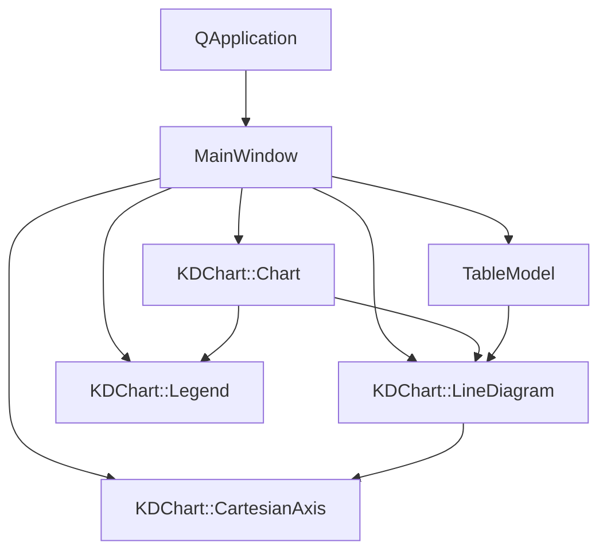
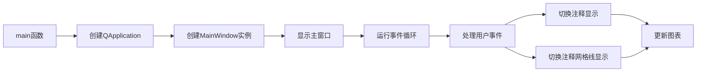

# 坐标轴标签配置示例

## 项目功能

本示例展示了如何使用KD Chart库配置坐标轴标签、注释和自定义刻度等高级功能。主要特性包括：

1. 自定义坐标轴标签文本和格式
2. 添加和管理坐标轴注释
3. 控制注释位置的网格线显示
4. 设置自定义刻度和刻度长度
5. 旋转坐标轴标签以避免重叠
6. 配置图例位置和对齐方式
7. 从CSV文件加载图表数据

## 文件结构

```
examples/Axis/Labels/
├── AdjustedCartesianAxis.cpp  // 自定义坐标轴实现
├── AdjustedCartesianAxis.h    // 自定义坐标轴头文件
├── BarChart.qrc               // 资源文件
├── CMakeLists.txt             // 构建配置文件
├── README.md                  // 项目说明文档
├── barSimple.csv              // 示例数据文件
├── main.cpp                   // 程序入口
├── mainwindow.cpp             // 主窗口实现
├── mainwindow.h               // 主窗口头文件
└── mainwindow.ui              // UI设计文件
```

## 代码执行逻辑

1. 程序入口点为`main.cpp`中的`main`函数，创建Qt应用程序对象和`MainWindow`实例
2. `MainWindow`构造函数初始化UI组件，创建图表布局和图表对象
3. 从CSV文件加载数据到`TableModel`对象
4. 创建折线图并设置数据模型
5. 配置X轴和Y轴，包括标签、自定义刻度和旋转属性
6. 设置图例位置和对齐方式
7. 连接UI控件的信号与槽函数，实现交互功能
8. 槽函数`annotationsToggled`和`gridLinesOnAnnotationsToggled`处理用户交互，更新图表注释和网格线显示

## Qt 5.15.2和C++17兼容性说明

- 代码使用Qt 5.15.2兼容的API，所有Qt类和方法均符合该版本规范
- 使用C++17标准特性，包括自动类型推导(`auto`)、列表初始化和智能指针
- 代码中未使用已废弃的Qt API，确保在Qt 5.15.2下正常编译和运行
- 所有头文件包含和命名空间使用均符合C++17标准

## 执行逻辑关系

### 类关系图



### 函数执行流程图

