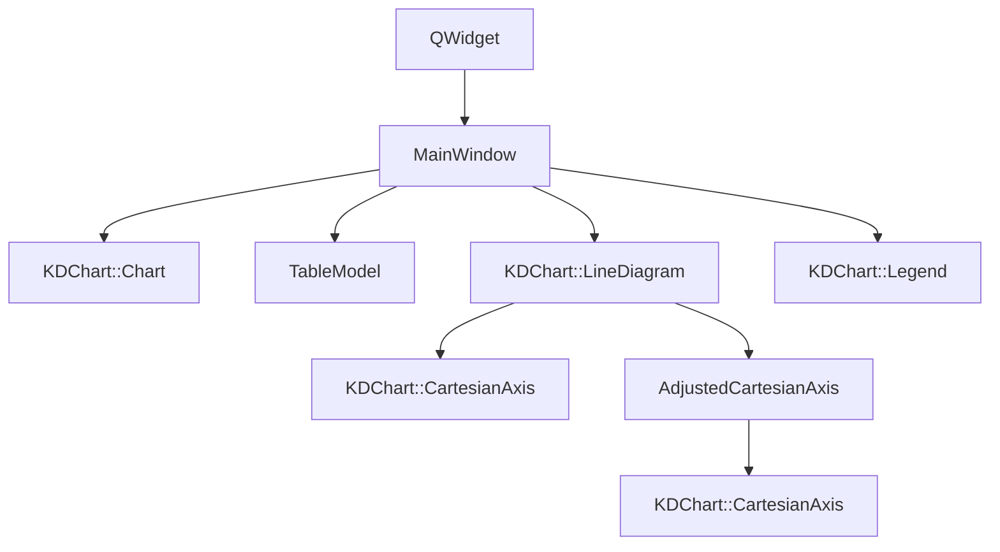
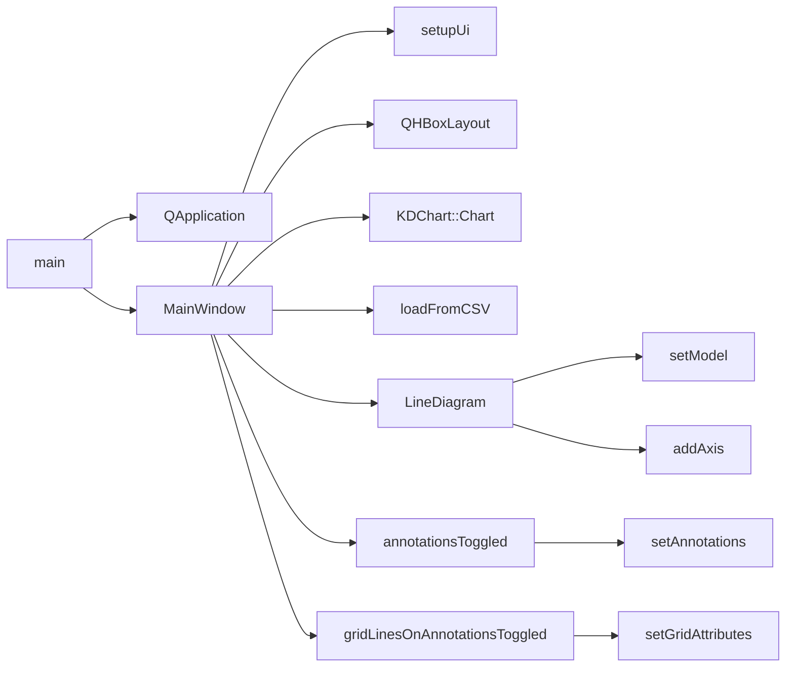

# 坐标轴标签自定义示例

## 项目概述
该示例展示了如何使用KD Chart库创建自定义坐标轴标签，实现坐标轴范围控制、标签格式化和注释功能。通过AdjustedCartesianAxis类扩展了KDChart的坐标轴功能，支持自定义边界设置和标签过滤。

## 文件结构
- **AdjustedCartesianAxis.h/cpp**: 自定义坐标轴实现，支持边界控制和标签过滤
- **mainwindow.h/cpp**: 主窗口类，管理图表布局和用户交互
- **main.cpp**: 应用程序入口点
- **BarChart.qrc**: 资源文件配置
- **mainwindow.ui**: UI界面设计文件

## 类功能说明
### AdjustedCartesianAxis类
- **核心功能**: 扩展KDChart::CartesianAxis，提供坐标轴边界控制和自定义标签格式化
- **关键方法**: 
  - `setBounds(qreal lower, qreal upper)`: 设置坐标轴显示范围
  - `customizedLabel(const QString &label)`: 过滤超出边界的标签

### MainWindow类
- **核心功能**: 创建图表界面，配置坐标轴属性，处理用户交互
- **关键属性**: 
  - `m_chart`: 图表对象，管理图表布局
  - `m_xAxis/m_yAxis`: 坐标轴对象，控制标签显示
  - `m_model`: 数据模型，存储图表数据
- **主要方法**: 
  - `annotationsToggled(bool)`: 切换坐标轴注释显示
  - `gridLinesOnAnnotationsToggled(bool)`: 控制注释位置网格线显示

## 代码执行逻辑
1. **应用程序初始化**: `main()`函数创建QApplication和MainWindow实例
2. **UI组件设置**: `MainWindow`构造函数调用`setupUi()`初始化界面
3. **图表配置**: 创建KDChart::Chart对象和布局管理器
4. **数据加载**: 从CSV文件加载图表数据到TableModel
5. **坐标轴设置**: 创建自定义坐标轴，配置标签旋转和位置
6. **用户交互**: 连接复选框信号到注释显示控制槽函数
7. **事件循环**: 启动QApplication事件循环，响应用户操作

## 执行逻辑关系
### 类关系图

### 函数执行流程图

## Qt5.15.2升级说明
- **主要变更点**: 
  - 检查QWidget::setLayout在高DPI环境下的布局行为
  - 验证KDChart::CartesianAxis坐标系计算逻辑变更
  - 确认QApplication构造函数参数要求变更
  - 检查KDChart::CartesianAxis::customizedLabel在Qt5.15.2中的行为变更
  - 验证QString::toDouble在不同语言环境下的解析行为
- **TODO项**: 
  - `// TODO: Qt5.15.2升级 检查QWidget::setLayout在Qt5.15.2中的高DPI布局行为`
  - `// TODO: Qt5.15.2升级 检查KDChart::CartesianAxis在Qt5.15.2中的坐标系计算逻辑变更`
  - `// TODO: Qt5.15.2升级 验证QApplication构造函数在Qt5.15.2中的参数要求变更`
  - `// TODO: Qt5.15.2升级 检查KDChart::CartesianAxis::customizedLabel在Qt5.15.2中的行为变更`
  - `// TODO: Qt5.15.2升级 验证QString::toDouble在不同语言环境下的解析行为`

## C++17升级说明
- **主要调整**: 
  - 使用constexpr优化成员变量初始化
  - 考虑使用std::unique_ptr管理动态对象
  - 应用[[maybe_unused]]标记未使用参数
  - 使用std::string_view优化字符串处理
  - 考虑使用std::optional返回可能为空的结果
  - 使用if constexpr优化条件判断
- **TODO项**: 
  - `// TODO: C++17升级 使用std::string_view优化字符串处理`
  - `// TODO: C++17升级 使用[[maybe_unused]]标记未使用的命令行参数`
  - `// TODO: C++17升级 考虑使用if constexpr优化条件判断`
  - `// TODO: C++17升级 可使用std::optional返回可能为空的标签结果`
  - `// TODO: C++17升级 使用constexpr优化常量表达式计算`
  - `// TODO: C++17升级 考虑使用结构化绑定优化多变量声明`