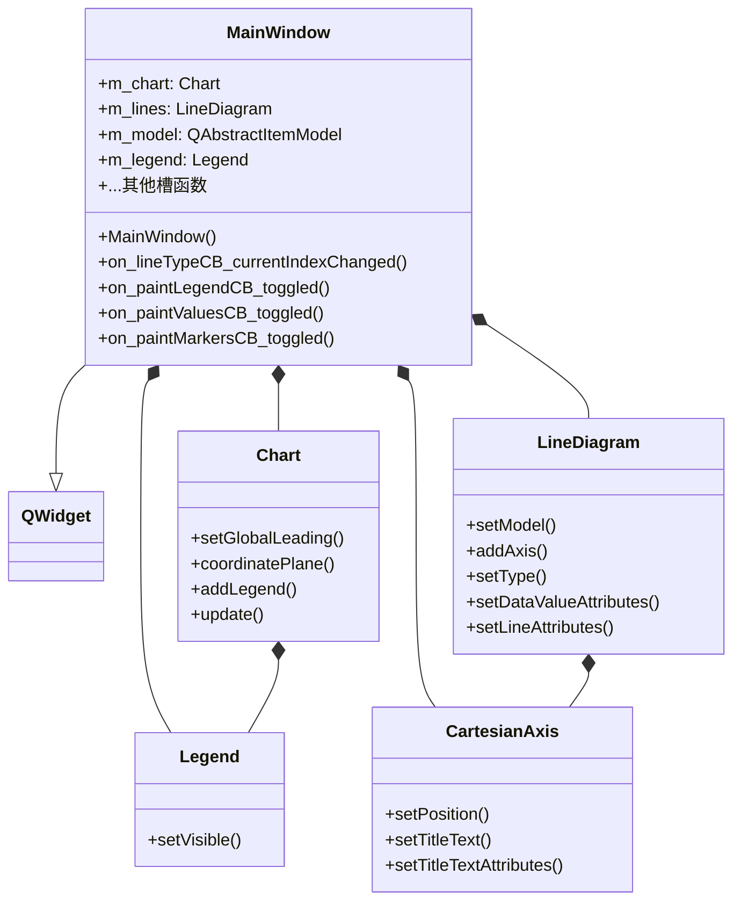
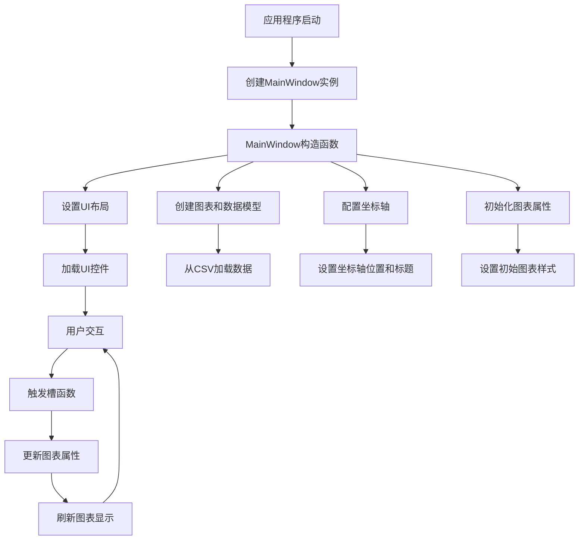

# 坐标轴参数配置示例工程

## 工程概述

这个示例工程展示了如何使用KD Chart库配置和自定义坐标轴参数，包括线条类型、标记样式、数值显示、区域填充和缩放功能等。通过交互式控件，用户可以实时调整图表的各种属性，直观地查看不同参数设置对图表外观的影响。

## 文件结构

- `main.cpp`: 应用程序入口文件，创建QApplication和MainWindow实例
- `mainwindow.h`: 主窗口类头文件，定义了UI元素和交互逻辑
- `mainwindow.cpp`: 主窗口类实现文件，包含图表初始化和参数配置逻辑
- `mainwindow.ui`: UI设计文件，定义了交互控件布局
- `data.csv`: 示例数据文件
- `README.md`: 工程说明文档

## 功能说明

该示例提供了以下坐标轴和图表参数配置功能：

1. **线条类型切换**：支持普通、堆叠和百分比三种折线图类型
2. **图例显示控制**：可切换图例的显示与隐藏
3. **数值标注控制**：可切换数据点数值的显示与隐藏
4. **标记点样式设置**：支持多种标记样式（方形、圆形、菱形等）和自定义大小
5. **区域填充控制**：可切换折线下方区域的填充状态和透明度
6. **缩放功能**：支持图表的缩放和平移操作

## 代码结构

### MainWindow类

#### 成员变量

- `m_chart`: KDChart::Chart对象，图表的主容器
- `m_lines`: KDChart::LineDiagram对象，折线图实例
- `m_model`: 数据模型，存储图表数据
- `m_legend`: KDChart::Legend对象，图表图例

#### 成员函数

- `MainWindow()`: 构造函数，初始化UI、图表布局和数据模型
- `on_lineTypeCB_currentIndexChanged()`: 处理线条类型切换
- `on_paintLegendCB_toggled()`: 处理图例显示控制
- `on_paintValuesCB_toggled()`: 处理数值标注控制
- `on_paintMarkersCB_toggled()`: 处理标记点显示控制
- `on_markersStyleCB_currentIndexChanged()`: 处理标记样式切换
- `on_markersWidthSB_valueChanged()`: 处理标记宽度调整
- `on_markersHeightSB_valueChanged()`: 处理标记高度调整
- `on_displayAreasCB_toggled()`: 处理区域填充控制
- `on_transparencySB_valueChanged()`: 处理透明度调整
- `on_zoomFactorSB_valueChanged()`: 处理缩放因子调整
- `on_hSBar_valueChanged()`: 处理水平滚动条事件
- `on_vSBar_valueChanged()`: 处理垂直滚动条事件

## 执行逻辑

1. 应用程序启动，创建MainWindow实例
2. 在MainWindow构造函数中：
   - 设置UI布局
   - 创建图表和数据模型
   - 配置四个坐标轴（底部、左侧、顶部和右侧）
   - 设置坐标轴标题和文本属性
   - 初始化图表属性和交互控件状态
3. 用户通过UI控件调整图表参数，触发相应的槽函数
4. 槽函数更新图表属性并调用`m_chart->update()`刷新显示

## 版本升级说明

### Qt 5.15.2 升级

该示例在Qt 5.15.2下兼容良好，未发现使用已废弃的API。以下是一些可能的优化点：

- 可以使用Qt 5.15引入的新图表特性增强交互体验
- 考虑使用Qt Quick替代部分UI组件以提高性能

### C++17 升级

该示例代码可以通过以下方式优化以支持C++17标准：

- 使用结构化绑定简化复杂数据类型的解构
- 利用std::optional处理可能为空的返回值
- 采用std::filesystem替代传统文件操作函数
- 使用if constexpr优化条件编译代码

## 执行逻辑关系图

