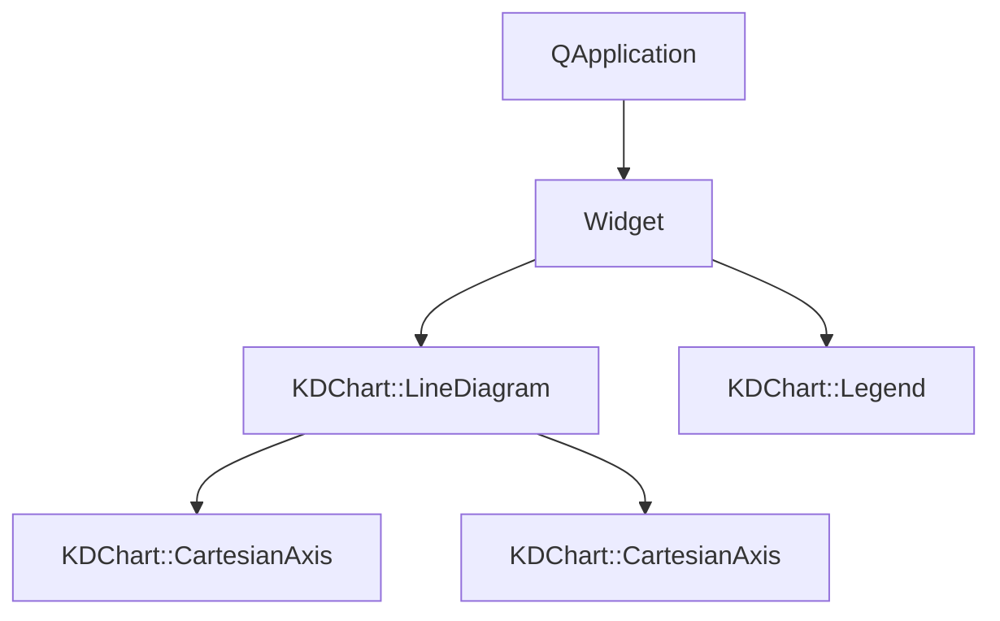
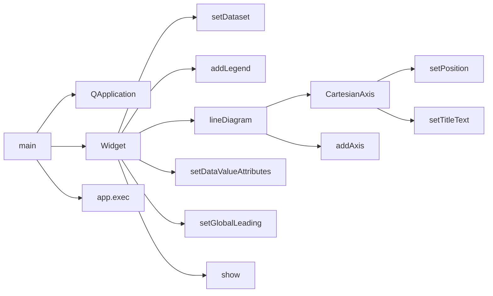

# 坐标轴控件示例

## 项目概述
该示例展示了KDChart::Widget控件的基本使用方法，重点演示坐标轴配置、数据绑定和图例设置。通过创建折线图并自定义坐标轴标签，展示了KDChart库的核心功能。

## 文件结构
- **main.cpp**: 应用程序入口点，配置图表和坐标轴
- **CMakeLists.txt**: 构建配置文件
- **README.md**: 项目说明文档

## 类功能说明
### Widget类 (KDChart::Widget)
- **核心功能**: 提供预配置的图表控件，集成图表显示和交互功能
- **关键方法**: 
  - `setDataset(int dataset, const QVector<qreal> &values, const QString &name)`: 绑定数据到图表
  - `addLegend(Position position)`: 添加图例并设置位置
  - `lineDiagram()`: 获取折线图对象
  - `setGlobalLeading(int top, int right, int bottom, int left)`: 设置图表边距

## 代码执行逻辑
1. **应用程序初始化**: `main()`函数创建QApplication和Widget实例
2. **窗口配置**: 设置窗口大小为600x600像素
3. **数据准备**: 创建抛物线形状的数据向量vec1
4. **数据绑定**: 将vec1数据集绑定到图表，设置图例名称
5. **图例设置**: 添加图例并放置在顶部位置
6. **坐标轴配置**: 创建X轴和Y轴，设置位置和标题
7. **标签设置**: 配置X轴完整标签和简短标签
8. **数据值显示**: 设置数据值可见属性
9. **边距调整**: 设置全局边距确保数据显示完整
10. **窗口显示**: 显示图表窗口并启动事件循环

## 执行逻辑关系
### 类关系图

### 函数执行流程图

## Qt5.15.2升级说明
- **主要变更点**: 
  - 检查CartesianAxis::setPosition在Qt5.15.2中的行为变更
  - 验证Widget控件在高DPI环境下的显示效果
- **TODO项**: 
  - `// TODO: Qt5.15.2升级 检查CartesianAxis::setPosition在Qt5.15.2中的行为变更`

## C++17升级说明
- **主要调整**: 
  - 使用std::unique_ptr管理动态创建的坐标轴对象
  - 考虑使用结构化绑定优化数据处理
- **TODO项**: 
  - `// TODO: C++17升级 使用std::unique_ptr管理xAxis和yAxis动态对象`