# 坐标轴控件示例工程

## 工程概述
此工程展示了如何在KD Chart库中使用坐标轴控件(Widget)来创建和配置折线图。示例中包含了坐标轴标签设置、图例配置、数据值显示等功能。

## 文件结构
- `CMakeLists.txt`: 构建配置文件
- `main.cpp`: 主程序入口文件，包含应用程序启动和图表配置逻辑

## 功能描述
1. 创建基本折线图并设置窗口大小
2. 配置数据集并添加到图表
3. 添加顶部图例
4. 配置X轴(底部)和Y轴(左侧)及其标题
5. 设置自定义坐标轴标签和简短标签
6. 显示数据点的值
7. 调整图表边距以确保数据值在边界处正确显示

## 代码执行逻辑
1. 创建Qt应用程序对象
2. 实例化Widget图表窗口并设置大小
3. 准备数据向量并填充抛物线形状的数据
4. 将数据集添加到图表并设置图例文本
5. 配置X轴和Y轴的位置和标题
6. 设置自定义的星期标签和简短标签
7. 启用数据值显示
8. 调整全局边距
9. 显示窗口并启动事件循环

## 版本升级说明
### Qt 5.15.2升级
- 经检查，此示例代码与Qt 5.15.2兼容
- 未使用已废弃的API
- 所有Qt相关功能在Qt 5.15.2中可正常工作

### C++17升级
- 已使用C++17特性: `auto` 类型推导
- 可考虑进一步优化: 使用结构化绑定、if constexpr等特性

## 执行逻辑关系

### 类关系图
```mermaid
graph TD
    A[QApplication] --> B[Widget]
    B --> C[LineDiagram]
    C --> D[CartesianAxis(X轴)]
    C --> E[CartesianAxis(Y轴)]
    C --> F[DataValueAttributes]
```

### 函数执行流程图

```mermaid
graph LR
    main[main函数] --> createApp[创建QApplication对象]
    createApp --> createWidget[创建Widget实例]
    createWidget --> resize[设置窗口大小]
    resize --> prepareData[准备数据]
    prepareData --> setDataset[设置数据集]
    setDataset --> addLegend[添加图例]
    addLegend --> createAxes[创建坐标轴]
    createAxes --> configureAxes[配置坐标轴]
    configureAxes --> setLabels[设置标签]
    setLabels --> addAxes[添加坐标轴到图表]
    addAxes --> showDataValues[显示数据值]
    showDataValues --> setMargins[设置边距]
    setMargins --> showWidget[显示窗口]
    showWidget --> exec[启动事件循环]
```
