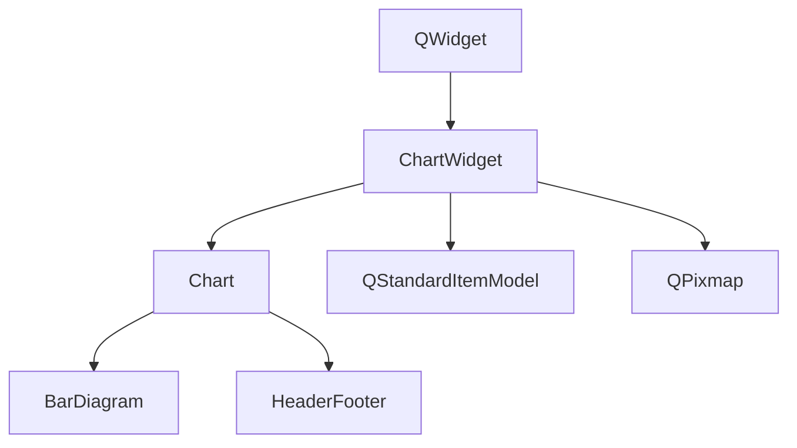
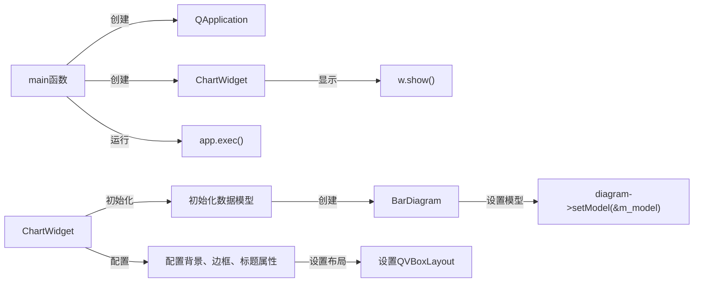

# 图表背景设置示例

## 项目功能

本示例展示了如何使用KD Chart库设置图表的背景、边框、标题和文本属性等。主要功能包括：

1. 设置坐标平面的背景图片，并配置图片拉伸模式
2. 配置图表标题（表头）的文本属性、背景和边框
3. 设置坐标平面的边框属性
4. 创建简单的柱状图并显示数据

## 文件结构

```
examples/Background/
├── CMakeLists.txt       # CMake构建配置文件
├── README.md            # 项目说明文档
├── background.png       # 背景图片资源
└── main.cpp             # 主程序文件，包含ChartWidget类的实现
```

## 代码执行逻辑

1. **ChartWidget类**：自定义图表窗口部件，继承自QWidget
   - 构造函数：初始化数据模型，创建柱状图，配置图表背景、边框、标题和文本属性
   - 私有成员：Chart对象、QStandardItemModel数据模型和QPixmap背景图片

2. **main函数**：应用程序入口
   - 创建QApplication对象
   - 实例化ChartWidget并显示
   - 启动应用程序事件循环

## Qt 5.15.2和C++17兼容性说明

- 本示例代码在Qt 5.15.2下编译运行正常
- 使用了C++11特性（如auto类型推导、范围for循环），完全兼容C++17标准
- 未使用任何已废弃的Qt API

## 类关系图



## 函数执行流程图

