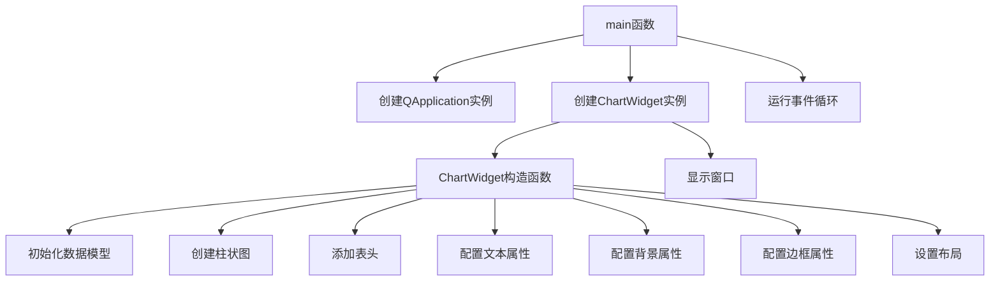

# Background 项目说明

## 项目概述

本项目是KD Chart库的示例，展示了如何设置图表的背景、边框、标题和文本属性等视觉元素。通过这个示例，您可以学习如何为图表添加背景图片、设置边框样式、配置标题文本属性等，以创建具有专业外观的图表。

## 文件结构

- `CMakeLists.txt`: 项目构建配置文件
- `README.md`: 项目说明文档
- `background.png`: 背景图片文件
- `main.cpp`: 程序入口和主要实现文件

## 类功能说明

### ChartWidget 类

继承自QWidget，用于展示如何设置KD Chart图表的背景、边框、标题和文本属性等。

#### 成员变量
- `m_chart`: KDChart::Chart对象，用于显示和管理图表及其所有元素
- `m_model`: QStandardItemModel对象，数据模型，存储和管理图表要显示的数据
- `pixmap`: QPixmap对象，背景图片，用于设置图表背景

#### 成员函数
- `explicit ChartWidget(QWidget *parent = nullptr)`: 构造函数，初始化数据模型，创建柱状图，配置图表背景、边框、标题和文本属性等

## 代码执行逻辑

1. 程序启动，执行main函数
2. 创建QApplication实例
3. 创建ChartWidget实例并显示
4. ChartWidget构造函数执行
   - 初始化数据模型并填充数据
   - 创建柱状图并设置数据模型
   - 添加表头并设置文本属性
   - 配置坐标平面的背景和边框属性
   - 配置表头的背景和边框属性
   - 设置窗口布局
5. 应用程序进入事件循环，等待用户交互

## 类关系图

```mermaid
classDiagram
    QWidget <|-- ChartWidget
    ChartWidget ..> KDChart::Chart : 包含
    ChartWidget ..> QStandardItemModel : 包含
    ChartWidget ..> QPixmap : 包含
    KDChart::Chart --> KDChart::BarDiagram : 包含
    KDChart::Chart --> KDChart::HeaderFooter : 包含
```

## 函数执行逻辑图



## Qt 5.15.2 和 C++17 兼容性说明

### Qt 5.15.2 升级
- 检查KDChart::BackgroundAttributes在Qt5.15.2中的兼容性
- 验证QPixmap和QVBoxLayout行为变化
- 确认KDChart库与Qt5.15.2的兼容性

### C++17 升级
- 考虑使用constexpr优化常量表达式
- 考虑使用结构化绑定优化多变量赋值
- 确保所有代码符合C++17标准规范

## TODO 项

1. `// TODO: Qt5.15.2升级 检查KDChart::BackgroundAttributes在Qt5.15.2中的兼容性` - main.cpp
2. `// TODO: Qt5.15.2升级 验证QPixmap和QVBoxLayout行为变化` - main.cpp
3. `// TODO: C++17升级 考虑使用constexpr优化常量表达式` - main.cpp
4. `// TODO: C++17升级 考虑使用结构化绑定优化多变量赋值` - main.cpp