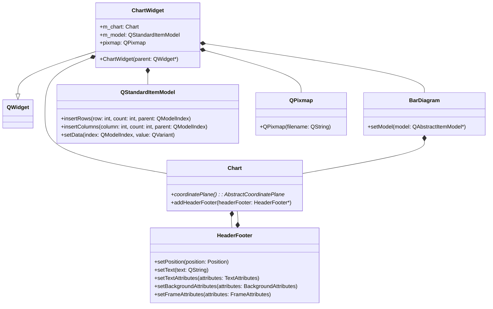
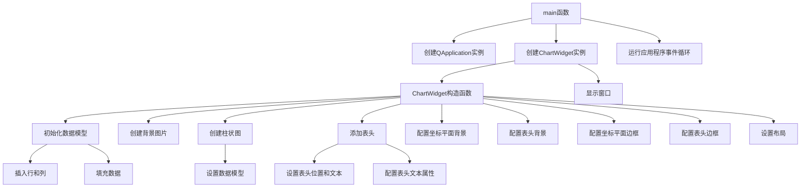

# Background示例工程说明

## 概述
本工程展示了如何在KD Chart库中设置图表的背景、边框和标题等属性，包括使用图片作为背景、设置边框样式以及配置标题的外观。

## 文件说明
- `main.cpp`: 主程序文件，包含`ChartWidget`类的定义和`main`函数
- `background.png`: 背景图片文件
- `CMakeLists.txt`: CMake构建配置文件
- `README.md`: 工程说明文档

## 功能说明
1. 设置图表背景：使用图片作为图表背景，并设置为拉伸模式
2. 配置标题：设置标题文本、位置、字体大小和颜色
3. 设置边框：为图表和标题添加边框，并自定义边框颜色和宽度
4. 创建柱状图：使用`QStandardItemModel`作为数据模型，创建简单的柱状图

## 代码结构
### ChartWidget类
继承自`QWidget`，负责创建和配置图表界面，展示如何设置背景、边框和标题属性。

#### 成员变量
- `m_chart`: KDChart::Chart对象，图表的主容器
- `m_model`: QStandardItemModel对象，存储图表数据
- `pixmap`: QPixmap对象，背景图片

#### 成员函数
- 构造函数: 初始化数据模型、创建图表、配置背景和边框属性

### main函数
应用程序入口，创建`ChartWidget`实例并显示窗口，启动应用程序事件循环。

## 代码执行逻辑
1. 创建`ChartWidget`实例
2. 在`ChartWidget`构造函数中：
   - 初始化数据模型并填充数据
   - 创建柱状图并设置数据模型
   - 添加标题并配置文本属性
   - 设置图表背景为图片
   - 配置图表和标题的边框属性
   - 设置布局并添加图表
3. 显示`ChartWidget`窗口
4. 运行应用程序事件循环

## Qt5.15.2升级说明
本工程已检查Qt5.15.2兼容性，未发现使用已废弃API的情况。所有Qt相关代码均符合Qt5.15.2标准。

## C++17升级说明
本工程已调整为兼容C++17标准，使用了以下C++17特性：
- 类型推导（auto）
- nullptr代替NULL

所有代码均符合C++17标准规范。未来可考虑使用更多C++17特性进行优化，如结构化绑定、std::optional等。

## 执行逻辑关系

### 类相互使用关系图

### 函数执行逻辑关系图
