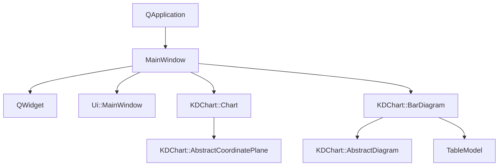
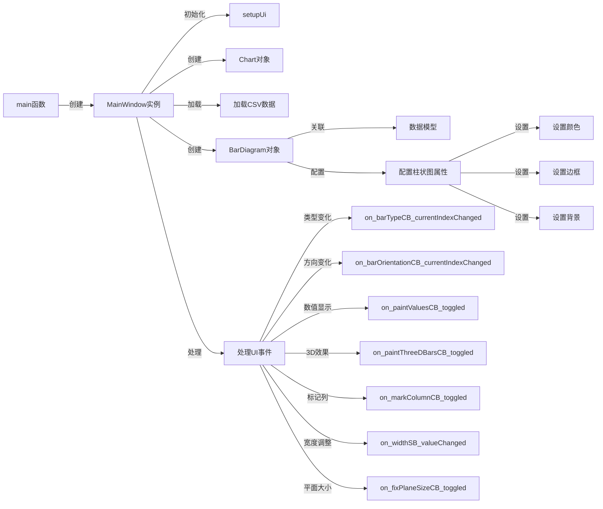

# 高级柱状图示例

## 项目功能

本项目是KD Chart库的高级柱状图示例，展示了如何创建和配置具有多种交互功能的柱状图。主要功能包括：

- 支持三种柱状图类型：普通柱状图、堆叠柱状图和百分比柱状图
- 可切换柱状图方向（垂直或水平）
- 可配置是否在柱状图上显示数值
- 支持3D效果及深度调整
- 可标记特定列，突出显示重要数据
- 可设置柱状图的固定宽度
- 支持固定坐标平面大小，便于缩放和滚动

## 文件结构

```
examples/Bars/Advanced/
├── BarChart.qrc         # 资源文件
├── CMakeLists.txt       # CMake构建文件
├── README.md            # 项目说明文档
├── barSimple.csv        # 示例数据文件
├── main.cpp             # 程序入口文件
├── mainwindow.cpp       # 主窗口实现文件
├── mainwindow.h         # 主窗口头文件
└── mainwindow.ui        # UI设计文件
```

## 代码执行逻辑

1. **程序入口**：`main.cpp`中的`main`函数创建Qt应用程序对象和`MainWindow`实例，并启动事件循环

2. **主窗口初始化**：
   - `MainWindow`构造函数调用`setupUi`初始化UI界面
   - 创建图表布局和`Chart`对象
   - 从CSV文件加载数据到`m_model`
   - 创建`BarDiagram`对象并关联数据模型
   - 配置柱状图的颜色、边框和背景

3. **用户交互处理**：
   - `on_barTypeCB_currentIndexChanged`：切换柱状图类型
   - `on_barOrientationCB_currentIndexChanged`：切换柱状图方向
   - `on_paintValuesCB_toggled`：显示/隐藏数值
   - `on_paintThreeDBarsCB_toggled`：启用/禁用3D效果
   - `on_markColumnCB_toggled`：标记/取消标记特定列
   - `on_depthSB_valueChanged`：调整3D深度
   - `on_threeDDepthCB_toggled`：启用/禁用3D深度自定义
   - `on_markColumnSB_valueChanged`：切换标记列
   - `on_widthSB_valueChanged`：调整柱状图宽度
   - `on_widthCB_toggled`：启用/禁用固定宽度
   - `on_fixPlaneSizeCB_toggled`：固定/取消固定坐标平面大小

## Qt 5.15.2和C++17兼容性说明

- 本项目使用的Qt API在Qt 5.15.2中均受支持，无需特殊修改
- 代码使用C++11特性，可以轻松迁移到C++17
- 如需利用C++17新特性，可以考虑使用`std::optional`、`std::string_view`等替代相应的Qt API

## 执行逻辑关系

### 类关系图



### 函数执行流程图

