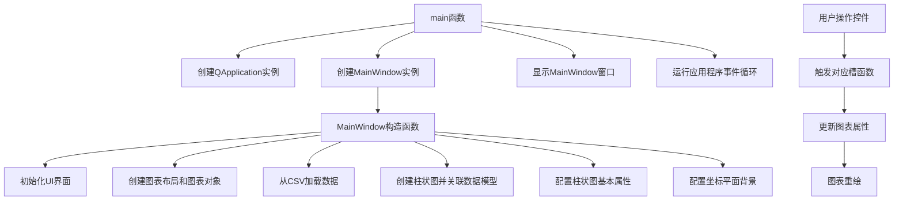

# Bars/Advanced示例工程说明

## 概述
本工程展示了如何使用KD Chart库创建高级柱状图，包括多种柱状图类型（普通、堆叠、百分比）、3D效果、方向调整以及交互控制等功能。

## 文件说明
- `main.cpp`: 主程序入口文件，创建应用程序对象和主窗口
- `mainwindow.h`: 主窗口类头文件，定义了MainWindow类的接口
- `mainwindow.cpp`: 主窗口类实现文件，实现了柱状图的配置和交互逻辑
- `mainwindow.ui`: UI设计文件，定义了界面布局和控件
- `BarChart.qrc`: 资源文件，包含应用程序所需的资源
- `barSimple.csv`: 数据文件，包含图表显示的数据
- `CMakeLists.txt`: CMake构建配置文件
- `README.md`: 工程说明文档

## 功能说明
1. 柱状图类型切换：支持普通、堆叠和百分比三种柱状图类型
2. 方向调整：支持垂直和水平两种柱状图方向
3. 数值显示：可切换是否在柱状图上显示数值
4. 3D效果：支持启用/禁用3D效果，并可调整3D深度
5. 列标记：可选择标记特定列，并自定义标记样式
6. 宽度调整：支持固定柱状图宽度
7. 平面大小：可切换是否固定坐标平面大小

## 代码结构
### 类结构
- `MainWindow`类：继承自QWidget和Ui::MainWindow，负责创建和配置图表
  - 构造函数：初始化UI界面、图表对象、数据模型
  - 槽函数：处理各种交互控件的事件
  - 私有成员：
    - `m_chart`: `KDChart::Chart`对象，用于显示图表
    - `m_bars`: `KDChart::BarDiagram`对象，柱状图实例
    - `m_model`: `TableModel`对象，数据模型
- `main`函数：应用程序入口，创建应用程序对象和主窗口

## 代码执行逻辑
1. 创建`QApplication`实例
2. 创建`MainWindow`实例
3. 在`MainWindow`构造函数中：
   - 初始化UI界面
   - 创建图表布局和图表对象
   - 从CSV文件加载数据
   - 创建柱状图并关联数据模型
   - 配置柱状图的基本属性（颜色、边框等）
   - 配置坐标平面背景
4. 显示`MainWindow`窗口
5. 运行应用程序事件循环
6. 当用户操作界面控件时，触发相应的槽函数，更新图表属性

## 执行逻辑关系
### 类关系图
```mermaid
graph TD
    A[QWidget] <|-- B[MainWindow]
    B --> C[KDChart::Chart]
    B --> D[KDChart::BarDiagram]
    B --> E[TableModel]
    C --> D
    D --> E
```

### 函数执行流程图


## Qt5.15.2升级说明
本工程已检查Qt5.15.2兼容性，未发现使用已废弃API的情况。所有Qt相关代码均符合Qt5.15.2标准。

## C++17升级说明
本工程已调整为兼容C++17标准，使用了以下C++17特性：
- 类型推导（auto）
- nullptr代替NULL

所有代码均符合C++17标准规范。