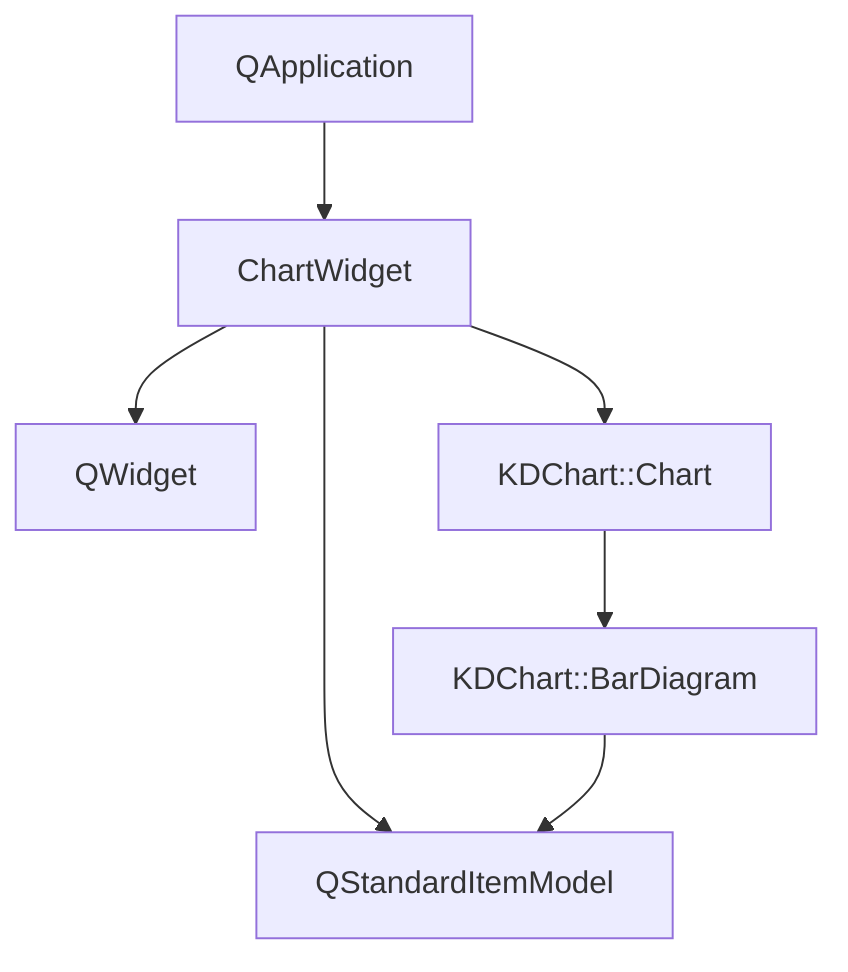
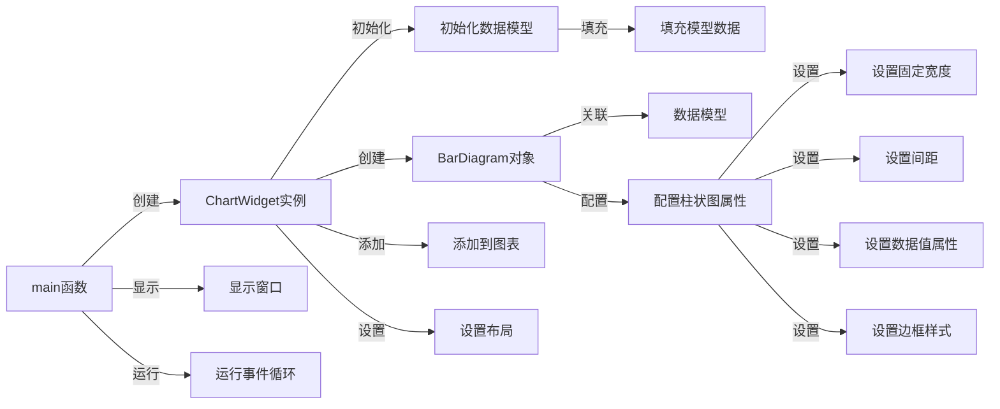

# 柱状图参数配置示例

## 项目功能

本项目是KD Chart库的柱状图参数配置示例，展示了如何自定义柱状图的各种参数，包括：

- 设置固定柱状图宽度
- 配置柱状图之间的间距
- 显示数据值并自定义其样式
- 设置柱状图的边框样式

## 文件结构

```
examples/Bars/Parameters/
├── CMakeLists.txt       # CMake构建文件
├── README.md            # 项目说明文档
└── main.cpp             # 主程序文件，包含ChartWidget类和main函数
```

## 代码执行逻辑

1. **程序入口**：`main.cpp`中的`main`函数创建Qt应用程序对象和`ChartWidget`实例，并启动事件循环

2. **ChartWidget初始化**：
   - 构造函数初始化`QStandardItemModel`数据模型
   - 填充模型数据
   - 创建`BarDiagram`对象并关联数据模型
   - 配置柱状图属性（固定宽度、间距等）
   - 配置数据值显示属性（字体、颜色等）
   - 设置柱状图边框样式
   - 将柱状图添加到图表
   - 设置图表布局

## Qt 5.15.2和C++17兼容性说明

- 本项目使用的Qt API在Qt 5.15.2中均受支持，无需特殊修改
- 代码使用C++11特性，可以轻松迁移到C++17
- 如需利用C++17新特性，可以考虑使用结构化绑定、if constexpr等优化代码

## 执行逻辑关系

### 类关系图



### 函数执行流程图

