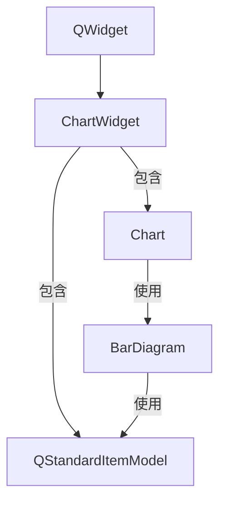
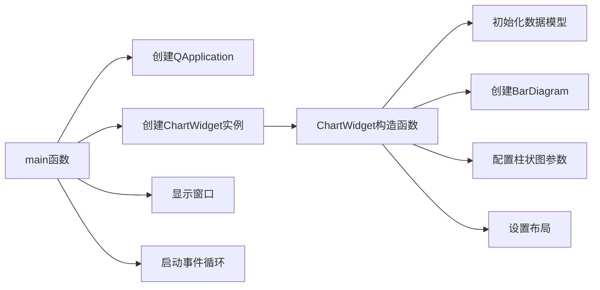

# 参数化柱状图示例

## 工程概述

本示例展示了如何在KD Chart库中配置柱状图的各种参数，包括固定宽度、间距、数值显示和边框样式等高级特性。通过这个示例，您可以学习如何精确控制柱状图的外观和行为，以满足特定的可视化需求。

## 文件说明

- `CMakeLists.txt`: 构建配置文件，用于编译和链接示例程序
- `main.cpp`: 主程序文件，包含ChartWidget类定义和应用程序入口

## 功能说明

1. **固定柱状图宽度**: 设置柱状图的固定宽度为140px
2. **间距控制**: 配置组间距因子(0.50)和柱间距因子(0.125)
3. **数据值显示**: 自定义数据值的字体(Comic, 9pt)、颜色(深绿色)和可见性
4. **边框样式**: 为特定数据集设置洋红色4px点线边框
5. **图表布局**: 设置图表顶部边距为40px

## 代码结构

### 类结构

```cpp
class ChartWidget : public QWidget
{
    Q_OBJECT
public:
    explicit ChartWidget(QWidget *parent = nullptr);

private:
    Chart m_chart; // 图表对象
    QStandardItemModel m_model; // 数据模型
};
```

### 核心函数

1. **ChartWidget构造函数**: 初始化数据模型，创建和配置柱状图，设置布局
2. **main函数**: 创建应用程序对象和ChartWidget实例，启动事件循环

## 代码执行逻辑

1. 程序启动，创建QApplication对象
2. 实例化ChartWidget，触发其构造函数
3. 在构造函数中:
   - 初始化QStandardItemModel(2行3列)
   - 填充模型数据(值为row*3+column)
   - 创建BarDiagram对象并关联模型
   - 配置BarAttributes(固定宽度、间距)
   - 配置DataValueAttributes(字体、颜色、可见性)
   - 设置特定数据集的边框样式
   - 将图表添加到布局并设置窗口布局
4. 显示ChartWidget窗口
5. 启动应用程序事件循环

## 类关系图



## 函数执行流程图



## Qt5.15.2兼容性说明

本示例代码与Qt5.15.2兼容，未使用已废弃的API。

## C++17兼容性说明

本示例代码使用了C++17特性，包括:
- `auto`关键字进行类型推导
- 空指针使用`nullptr`而非`NULL`
- 列表初始化

所有代码均符合C++17标准规范。