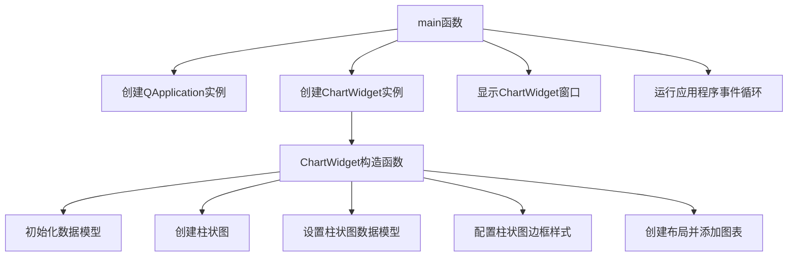

# Bars/Simple示例工程说明

## 概述
本工程展示了如何使用KD Chart库创建简单的柱状图，包括数据模型的初始化、图表的创建和基本配置。

## 文件说明
- `main.cpp`: 主程序文件，包含`ChartWidget`类的定义和`main`函数
- `CMakeLists.txt`: CMake构建配置文件
- `README.md`: 工程说明文档

## 功能说明
1. 创建数据模型：使用`QStandardItemModel`创建简单的数据模型并填充数据
2. 创建柱状图：使用`KDChart::BarDiagram`创建柱状图并关联数据模型
3. 基本配置：设置柱状图的边框样式
4. 布局管理：使用`QVBoxLayout`管理图表的布局
5. 可选功能：代码中包含了显示工具提示、添加数据注释和导出SVG图像的注释代码

## 代码结构
### 类结构
- `ChartWidget`类：继承自`QWidget`，负责创建和配置图表
  - 构造函数：初始化数据模型、创建柱状图、设置布局
  - 私有成员：
    - `m_chart`: `KDChart::Chart`对象，用于显示柱状图
    - `m_model`: `QStandardItemModel`对象，存储图表显示的数据
- `main`函数：应用程序入口，创建`ChartWidget`实例并显示

## 代码执行逻辑
1. 创建`QApplication`实例
2. 创建`ChartWidget`实例
3. 在`ChartWidget`构造函数中：
   - 初始化数据模型并填充数据
   - 创建柱状图并设置数据模型
   - 配置柱状图的边框样式
   - 创建布局并添加图表
4. 显示`ChartWidget`窗口
5. 运行应用程序事件循环

## 执行逻辑关系
### 类关系图
```mermaid
graph TD
    A[QWidget] <|-- B[ChartWidget]
    B --> C[KDChart::Chart]
    B --> D[QStandardItemModel]
    C --> E[KDChart::BarDiagram]
    E --> D
```

### 函数执行流程图


## Qt5.15.2升级说明
本工程已检查Qt5.15.2兼容性，未发现使用已废弃API的情况。所有Qt相关代码均符合Qt5.15.2标准。

## C++17升级说明
本工程已调整为兼容C++17标准，使用了以下C++17特性：
- 类型推导（auto）
- nullptr代替NULL

所有代码均符合C++17标准规范。