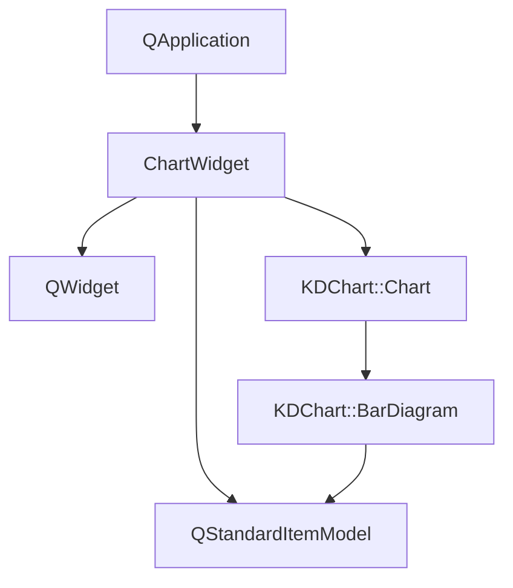
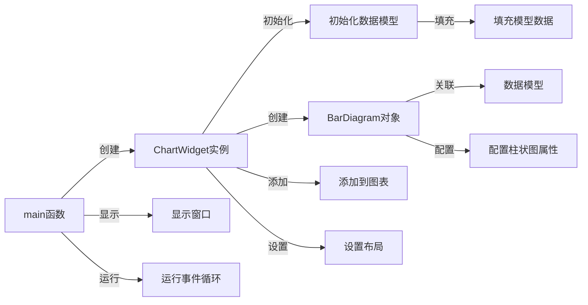

# 简单柱状图示例

## 项目功能

本项目是KD Chart库的简单柱状图示例，展示了如何创建和显示基本的柱状图，包括：

- 初始化数据模型
- 创建柱状图并关联数据
- 设置柱状图基本样式
- 简单的图表布局
- 可选的SVG导出功能

## 文件结构

```
examples/Bars/Simple/
├── CMakeLists.txt       # CMake构建文件
├── README.md            # 项目说明文档
└── main.cpp             # 主程序文件，包含ChartWidget类和main函数
```

## 代码执行逻辑

1. **程序入口**：`main.cpp`中的`main`函数创建Qt应用程序对象和`ChartWidget`实例，并启动事件循环

2. **ChartWidget初始化**：
   - 构造函数初始化`QStandardItemModel`数据模型
   - 填充模型数据
   - 创建`BarDiagram`对象并关联数据模型
   - 设置柱状图边框样式
   - 将柱状图添加到图表
   - 设置图表布局
   - 提供SVG导出功能的示例代码（已注释）

## Qt 5.15.2和C++17兼容性说明

- 本项目使用的Qt API在Qt 5.15.2中均受支持，无需特殊修改
- 代码使用C++11特性，可以轻松迁移到C++17
- 如需利用C++17新特性，可以考虑使用`std::optional`、结构化绑定等优化代码

## 执行逻辑关系

### 类关系图



### 函数执行流程图

