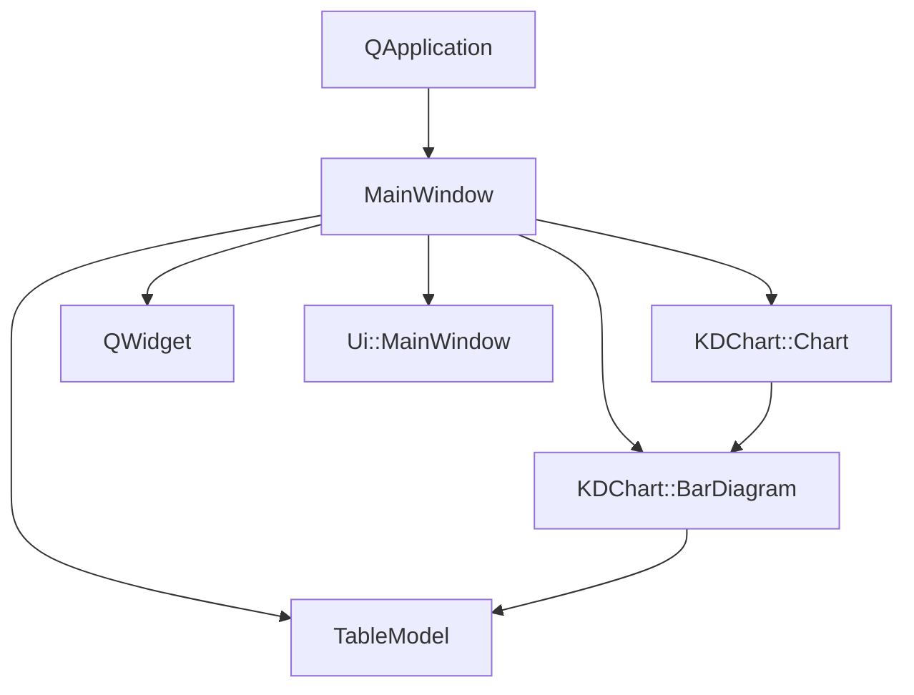

# DataValueTexts 示例项目

## 项目功能

DataValueTexts是KD Chart库的一个示例项目，展示了如何自定义图表中数据值文本的显示方式。主要功能包括：

1. 支持三种数据值作用域：
   - 全局作用域：应用于所有数据值
   - 数据集作用域：应用于选定数据集的所有数据值
   - 单bar作用域：应用于单个柱状图元素的数据值

2. 数据值文本自定义选项：
   - 显示/隐藏数据值
   - 字体选择
   - 相对大小调整
   - 最小像素大小设置
   - 旋转角度调整
   - 位置设置（顶部、底部、左侧、右侧等）
   - 对齐方式设置（居中、左对齐、右对齐等）
   - 水平和垂直填充调整
   - 标签、前缀和后缀文本设置

3. 从CSV文件加载示例数据

4. 实时更新图表显示

## 文件结构

```
DataValueTexts/
├── CMakeLists.txt       # 构建配置文件
├── DataValueTexts.qrc   # 资源文件
├── README.md            # 项目说明文档
├── barPositiveNegative.csv  # 示例数据文件
├── main.cpp             # 程序入口
├── mainwindow.cpp       # 主窗口实现
├── mainwindow.h         # 主窗口头文件
└── mainwindow.ui        # UI设计文件
```

## 代码执行逻辑

1. 程序入口：`main.cpp` 中的 `main` 函数
   - 创建 `QApplication` 对象，初始化Qt框架
   - 实例化 `MainWindow` 对象并显示
   - 启动应用程序事件循环

2. 主窗口初始化：`MainWindow` 构造函数
   - 初始化UI组件
   - 创建图表布局和图表对象
   - 从CSV文件加载数据
   - 创建柱状图并设置数据模型
   - 配置柱状图属性（画笔、边距等）
   - 设置初始UI状态

3. 用户交互处理：
   - 作用域切换（全局/数据集/单bar）
   - 数据值显示选项调整
   - 字体、大小、旋转角度等属性调整
   - 位置、对齐方式、填充等布局调整
   - 标签、前缀、后缀文本编辑

4. 图表更新：
   - 当用户更改设置时，更新数据值属性
   - 调用 `m_chart->update()` 刷新图表显示

## Qt 5.15.2兼容性说明

本项目在Qt 5.15.2下兼容，主要注意事项：

- `QApplication` 构造函数和 `exec()` 方法保持兼容
- KD Chart库的API在Qt 5.15.2下工作正常
- 未使用已废弃的Qt API

## C++17兼容性说明

本项目代码与C++17标准兼容，可考虑使用以下C++17特性优化：

- 使用 `std::optional` 处理可选值
- 使用 `std::string_view` 优化字符串处理
- 使用结构化绑定简化代码

## 执行逻辑关系

### 类关系图



### 函数执行流程图

```mermaid
graph TD
    main[main()]
    main --> QApplication[QApplication()]
    main --> MainWindow[MainWindow()]
    main --> show[show()]
    main --> exec[exec()]
    MainWindow --> setupUi[setupUi()]
    MainWindow --> chartLayout[创建图表布局]
    MainWindow --> loadData[加载CSV数据]
    MainWindow --> createBarDiagram[创建柱状图]
    MainWindow --> configBar[配置柱状图属性]
    MainWindow --> setInitialUI[设置初始UI状态]
    exec --> eventLoop[事件循环]
    eventLoop --> |用户交互| on_scopeOneBarRB_toggled
    eventLoop --> |用户交互| on_paintValuesCB_toggled
    eventLoop --> |用户交互| on_fontCombo_currentIndexChanged
    eventLoop --> |用户交互| 其他槽函数
    on_scopeOneBarRB_toggled --> populateWidgets[populateWidgets()]
    on_paintValuesCB_toggled --> attributes[attributes()]
    attributes --> setAttributes[setAttributes()]
    setAttributes --> updateChart[update()]
```

## 版本升级说明

### Qt 5.15.2升级

- 主要变更点：无重大API变更影响本项目
- 影响范围：最小
- 解决措施：无需修改代码

### C++17升级

- 主要调整点：无需要修改的兼容性问题
- 采用的新特性：暂无
- 兼容性处理：代码已兼容C++17标准

### TODO标记位置

本项目中无需要标记的Qt 5.15.2升级相关TODO项。