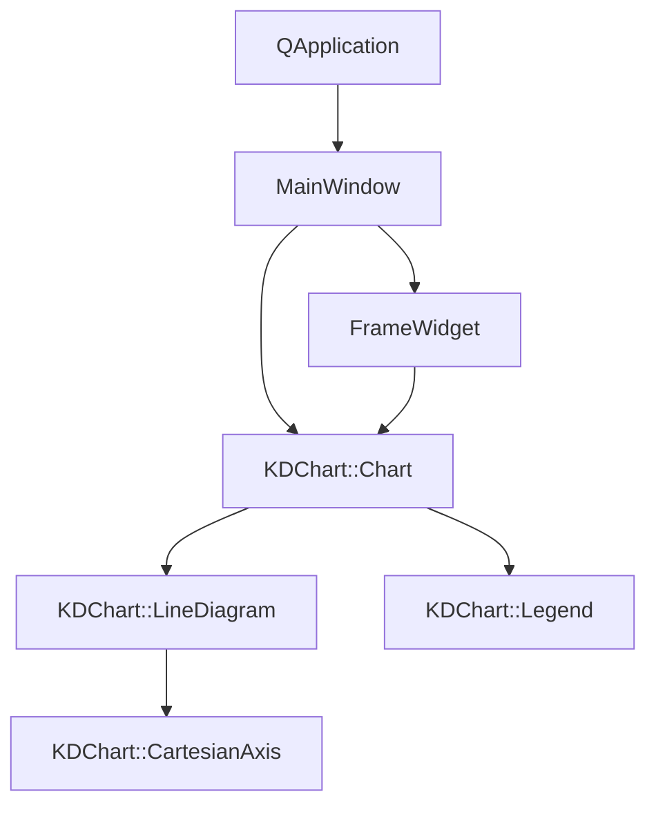
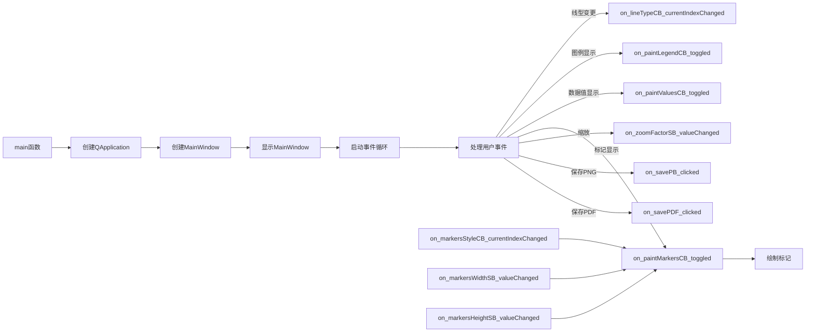

# DrawIntoPainter 示例项目

## 项目概述

本项目是KD Chart库的一个示例，展示了如何将图表绘制到自定义的QWidget中，并演示了各种图表属性的设置和操作。主要功能包括：

- 线图的绘制和配置（普通线、堆叠线、百分比线）
- 图表元素的自定义（线条样式、标记样式、区域填充）
- 图例的显示和隐藏
- 图表的缩放和平移操作
- 数据点标记的自定义
- 图表导出为PNG图片和PDF文件

## 文件结构

- `main.cpp`: 应用程序入口，创建并显示主窗口
- `mainwindow.h`: 主窗口类定义
- `mainwindow.cpp`: 主窗口类实现，包含图表初始化和各种交互功能
- `framewidget.h`: 自定义QWidget类定义，用于绘制图表
- `framewidget.cpp`: 自定义QWidget类实现，重写paintEvent来绘制图表
- `mainwindow.ui`: UI设计文件，定义了界面控件
- `CMakeLists.txt`: 构建配置文件
- `data`: 数据文件夹，包含CSV数据文件

## 代码执行逻辑

1. 程序启动时，`main`函数创建`QApplication`对象和`MainWindow`对象，并显示主窗口
2. `MainWindow`构造函数中：
   - 初始化UI控件
   - 创建图表布局和`FrameWidget`
   - 加载CSV数据
   - 设置图表属性（坐标轴、线条样式、框架、背景等）
   - 初始化图例
   - 创建两个小图表用于比较不同大小的绘制效果
3. 用户交互：
   - 线型组合框：切换线图类型（普通、堆叠、百分比）
   - 复选框：控制图例、数据值、标记、区域填充的显示/隐藏
   - 滑块和微调框：调整标记大小、透明度、缩放因子等
   - 滚动条：控制缩放中心
   - 按钮：保存图表为PNG或PDF
4. `FrameWidget`负责在自定义控件中绘制图表
5. 窗口大小改变时，调整小图表的位置

## Qt 5.15.2 兼容性说明

- `main.cpp`中使用了`<qapplication.h>`，建议升级为`<QApplication>`以符合Qt 5.15.2的命名规范
- `paintMarkers`函数中使用的`MarkerAttributes`可能需要检查是否有API变更
- 确保所有Qt相关的头文件引用使用大写字母开头的形式（如`<QApplication>`而不是`<qapplication.h>`）

## C++17 兼容性说明

本项目代码基本符合C++17标准，但可以考虑使用以下C++17特性进行优化：

- 使用结构化绑定简化复杂数据类型的声明
- 使用`std::optional`处理可能为空的值
- 利用`std::string_view`提高字符串处理效率
- 考虑使用`std::filesystem`替代传统文件操作API

## 类关系图

## 函数执行流程图

