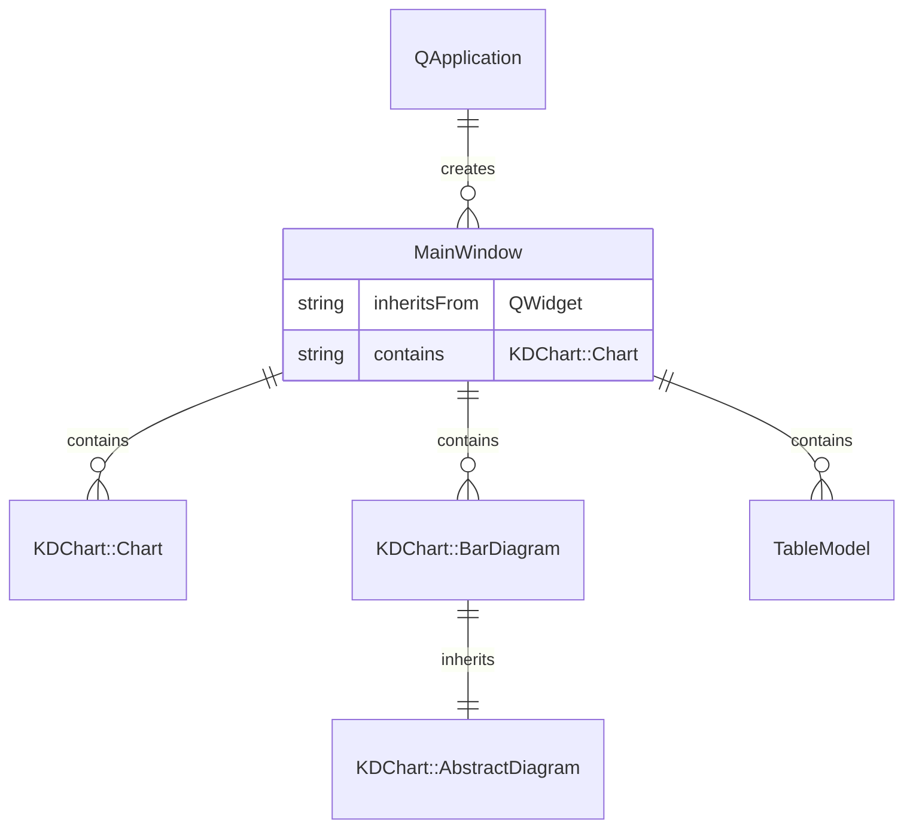
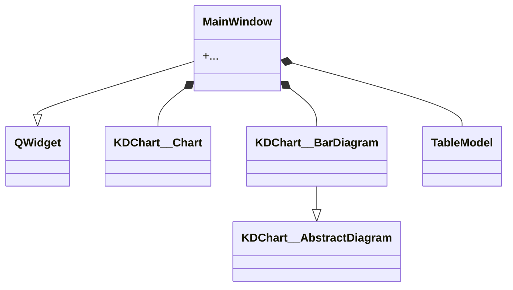
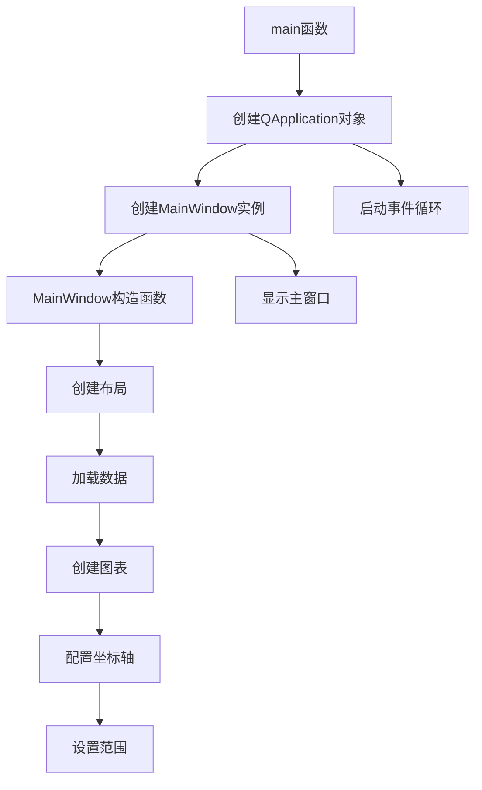

# EmptyValues 示例项目

## 项目功能

EmptyValues示例展示了KD Chart库如何处理和显示包含空值的数据。本项目主要功能包括：

1. 初始化包含空值的数据模型
2. 创建和配置柱状图
3. 设置图表的基本属性和布局
4. 演示空值在图表中的显示逻辑
5. 展示如何手动设置坐标平面的范围

## 文件结构

```
EmptyValues/
├── BarChart.qrc         # 资源文件
├── CMakeLists.txt       # CMake构建文件
├── README.md            # 项目说明文档
├── barSimple.csv        # 包含示例数据的CSV文件
├── main.cpp             # 应用程序入口文件
├── mainwindow.cpp       # 主窗口实现文件
└── mainwindow.h         # 主窗口头文件
```

## 代码执行逻辑

1. **应用程序启动**：
   - `main.cpp` 中的 `main` 函数初始化Qt应用程序
   - 创建 `MainWindow` 实例并显示
   - 启动应用程序事件循环

2. **主窗口初始化**：
   - 创建水平布局并添加图表
   - 从CSV文件加载包含空值的数据
   - 创建柱状图对象并设置数据模型
   - 为柱状图添加笛卡尔坐标轴
   - 替换坐标平面的图表为柱状图
   - 设置坐标平面的垂直范围

## Qt 5.15.2 兼容性说明

- 需要检查 `TableModel.h` 是否与Qt5.15.2兼容
- 考虑使用 `#include <QApplication>` 替代 `#include <qapplication.h>`
- 检查 `QStringLiteral` 是否可用于优化字符串处理
- 检查 `QApplication` 构造函数在Qt5.15.2中的变化

## C++17 兼容性说明

- 头文件包含方式符合C++17标准
- 使用 `auto` 关键字自动推导类型，符合C++17标准
- `using namespace` 指令符合C++17标准
- `dynamic_cast` 在C++17中仍受支持
- `QPair` 在Qt5.15.2中与C++17兼容
- 变量初始化方式符合C++17标准
- 函数调用方式符合C++17标准
- `return` 语句符合C++17标准

## 类关系图





## 函数执行流程图

