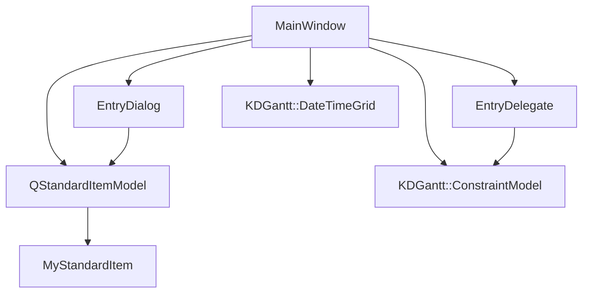
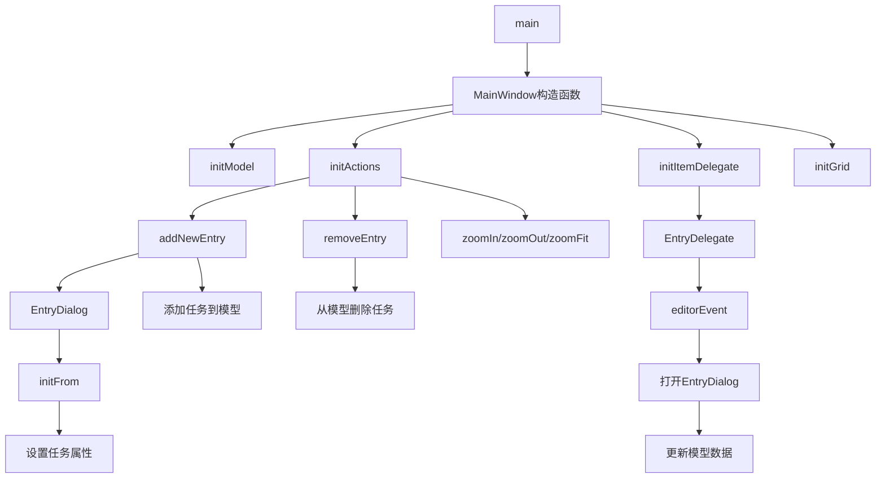

# Gantt 图例示例项目

## 项目功能

此项目展示了如何使用 KDGantt 库创建带有图例的甘特图应用程序。它允许用户创建、编辑和管理任务，设置任务之间的依赖关系，并通过图例直观地了解不同类型的任务项。

## 文件结构

```
examples/Gantt/legend_example/
├── CMakeLists.txt       # CMake 构建配置文件
├── entrydelegate.cpp    # 自定义项委托实现
├── entrydelegate.h      # 自定义项委托头文件
├── entrydialog.cpp      # 任务编辑对话框实现
├── entrydialog.h        # 任务编辑对话框头文件
├── entrydialog.ui       # 任务编辑对话框UI设计
├── main.cpp             # 应用程序入口点
├── mainwindow.cpp       # 主窗口实现
├── mainwindow.h         # 主窗口头文件
├── mainwindow.ui        # 主窗口UI设计
└── README.md            # 项目说明文档
```

## 类功能说明

### EntryDelegate 类

- **功能**：自定义项委托，用于处理甘特图中任务项的编辑事件
- **主要方法**：
  - `editorEvent`：处理双击事件，打开任务编辑对话框
  - `addConstraint`：添加任务之间的依赖约束
  - `setReadOnly`：设置任务项的只读状态
- **成员变量**：
  - `constraintModel`：任务约束模型，用于管理任务之间的依赖关系

### EntryDialog 类

- **功能**：任务编辑对话框，用于创建和编辑任务的详细信息
- **主要方法**：
  - `initFrom`：从模型索引初始化对话框数据
  - `name`/`setName`：获取/设置任务名称
  - `type`/`setType`：获取/设置任务类型
  - `startDate`/`setStartDate`：获取/设置任务开始日期
  - `endDate`/`setEndDate`：获取/设置任务结束日期
  - `completion`/`setCompletion`：获取/设置任务完成度
  - `legend`/`setLegend`：获取/设置任务图例
  - `depends`/`setDepends`：获取/设置依赖的任务
  - `readOnly`/`setReadOnly`：获取/设置只读状态
- **成员变量**：
  - `indexes`：持久化模型索引列表
  - `model`：任务数据模型
  - `ui`：对话框UI对象

### MainWindow 类

- **功能**：应用程序主窗口，管理甘特图视图和用户交互
- **主要方法**：
  - `initModel`：初始化数据模型
  - `initActions`：初始化菜单和工具栏动作
  - `initItemDelegate`：初始化项委托
  - `initGrid`：初始化甘特图网格
  - `showContextMenu`：显示上下文菜单
  - `enableActions`：根据选择启用动作
  - `addNewEntry`：添加新任务
  - `setReadOnly`：设置任务只读状态
  - `addConstraint`：添加任务约束
  - `removeEntry`：删除任务
  - `zoomIn`/`zoomOut`/`zoomFit`：缩放甘特图
  - `scaleAuto`/`scaleHour`/`scaleDay`/`scaleWeek`/`scaleMonth`：设置甘特图刻度
- **成员变量**：
  - `ui`：主窗口UI对象
  - `model`：任务数据模型
  - `constraintModel`：任务约束模型
  - `grid`：甘特图日期时间网格
  - `smallLegend`/`detailedLegend`：图例窗口
  - `newEntryAction`/`removeEntryAction`/`zoomInAction`等：菜单项和工具栏动作

### MyStandardItem 类

- **功能**：自定义标准项，继承自QStandardItem，用于在模型中存储数据
- **构造函数**：接受QVariant或QString类型数据，设置显示角色

## 代码执行逻辑

1. **应用程序启动**：
   - 执行`main.cpp`中的`main`函数，创建`MainWindow`实例
   - 显示主窗口

2. **主窗口初始化**：
   - 调用`initModel`创建数据模型、图例模型和约束模型
   - 调用`initActions`创建菜单和工具栏动作
   - 调用`initItemDelegate`设置自定义项委托
   - 调用`initGrid`初始化甘特图网格
   - 设置左侧树视图的列隐藏和表头属性
   - 连接信号和槽函数

3. **用户交互**：
   - 双击任务项触发`editorEvent`，打开`EntryDialog`编辑任务
   - 右键点击弹出上下文菜单，可添加或删除任务
   - 选择任务后，可通过菜单或快捷键执行相应操作
   - 可通过缩放功能调整甘特图显示比例
   - 可通过刻度菜单切换不同的时间刻度

4. **任务管理**：
   - 添加新任务时，弹出`EntryDialog`，设置任务属性
   - 任务信息存储在`model`中，通过`QStandardItemModel`管理
   - 任务之间的依赖关系通过`constraintModel`管理
   - 图例显示任务类型和颜色对应关系

## Qt 5.15.2 和 C++17 兼容性

### Qt 5.15.2 兼容性
- 代码使用了Qt 5.15.2支持的API，未发现使用已废弃的函数
- `QPointer`智能指针的使用符合Qt 5.15.2的最佳实践
- 信号槽语法使用了现代Qt的函数指针语法，提高了类型安全性

### C++17 兼容性
- 使用了C++17标准中的`std::max`算法
- 使用了C++17支持的范围for循环
- 代码结构清晰，符合C++17的编码规范
- 未使用C++17中已移除或修改的特性

## 执行逻辑关系

### 类相互使用关系



### 函数执行逻辑

