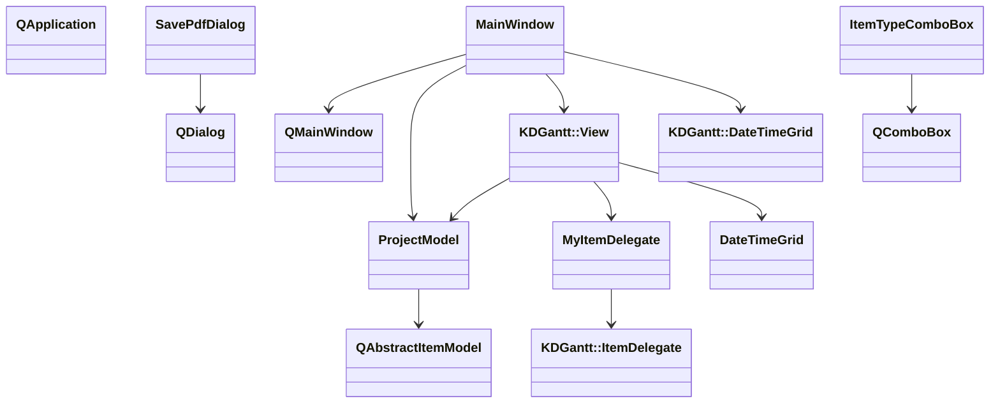
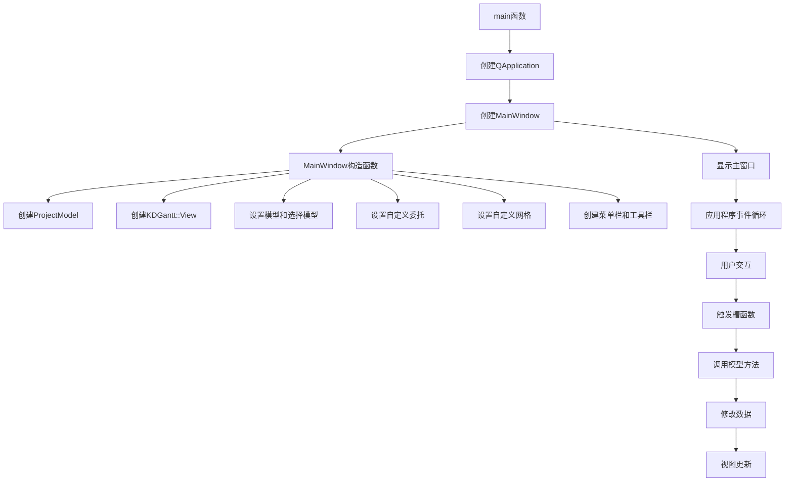

# 甘特图项目示例

## 项目概述

此项目是KD Chart库中的甘特图示例，展示了如何使用KDGantt组件创建功能完整的甘特图应用程序。该应用程序允许用户创建、编辑和管理项目任务，设置任务之间的依赖关系，并以甘特图形式可视化展示项目进度。

## 文件结构

- `main.cpp`: 应用程序入口文件，创建QApplication和MainWindow实例
- `mainwindow.h`: 主窗口类头文件，定义MainWindow和SavePdfDialog类
- `mainwindow.cpp`: 主窗口类实现文件，包含UI初始化、事件处理和业务逻辑
- `projectmodel.h`: 项目模型头文件，定义ProjectModel类
- `projectmodel.cpp`: 项目模型实现文件，提供数据存储和管理功能
- `CMakeLists.txt`: CMake构建脚本

## 类功能说明

### MainWindow类

继承自QMainWindow，是应用程序的主窗口。负责创建和管理UI组件，处理用户交互，以及协调模型和视图之间的交互。

主要功能：
- 初始化甘特图视图和模型
- 创建菜单栏和工具栏
- 处理文件操作（保存PDF、打印、退出）
- 处理工具操作（新建项目、追加项目、展开/折叠、对齐方式）

### SavePdfDialog类

继承自QDialog，是保存PDF文件的对话框。允许用户选择保存路径和设置打印选项。

主要功能：
- 提供文件路径输入框
- 提供行标签和列标签显示选项
- 处理文件选择对话框

### ProjectModel类

继承自QAbstractItemModel，是项目数据的模型。负责存储和管理项目任务数据，并提供标准的模型接口供视图访问。

主要功能：
- 存储项目任务数据
- 提供模型接口（rowCount、columnCount、data等）
- 支持数据的增删改查操作
- 支持数据的加载和保存（待实现）

### ItemTypeComboBox类

继承自QComboBox，是自定义的项目类型选择组合框。用于在编辑任务时选择任务类型。

主要功能：
- 提供任务类型选择（Task、Event、Summary）
- 支持项目类型的获取和设置

### MyItemDelegate类

继承自KDGantt::ItemDelegate，是自定义的项目委托。用于自定义甘特图项目的显示和编辑。

主要功能：
- 为任务类型列创建自定义编辑器
- 自定义任务类型的显示文本
- 处理编辑器数据和模型数据的转换

### DateTimeGrid类

继承自KDGantt::DateTimeGrid，是自定义的日期时间网格。用于自定义甘特图的背景和前景绘制。

主要功能：
- 自定义背景绘制（当前日期高亮）
- 自定义前景绘制（添加假期标记）

## 代码执行逻辑

1. 应用程序启动，执行main函数
2. 创建QApplication实例
3. 创建MainWindow实例并显示
4. MainWindow构造函数执行：
   - 创建ProjectModel实例
   - 创建KDGantt::View实例
   - 设置模型和选择模型
   - 为左侧视图设置自定义委托
   - 设置自定义网格
   - 创建菜单栏和工具栏
5. 用户与界面交互，触发相应的槽函数
6. 槽函数调用模型方法修改数据
7. 模型数据变化后，视图自动更新

## 执行逻辑关系

### 类相互使用关系

### 函数执行逻辑关系

## Qt 5.15.2 和 C++17 兼容性

本项目已检查Qt 5.15.2和C++17兼容性，未发现需要修改的API或语法问题。代码中使用的Qt类和方法在Qt 5.15.2中均受支持，C++语法也符合C++17标准。