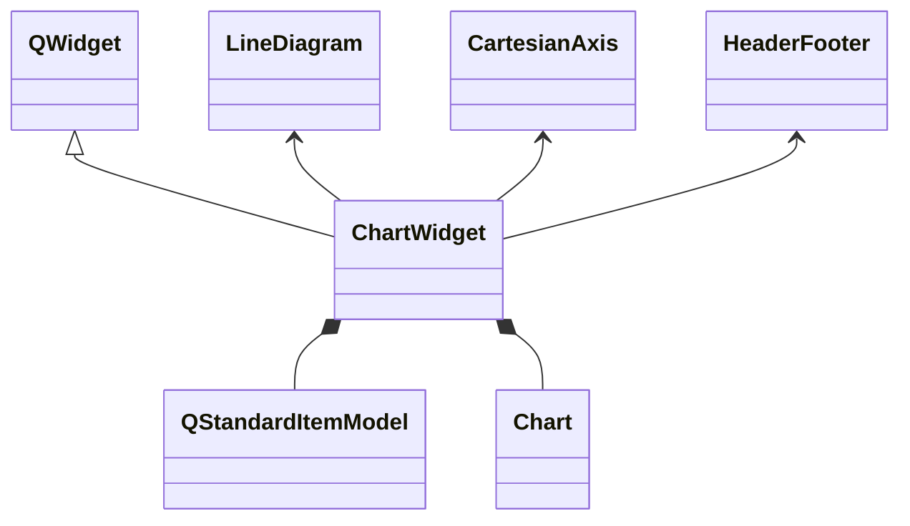
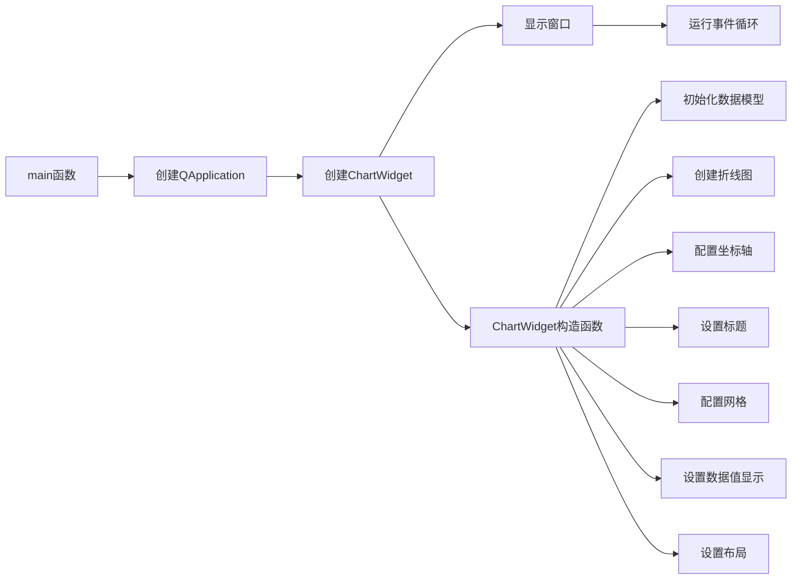

# CartesianGrid 示例项目

## 项目概述

本项目是KD Chart库的一个示例，展示了如何创建带有自定义网格配置的折线图。通过本示例，您可以学习如何配置图表的网格属性、标题样式、数据值显示以及坐标轴设置等功能。

## 文件结构

- `main.cpp`: 项目主文件，包含`ChartWidget`类定义和`main`函数
- `CMakeLists.txt`: CMake构建配置文件
- `main.moc`: Qt元对象编译器生成的文件（自动生成）

## 类功能说明

### ChartWidget 类

继承自`QWidget`，用于展示一个带有自定义网格配置的折线图。主要功能包括：

- 初始化数据模型并填充示例数据
- 创建折线图并设置数据模型
- 配置坐标轴（X轴和Y轴）
- 设置图表标题及其样式（文本属性、背景、边框）
- 自定义网格属性（主网格、子网格、零线）
- 配置数据值的显示方式和位置
- 设置窗口布局

### 主要函数

- `ChartWidget(QWidget *parent = nullptr)`: 构造函数，初始化图表和相关属性
- `main(int argc, char **argv)`: 程序入口函数，创建应用程序实例和图表窗口

## 代码执行逻辑

1. 程序启动，执行`main`函数
2. 创建`QApplication`实例
3. 创建`ChartWidget`实例并显示
4. 在`ChartWidget`构造函数中：
   - 初始化`QStandardItemModel`数据模型
   - 创建`LineDiagram`折线图并设置模型
   - 配置`CartesianAxis`坐标轴
   - 设置图表标题及其样式
   - 自定义网格属性
   - 配置数据值显示
   - 设置窗口布局
5. 运行应用程序事件循环

## Qt 5.15.2 和 C++17 兼容性

本项目已检查Qt 5.15.2和C++17兼容性：

- 使用了C++11及以上的特性（如`auto`类型推导、范围for循环）
- 所有Qt API调用与Qt 5.15.2兼容
- 代码符合C++17标准规范

## 执行逻辑关系图

### 类关系图

### 函数执行流程图

