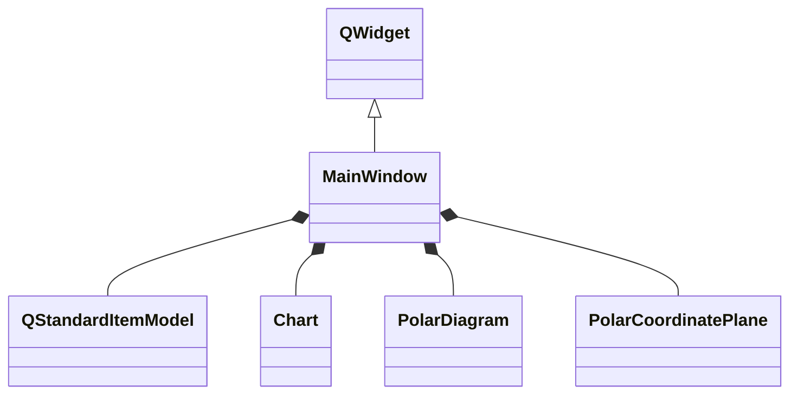
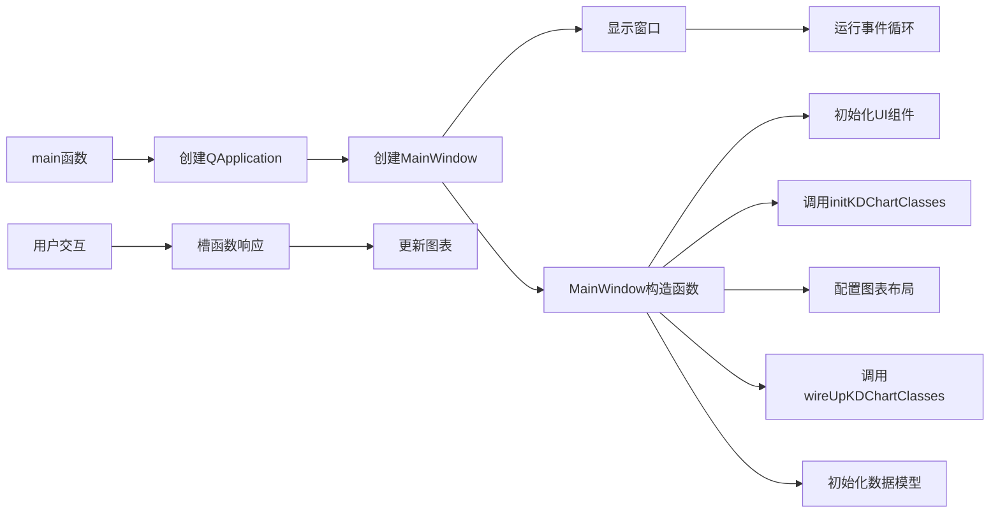

# PolarGrid 示例项目

## 项目概述

本项目是KD Chart库的一个示例，展示了如何创建和配置极坐标网格。通过本示例，您可以学习如何设置极坐标图表的网格属性、起始位置以及如何通过UI控件交互地调整这些属性。

## 文件结构

- `main.cpp`: 项目主文件，包含`main`函数
- `mainwindow.h`: 主窗口类头文件
- `mainwindow.cpp`: 主窗口类实现文件
- `mainwindow.ui`: UI设计文件
- `CMakeLists.txt`: CMake构建配置文件

## 类功能说明

### MainWindow 类

继承自`QWidget`和`Ui::MainWindow`，用于展示极坐标网格配置的示例。主要功能包括：

- 初始化KDChart相关类（图表、极坐标图、极坐标平面）
- 配置图表布局和数据模型
- 提供UI控件以交互方式调整极坐标网格属性
- 处理UI控件的信号事件

### 主要函数

- `MainWindow(QWidget *parent = nullptr)`: 构造函数，初始化窗口和图表
- `initKDChartClasses()`: 初始化KDChart相关类
- `wireUpKDChartClasses()`: 连接KDChart相关类
- `setItemModelData()`: 设置数据模型数据
- 槽函数：处理UI控件事件（如网格可见性、起始位置调整等）
- `main(int argc, char **argv)`: 程序入口函数

## 代码执行逻辑

1. 程序启动，执行`main`函数
2. 创建`QApplication`实例
3. 创建`MainWindow`实例并显示
4. 在`MainWindow`构造函数中：
   - 初始化UI组件
   - 调用`initKDChartClasses()`创建KDChart相关类
   - 配置图表布局
   - 调用`wireUpKDChartClasses()`连接KDChart相关类
   - 初始化数据模型并填充数据
5. 用户通过UI控件交互调整网格属性
6. 槽函数响应事件并更新图表
7. 运行应用程序事件循环

## Qt 5.15.2 和 C++17 兼容性

本项目已检查Qt 5.15.2和C++17兼容性：

- 使用了C++11及以上的特性（如`auto`类型推导、范围for循环）
- 所有Qt API调用与Qt 5.15.2兼容
- 代码符合C++17标准规范

## 执行逻辑关系图

### 类关系图

### 函数执行流程图

