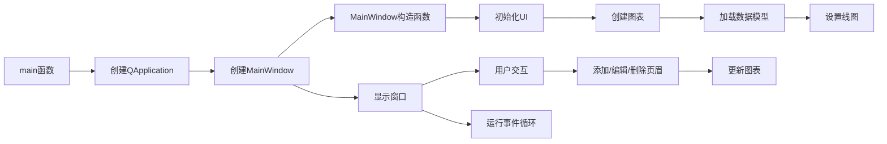

# HeadersFooters Advanced 示例项目

## 项目概述

本项目是KD Chart库的高级示例，展示了如何管理图表的页眉和页脚。通过本示例，您可以学习如何添加、编辑和删除图表的页眉和页脚，并自定义它们的属性。

## 文件结构

- `main.cpp`: 项目主文件，包含`main`函数
- `mainwindow.h`: 主窗口类头文件
- `mainwindow.cpp`: 主窗口类实现文件
- `mainwindow.ui`: 主窗口UI设计文件
- `addheaderdialog.ui`: 添加页眉对话框UI设计文件
- `HeadersFooters.qrc`: 资源文件
- `CMakeLists.txt`: CMake构建配置文件

## 代码功能说明

### 主要类

1. **HeaderItem**类
   - 继承自`QTreeWidgetItem`
   - 用于在树形视图中表示页眉/页脚项
   - 存储对应的`KDChart::HeaderFooter`指针

2. **MainWindow**类
   - 继承自`QWidget`和`Ui::MainWindow`
   - 提供添加、编辑和删除页眉/页脚的功能
   - 管理图表、数据模型和线图

### 主要函数

1. `MainWindow(QWidget *parent = nullptr)`: 构造函数，初始化UI、图表和数据模型
2. `setupAddHeaderDialog(QDialog *dlg, Ui::AddHeaderDialog &conf) const`: 设置添加页眉对话框
3. `on_addHeaderPB_clicked()`: 添加页眉按钮点击事件处理
4. `on_editHeaderPB_clicked()`: 编辑页眉按钮点击事件处理
5. `on_removeHeaderPB_clicked()`: 删除页眉按钮点击事件处理
6. `on_headersTV_itemSelectionChanged()`: 页眉表格选择项改变事件处理
7. `main(int argc, char **argv)`: 程序入口函数

### 代码执行逻辑

1. 程序启动，执行`main`函数
2. 创建`QApplication`实例
3. 创建`MainWindow`实例
4. `MainWindow`构造函数执行：
   - 初始化UI
   - 创建图表和布局
   - 加载数据模型
   - 设置线图
5. 显示主窗口
6. 用户交互：
   - 点击"添加页眉"按钮，弹出对话框添加新页眉/页脚
   - 选中页眉/页脚后，点击"编辑页眉"按钮修改属性
   - 选中页眉/页脚后，点击"删除页眉"按钮移除
7. 运行应用程序事件循环

## Qt 5.15.2 和 C++17 兼容性

本项目已检查Qt 5.15.2和C++17兼容性：

- 使用了C++11及以上的特性
- 所有Qt API调用与Qt 5.15.2兼容
- 代码符合C++17标准规范

## 执行逻辑关系图

### 类关系图

```mermaid
classDiagram
    class QWidget {
    }
    class MainWindow {
        -KDChart::Chart *m_chart
        -TableModel m_model
        -KDChart::DatasetProxyModel *m_datasetProxy
        -KDChart::LineDiagram *m_lines
        +MainWindow(QWidget*)
        +setupAddHeaderDialog(QDialog*, Ui::AddHeaderDialog&) const
        +on_addHeaderPB_clicked()
        +on_editHeaderPB_clicked()
        +on_removeHeaderPB_clicked()
        +on_headersTV_itemSelectionChanged()
    }
    class QTreeWidgetItem {
    }
    class HeaderItem {
        -KDChart::HeaderFooter *m_header
        +HeaderItem(KDChart::HeaderFooter*, QTreeWidget*)
        +header() const
    }
    class KDChart::Chart {
    }
    class TableModel {
    }
    class KDChart::DatasetProxyModel {
    }
    class KDChart::LineDiagram {
    }
    class KDChart::HeaderFooter {
    }

    MainWindow --> QWidget : 继承
    HeaderItem --> QTreeWidgetItem : 继承
    MainWindow --> KDChart::Chart : 包含
    MainWindow --> TableModel : 包含
    MainWindow --> KDChart::DatasetProxyModel : 包含
    MainWindow --> KDChart::LineDiagram : 包含
    HeaderItem --> KDChart::HeaderFooter : 包含
```

### 函数执行流程图

