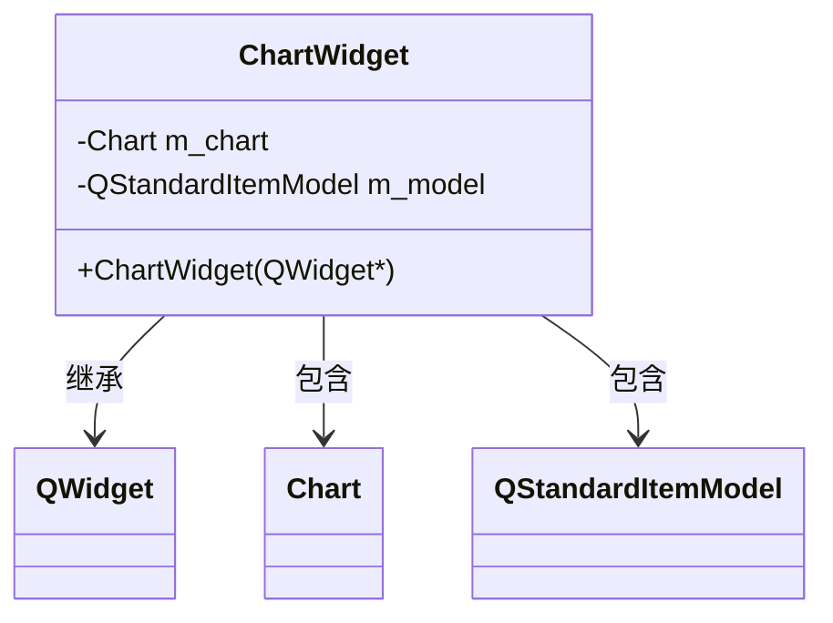
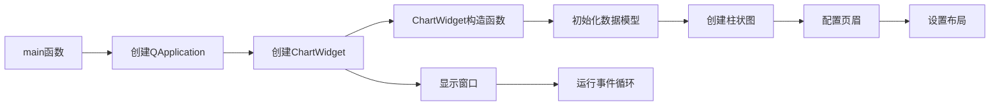

# HeadersFootersParameters 示例项目

## 项目概述

本项目是KD Chart库的一个示例，展示了如何自定义图表页眉的各种属性。通过本示例，您可以学习如何创建柱状图、配置页眉的文本属性、背景属性和边框属性。

## 文件结构

- `main.cpp`: 项目主文件，包含`ChartWidget`类和`main`函数
- `CMakeLists.txt`: CMake构建配置文件

## 代码功能说明

### ChartWidget类

`ChartWidget`类继承自`QWidget`，主要功能包括：

- 初始化数据模型并填充数据
- 创建柱状图并设置数据模型
- 配置图表页眉的位置和文本
- 自定义页眉的文本属性（颜色、字体大小）
- 自定义页眉的背景属性（颜色、可见性）
- 自定义页眉的边框属性（颜色、宽度、可见性）
- 设置窗口布局

### 主要函数

1. `ChartWidget(QWidget *parent = nullptr)`: 构造函数，初始化图表和页眉属性
2. `main(int argc, char **argv)`: 程序入口函数，创建应用程序和图表窗口

### 代码执行逻辑

1. 程序启动，执行`main`函数
2. 创建`QApplication`实例
3. 创建`ChartWidget`实例
4. `ChartWidget`构造函数执行：
   - 初始化数据模型
   - 创建柱状图并设置模型
   - 添加并配置页眉
   - 设置布局
5. 显示图表窗口
6. 运行应用程序事件循环

## Qt 5.15.2 和 C++17 兼容性

本项目已检查Qt 5.15.2和C++17兼容性：

- 使用了C++11及以上的特性
- 所有Qt API调用与Qt 5.15.2兼容
- 代码符合C++17标准规范

## 执行逻辑关系图

### 类关系图

### 函数执行流程图

