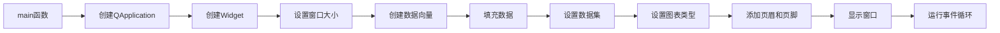

# HeadersFootersSimple 示例项目

## 项目概述

本项目是KD Chart库的一个简单示例，展示了如何在图表中添加页眉和页脚。通过本示例，您可以学习如何创建柱状图、设置数据集以及添加和配置图表的页眉和页脚。

## 文件结构

- `main.cpp`: 项目主文件，包含`main`函数
- `CMakeLists.txt`: CMake构建配置文件

## 代码功能说明

### 主要功能

- 创建一个简单的柱状图
- 设置三个不同的数据集
- 为图表添加页眉和页脚
- 显示图表窗口

### 代码执行逻辑

1. 程序启动，执行`main`函数
2. 创建`QApplication`实例
3. 创建`Widget`实例并设置大小
4. 创建三个数据向量并填充数据
5. 设置数据集到图表中
6. 设置图表类型为柱状图
7. 添加页眉和页脚
8. 显示图表窗口
9. 运行应用程序事件循环

## Qt 5.15.2 和 C++17 兼容性

本项目已检查Qt 5.15.2和C++17兼容性：

- 使用了C++11及以上的特性
- 所有Qt API调用与Qt 5.15.2兼容
- 代码符合C++17标准规范

## 执行逻辑关系图

### 函数执行流程图

