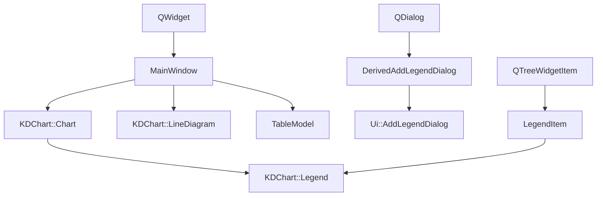
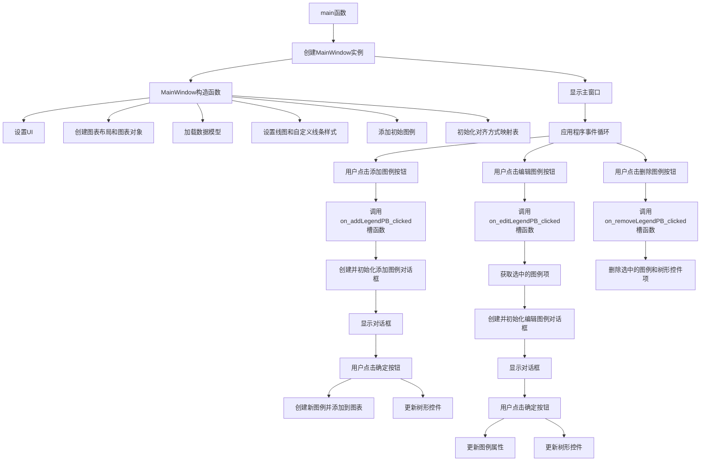

# LegendAdvanced 项目说明

## 项目概述

LegendAdvanced是KD Chart库的一个高级图例示例项目，展示了如何创建、编辑、删除和自定义图表图例。该项目允许用户通过图形界面交互地配置图例的位置、对齐方式、标题、方向和样式等属性，并实时预览更改效果。

## 文件结构

```
LegendAdvanced/
├── CMakeLists.txt       # CMake构建配置文件
├── Legends.qrc          # Qt资源文件
├── main.cpp             # 应用程序入口文件
├── mainwindow.h         # 主窗口类头文件
├── mainwindow.cpp       # 主窗口类实现文件
├── derivedaddlegenddialog.h # 派生的添加图例对话框头文件
├── derivedaddlegenddialog.cpp # 派生的添加图例对话框实现文件
├── ui/
│   ├── addlegenddialog.ui   # 添加图例对话框UI文件
│   └── mainwindow.ui        # 主窗口UI文件
└── README.md            # 项目说明文档
```

## 主要类功能说明

### MainWindow 类

- **功能**：应用程序的主窗口，负责创建图表、数据模型和管理图例
- **成员变量**：
  - `m_chart`：KDChart::Chart对象，用于显示图表
  - `m_lines`：KDChart::LineDiagram对象，线图图表类型
  - `m_model`：TableModel对象，数据模型
  - `alignmentMap`：QMap<Qt::Alignment, QString>对象，对齐方式映射表
- **主要方法**：
  - 构造函数：初始化UI、图表、数据模型和初始图例
  - `initAddLegendDialog`：初始化添加图例对话框
  - 槽函数：处理添加、编辑、删除图例和选择项变更事件

### DerivedAddLegendDialog 类

- **功能**：派生的添加图例对话框，用于配置图例属性
- **继承**：QDialog和Ui::AddLegendDialog
- **构造函数**：创建对话框实例并设置UI

### LegendItem 类

- **功能**：图例项辅助类，用于在树形控件中存储图例对象的引用
- **继承**：QTreeWidgetItem
- **成员变量**：`m_legend`，关联的图例对象
- **主要方法**：`legend()`，获取关联的图例对象

## 代码执行逻辑

1. 应用程序启动，执行main函数
2. 创建MainWindow实例
3. MainWindow构造函数执行：
   - 设置UI
   - 创建图表布局和图表对象
   - 加载数据模型
   - 设置线图和自定义线条样式
   - 添加初始图例并设置其属性
   - 初始化对齐方式映射表
4. 用户交互：
   - 点击"添加图例"按钮：打开添加图例对话框，配置并添加新图例
   - 点击"编辑图例"按钮：打开编辑图例对话框，更新选中图例的属性
   - 点击"删除图例"按钮：删除选中的图例
   - 选择图例项：更新删除按钮的启用状态
5. 应用程序事件循环

## 类关系图



## 函数执行逻辑图



## Qt 5.15.2 和 C++17 兼容性说明

1. **Qt 5.15.2 兼容性**：
   - 项目中使用的Qt API均兼容Qt 5.15.2版本
   - 未使用已废弃的Qt API
   - UI文件和资源管理符合Qt 5.15.2的规范

2. **C++17 兼容性**：
   - 代码中使用的C++特性均符合C++17标准
   - 可以考虑使用C++17的结构化绑定和if constexpr等特性进一步优化代码
   - 建议使用C++17的filesystem库替代传统文件操作函数

## TODO: Qt5.15.2升级

- 目前项目中未发现需要修改的Qt API调用
- 建议定期检查KD Chart库是否有针对Qt 5.15.2的更新版本