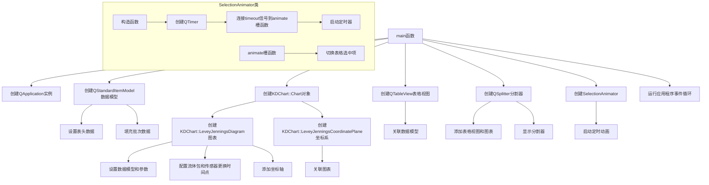

# Levey-Jennings 图表示例项目

## 项目概述

本项目展示了如何使用KD Chart库创建Levey-Jennings质量控制图表。Levey-Jennings图表是一种常用于临床实验室质量控制的图表类型，用于监控测试过程的稳定性和准确性。

## 文件结构

- `CMakeLists.txt`: 项目构建配置文件
- `main.cpp`: 主程序文件，包含图表实现代码
- `README.md`: 项目说明文档

## 主要类功能说明

### SelectionAnimator 类

- **功能**: 继承自QObject，用于在表格视图中自动切换选中项，实现动画效果
- **构造函数**: `SelectionAnimator(QAbstractItemView *view)` - 创建动画器实例并关联到指定表格视图
- **槽函数**: `animate()` - 每秒触发一次，切换表格中的选中项
- **成员变量**: `view` - 关联的表格视图对象

## 代码执行逻辑

1. 创建QApplication应用程序实例
2. 创建14行6列的QStandardItemModel数据模型
3. 设置表头数据（批次、数值、合格、日期/时间、平均值、标准差）
4. 填充两批次的质量控制数据
5. 创建KDChart::Chart图表对象
6. 创建KDChart::LeveyJenningsDiagram图表并配置数据模型、预期平均值和标准差
7. 创建KDChart::LeveyJenningsCoordinatePlane坐标系并关联图表
8. 配置流体包和传感器更换时间点
9. 添加左侧、右侧和底部坐标轴
10. 创建QTableView表格视图并关联数据模型
11. 创建QSplitter分割器布局，添加表格视图和图表
12. 显示分割器
13. 创建SelectionAnimator实现表格选中动画
14. 运行应用程序事件循环

## 类关系图

```mermaid
classDiagram
    class QObject {
    }
    class SelectionAnimator {
        +SelectionAnimator(QAbstractItemView *view)
        +animate()
        -view: QAbstractItemView *
    }
    QObject <|-- SelectionAnimator
    SelectionAnimator --> QAbstractItemView

    class QApplication {
    }
    class QStandardItemModel {
    }
    class KDChart::Chart {
    }
    class KDChart::LeveyJenningsDiagram {
    }
    class KDChart::LeveyJenningsCoordinatePlane {
    }
    class KDChart::LeveyJenningsAxis {
    }
    class QTableView {
    }
    class QSplitter {
    }

    QApplication --> QStandardItemModel
    QApplication --> KDChart::Chart
    KDChart::Chart --> KDChart::LeveyJenningsCoordinatePlane
    KDChart::LeveyJenningsCoordinatePlane --> KDChart::LeveyJenningsDiagram
    KDChart::LeveyJenningsDiagram --> QStandardItemModel
    KDChart::LeveyJenningsDiagram --> KDChart::LeveyJenningsAxis
    QTableView --> QStandardItemModel
    QSplitter --> QTableView
    QSplitter --> KDChart::Chart
```

## 函数执行逻辑图



## Qt 5.15.2 兼容性说明

- 需要检查KDChart::LeveyJennings相关类在Qt5.15.2中的兼容性
- 需要验证QDateTime::fromString在Qt5.15.2中的行为是否有变化
- 代码中已添加相关TODO注释标记

## C++17 兼容性说明

- 考虑使用结构化绑定优化数据模型的设置
- 考虑使用if constexpr优化条件判断逻辑
- 代码中已添加相关TODO注释标记

## TODO项

- `// TODO: Qt5.15.2升级 检查KDChart::LeveyJennings相关类在Qt5.15.2中的兼容性`
- `// TODO: Qt5.15.2升级 验证QDateTime::fromString在Qt5.15.2中的行为是否有变化`
- `// TODO: C++17升级 考虑使用结构化绑定优化数据模型的设置`
- `// TODO: C++17升级 考虑使用if constexpr优化条件判断逻辑`