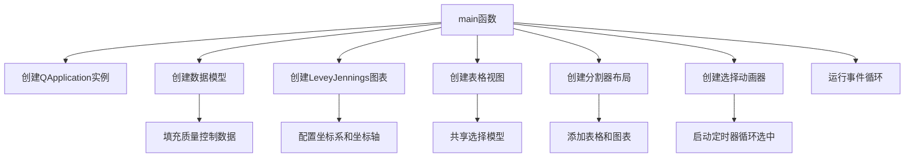

# Levey-Jennings图表示例项目

## 项目概述

本项目展示了如何使用KD Chart库创建Levey-Jennings图表，这是一种常用于实验室质量控制的可视化工具，用于监控测量结果随时间的变化趋势。该示例包含数据模型、图表配置、表格视图联动及自动选择动画功能，完整演示了Levey-Jennings图表的核心应用场景。

## 文件结构

- `CMakeLists.txt`: 项目构建配置文件
- `main.cpp`: 主要源代码文件，包含SelectionAnimator类和main函数
- `README.md`: 项目说明文档

## 类功能说明

### SelectionAnimator类

继承自QObject，实现表格视图行的自动循环选中效果：
- **核心功能**：通过定时器控制表格视图的选中项切换，实现数据高亮动画
- **关键方法**：
  - 构造函数：初始化定时器并设置1秒触发间隔
  - animate()槽函数：实现行索引循环计算与选中状态更新
- **成员变量**：`view`（关联的表格视图指针）

### main函数

应用程序入口点，负责创建Levey-Jennings图表并配置相关组件：
- 初始化QApplication实例
- 创建14行6列的QStandardItemModel数据模型
- 配置LeveyJenningsDiagram图表对象及坐标系
- 设置数据模型、预期平均值(200)和标准差(20)
- 创建表格视图与图表的联动选择
- 实现分割器布局，同时展示表格数据与图表

## 代码执行逻辑

1. **应用程序初始化**：创建QApplication实例
2. **数据模型准备**：
   - 创建14行6列的标准项模型
   - 设置表头（批次、数值、合格状态等6个字段）
   - 填充14组质量控制数据（包含合格/不合格样本、缺失值）
3. **图表配置**：
   - 创建LeveyJenningsDiagram图表对象
   - 配置坐标系和坐标轴（左侧测量值、右侧计算值、底部时间轴）
   - 设置流体包和传感器更换时间点标记
4. **UI布局**：
   - 创建表格视图并关联数据模型
   - 实现图表与表格的选择联动
   - 使用QSplitter实现左右分栏布局
5. **动画效果**：创建SelectionAnimator实例，实现表格行自动选中
6. **事件循环**：启动应用程序事件循环

## 执行逻辑关系

### 类关系图

```mermaid
classDiagram
    QObject <|-- SelectionAnimator
    SelectionAnimator *-- QAbstractItemView
    QApplication <-- main
    main *-- QStandardItemModel
    main *-- KDChart::Chart
    KDChart::Chart *-- KDChart::LeveyJenningsCoordinatePlane
    KDChart::LeveyJenningsCoordinatePlane *-- KDChart::LeveyJenningsDiagram
    KDChart::LeveyJenningsDiagram --> QStandardItemModel
    main *-- QTableView
    main *-- QSplitter
```

### 函数执行逻辑图



## 兼容性说明

### Qt 5.15.2升级
- **主要变更**：检查LeveyJenningsDiagram相关API兼容性
- **行为验证**：确认QDateTime::fromString()在新版本中的解析行为
- **布局适配**：验证QSplitter的分栏布局在高DPI环境下的表现

### C++17升级
- **内存管理**：建议使用std::make_unique管理动态对象（chart、diagram等）
- **数据处理**：使用结构化绑定优化数据模型设置代码
- **缺失值处理**：采用std::optional处理第3行缺失的数值

## TODO项列表
- // TODO: C++17升级 考虑使用final修饰符
- // TODO: Qt5.15.2升级 检查LeveyJenningsDiagram在Qt5.15.2中的API兼容性
- // TODO: Qt5.15.2升级 验证QDateTime::fromString()在新版本中的行为变化
- // TODO: C++17升级 使用std::make_unique管理动态内存（如chart、diagram等对象）
- // TODO: C++17升级 使用结构化绑定优化数据模型设置代码
- // TODO: C++17升级 使用std::optional处理缺失的数值（如第3行数据）