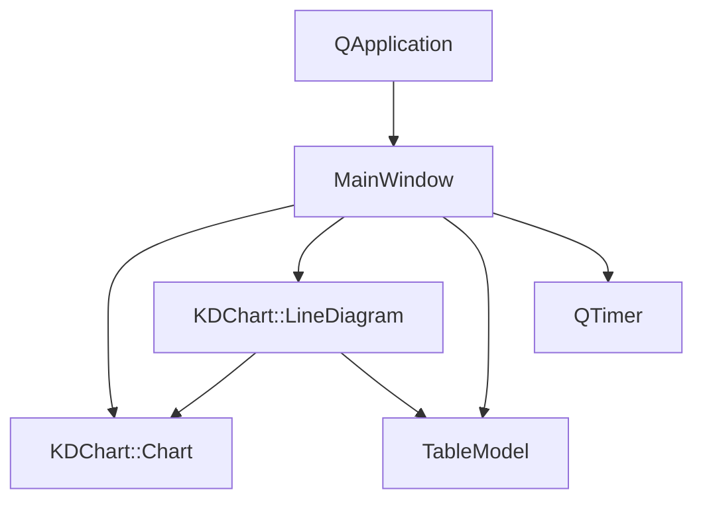
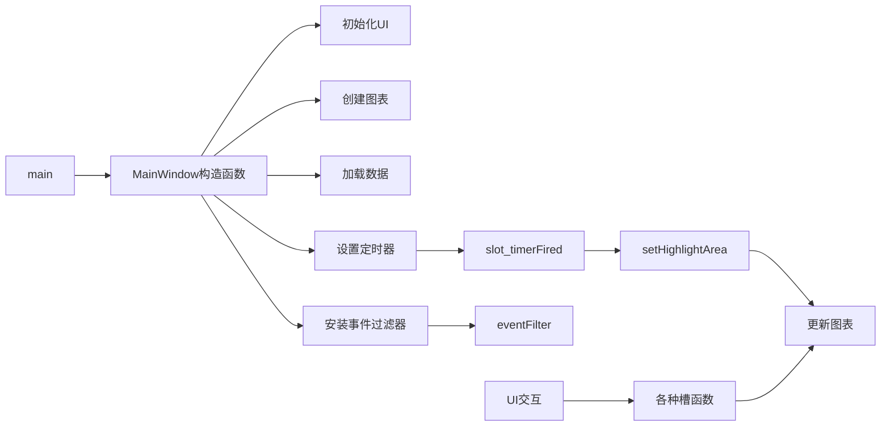

# Lines/Advanced 项目说明

## 项目概述

此项目是KD Chart库的高级线图示例，展示了多种高级功能，包括线图类型切换（普通、堆叠、百分比）、数据值显示控制、平滑线条调整、区域动画效果、3D模式切换、坐标轴反转等。通过UI控件可以交互式地调整图表的各种属性，体验KD Chart库的强大功能。

## 文件结构

- `CMakeLists.txt`: 项目构建配置文件
- `LineChart.qrc`: 资源文件，包含项目所需的数据文件
- `lineAnimate.csv`: 示例数据文件
- `main.cpp`: 程序入口文件，创建应用程序和主窗口
- `mainwindow.h`: 主窗口类头文件，定义了MainWindow类的接口
- `mainwindow.cpp`: 主窗口类实现文件，实现了图表的创建和交互功能
- `mainwindow.ui`: UI设计文件，定义了主窗口的界面布局

## 主要类功能说明

### MainWindow 类

继承自QWidget，实现了UI::MainWindow接口，是应用程序的主窗口。

**成员变量:**
- `m_chart`: KDChart::Chart对象，用于显示图表
- `m_lines`: KDChart::LineDiagram对象，线图实例
- `m_model`: TableModel对象，数据模型
- `m_curRow`: 当前行索引，用于区域动画
- `m_curColumn`: 当前列索引，用于区域动画
- `m_curOpacity`: 当前透明度，用于区域动画

**主要成员函数:**
- `MainWindow(QWidget *parent = nullptr)`: 构造函数，初始化UI、图表、数据模型和定时器
- `bool eventFilter(QObject *target, QEvent *event)`: 事件过滤器，捕获图表的鼠标移动事件
- `void on_lineTypeCB_currentIndexChanged(int index)`: 线图类型切换槽函数
- `void on_paintValuesCB_toggled(bool checked)`: 数据值显示控制槽函数
- `void on_smoothLinesSDR_valueChanged(int value)`: 平滑线条调整槽函数
- `void on_animateAreasCB_toggled(bool checked)`: 区域动画控制槽函数
- `void slot_timerFired()`: 定时器触发槽函数，用于实现区域动画
- `void setHighlightArea(int row, int column, int opacity, bool checked, bool doUpdate)`: 设置高亮区域
- `void on_threeDModeCB_toggled(bool checked)`: 3D模式切换槽函数
- `void setTrackedArea(int column, bool checked, bool doUpdate)`: 设置跟踪区域
- `void on_reverseHorizontalCB_toggled(bool checked)`: 水平坐标轴反转槽函数
- `void on_reverseVerticalCB_toggled(bool checked)`: 垂直坐标轴反转槽函数

## 代码执行逻辑

1. 程序启动，执行`main`函数
2. 创建`QApplication`实例
3. 创建`MainWindow`实例
4. 在`MainWindow`构造函数中:
   - 初始化UI控件
   - 创建图表和布局
   - 加载数据模型
   - 设置线图和坐标轴
   - 配置定时器和事件过滤器
5. 显示主窗口
6. 运行应用程序事件循环
7. 用户交互触发相应的槽函数，更新图表属性
8. 定时器定期触发，实现区域动画效果

## 类关系图

## 函数执行逻辑图

## Qt 5.15.2 兼容性说明

本项目使用的Qt API在Qt 5.15.2中大部分是兼容的。以下是需要注意的几点：

1. `QWidget`、`QTimer`、`QEvent`等基础类在Qt 5.15.2中没有重大变化
2. 信号槽语法使用了新的语法（`connect(sender, &Sender::signal, receiver, &Receiver::slot)`），这在Qt 5.15.2中完全支持
3. 未发现使用已废弃的API

## C++17 兼容性说明

本项目代码基本符合C++17标准，以下是一些观察：

1. 使用了`auto`类型推导
2. 使用了范围for循环
3. 使用了lambda表达式
4. 未发现与C++17不兼容的语法
5. 可以考虑使用C++17的结构化绑定、if constexpr等特性进一步优化代码

## TODO项

1. 进一步优化代码，使用更多C++17特性
2. 添加更多注释，详细说明每个功能的实现细节
3. 考虑添加单元测试，确保功能的正确性
4. 优化UI设计，提升用户体验
5. 检查是否有可以使用的Qt 5.15.2新特性来改进代码