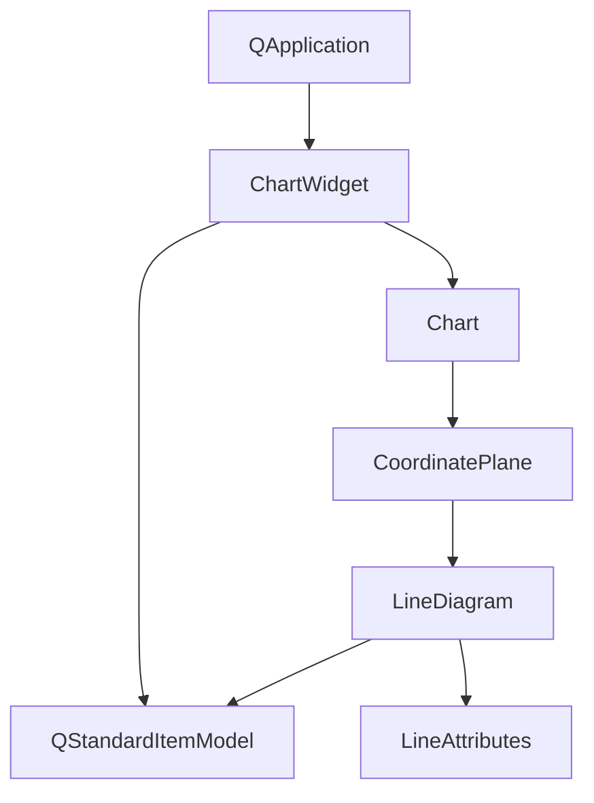

# 区域填充线图示例

## 项目概述

此示例展示了如何使用KD Chart库创建带有区域填充的线图，实现了以下功能：
- 创建线图并配置数据模型
- 为特定数据点设置区域填充
- 使用不同颜色的画刷填充区域
- 设置区域透明度
- 自定义布局

## 文件结构

```
Lines/AreaPerCell/
├── CMakeLists.txt  # 构建配置文件
├── main.cpp        # 主程序文件，包含区域填充线图实现
└── README.md       # 项目说明文档
```

## 主要类功能说明

### ChartWidget类

**功能**：继承自QWidget，用于展示带有区域填充的线图。

**成员变量**：
- `m_chart`: KD Chart的Chart对象
- `m_model`: QStandardItemModel数据模型

**方法**：
- `ChartWidget(QWidget *parent = nullptr)`: 构造函数，初始化数据模型和图表

## 代码执行逻辑

1. 应用程序启动后，创建ChartWidget实例
2. ChartWidget构造函数中：
   - 初始化数据模型，插入6行1列
   - 填充数据值
   - 创建LineDiagram并设置数据模型
   - 替换图表的坐标系中的图表
   - 配置线条属性，启用区域显示并设置透明度
   - 为索引1、3、4的数据点设置不同颜色的画刷
   - 创建垂直布局并添加图表
3. 显示ChartWidget窗口部件
4. 运行应用程序事件循环

## 类关系图



## 函数执行逻辑图


## Qt 5.15.2和C++17兼容性说明

1. **Qt 5.15.2兼容性**：
   - 代码中使用的Qt API均兼容Qt 5.15.2版本
   - 未使用任何已在Qt 5.15.2中废弃的API

2. **C++17兼容性**：
   - 代码使用了C++11特性，可无缝升级到C++17
   - 标准库使用符合C++17规范

## TODO项

- 暂无需要特别标记的Qt 5.15.2升级项
- 可考虑使用C++17特性优化代码结构