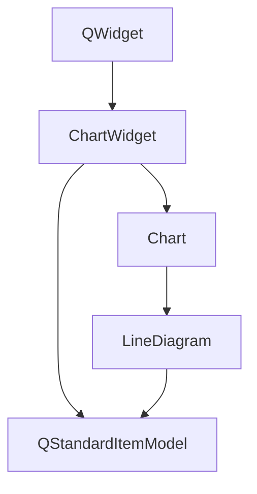
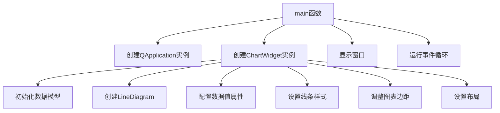

# 参数配置线图示例

## 项目概述

此示例展示了如何创建带有自定义参数配置的线图。通过此示例，您可以学习如何：
- 配置数据值显示格式（小数位数、单位后缀）
- 自定义数据值文本的字体、颜色和大小
- 设置线条宽度和样式
- 为特定数据点设置不同的线条样式
- 调整图表边距

## 文件结构

```
Parameters/
├── CMakeLists.txt
└── main.cpp
```

## 主要类功能说明

### ChartWidget类

继承自QWidget，用于展示带有自定义参数的线图。

#### 成员变量
- `m_chart`: KDChart::Chart对象，用于绘制图表
- `m_model`: QStandardItemModel对象，用于存储图表数据

#### 构造函数
- `explicit ChartWidget(QWidget *parent = nullptr)`: 初始化数据模型，配置图表参数，设置布局

### main函数

- 功能：创建应用程序实例和ChartWidget窗口部件，并启动事件循环
- 参数：
  - `argc`: 命令行参数个数
  - `argv`: 命令行参数数组
- 返回值：应用程序退出代码

## 代码执行逻辑

1. 创建ChartWidget实例
2. 初始化5x5的数据模型并填充随机数据
3. 创建LineDiagram并设置数据模型
4. 配置数据值属性：
   - 设置小数位数为2
   - 添加"Ohm"单位后缀
   - 设置Comic字体，深绿色，缩小字号
5. 为所有数据集设置17宽度的线条
6. 为特定数据点（索引1,1）设置黄色7宽度虚线样式
7. 调整图表右侧边距为50
8. 设置窗口布局并添加图表
9. 显示窗口并启动应用事件循环

## 类关系图



## 函数执行逻辑图



## Qt 5.15.2兼容性说明

此示例代码在Qt 5.15.2下应能正常编译和运行。未使用已废弃的API，所有使用的Qt类和函数在Qt 5.15.2中均受支持。

## C++17兼容性说明

代码使用了C++11/14特性，可在C++17标准下正常编译。未使用与C++17不兼容的语法或特性。

## TODO项

- 添加更多参数配置示例，如线条颜色渐变
- 实现交互式参数调整界面
- 添加数据导出功能
- 优化大数据集的性能