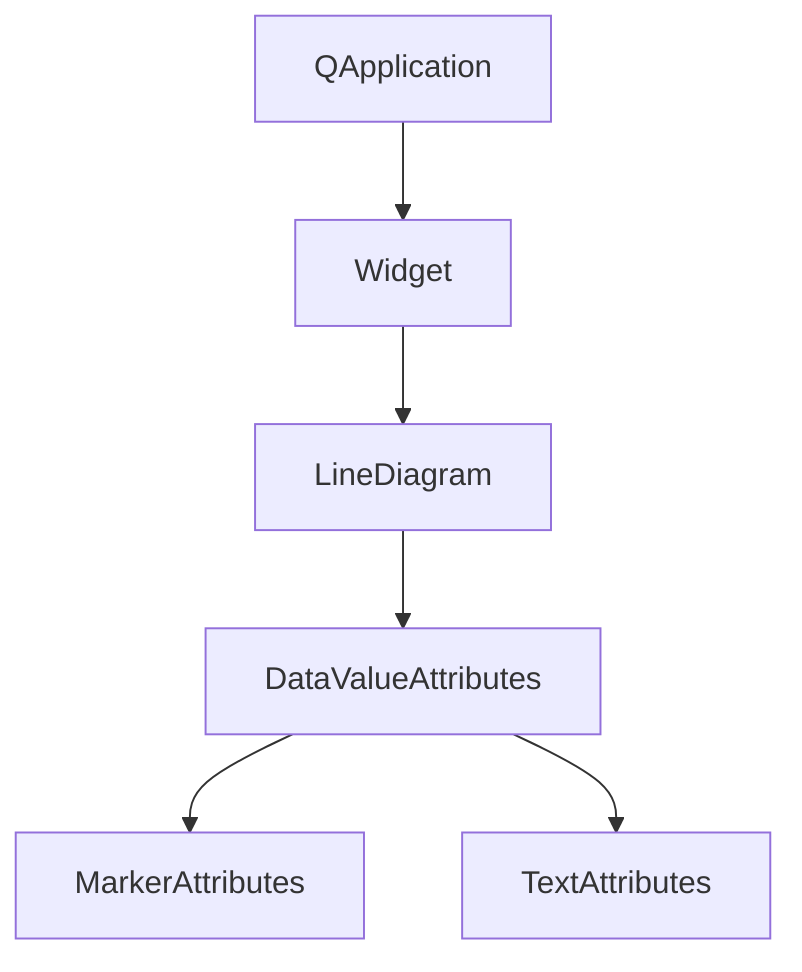

# 点图示例

## 项目概述

此示例展示了如何使用KD Chart库创建点图，实现了以下功能：
- 绘制多个数据集的数据点
- 隐藏线条，仅显示数据点
- 配置数据点标记属性
- 设置全局边距
- 隐藏数据值文本

## 文件结构

```
Lines/PointWidget/
├── CMakeLists.txt  # 构建配置文件
├── main.cpp        # 主程序文件，包含点图实现
└── README.md       # 项目说明文档
```

## 代码执行逻辑

1. 创建QApplication实例
2. 初始化KD Chart的Widget控件并设置大小
3. 创建三个数据向量并填充数据
4. 将数据集添加到图表中
5. 配置图表不显示线条（仅显示数据点）
6. 设置数据值属性：显示标记，隐藏文本值
7. 应用数据值属性到图表
8. 设置全局边距
9. 显示图表控件
10. 运行应用程序事件循环

## 类关系图



## 函数执行逻辑图

```mermaid
graph LR
    main[main函数]
    createApp[创建QApplication]
    createWidget[创建Widget]
    prepareData[准备数据]
    setupDatasets[设置数据集]
    hideLines[隐藏线条]
    configAttributes[配置数据属性]
    applyAttributes[应用属性]
    setMargins[设置边距]
    showWidget[显示控件]
    execApp[运行应用程序]

    main --> createApp
    createApp --> createWidget
    createWidget --> prepareData
    prepareData --> setupDatasets
    setupDatasets --> hideLines
    hideLines --> configAttributes
    configAttributes --> applyAttributes
    applyAttributes --> setMargins
    setMargins --> showWidget
    showWidget --> execApp
```



## Qt 5.15.2和C++17兼容性说明

1. **Qt 5.15.2兼容性**：
   - 代码中使用的Qt API均兼容Qt 5.15.2版本
   - 未使用任何已在Qt 5.15.2中废弃的API

2. **C++17兼容性**：
   - 代码使用了C++11特性，可无缝升级到C++17
   - 标准库使用符合C++17规范

## TODO项

- 暂无需要特别标记的Qt 5.15.2升级项
- 可考虑使用C++17特性优化代码结构