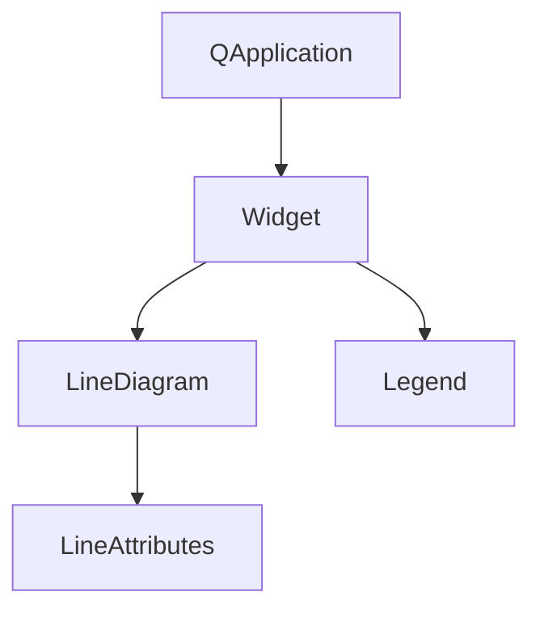

# 简单线图示例

## 项目概述

此示例展示了如何使用KD Chart库创建简单的线图，实现了以下功能：
- 绘制多条数据线
- 配置线条样式（颜色、宽度、线型）
- 设置图表为百分比模式
- 添加和配置图例
- 启用区域显示并设置透明度

## 文件结构

```
Lines/SimpleLineWidget/
├── CMakeLists.txt  # 构建配置文件
├── main.cpp        # 主程序文件，包含线图实现
└── README.md       # 项目说明文档
```

## 代码执行逻辑

1. 创建QApplication实例
2. 初始化KD Chart的Widget控件并设置大小
3. 创建三个数据向量并填充数据
4. 将数据集添加到图表中，并设置为百分比模式
5. 配置第二条线的画笔和画刷（黄色点线）
6. 创建并配置图例（东侧垂直显示，仅显示线条）
7. 设置线条属性，启用区域显示并设置透明度
8. 显示图表控件
9. 运行应用程序事件循环

## 类关系图



## 函数执行逻辑图


## Qt 5.15.2和C++17兼容性说明

1. **Qt 5.15.2兼容性**：
   - 代码中使用的Qt API均兼容Qt 5.15.2版本
   - 未使用任何已在Qt 5.15.2中废弃的API

2. **C++17兼容性**：
   - 代码使用了C++11特性，可无缝升级到C++17
   - 标准库使用符合C++17规范

## TODO项

- 暂无需要特别标记的Qt 5.15.2升级项
- 可考虑使用C++17特性优化代码结构