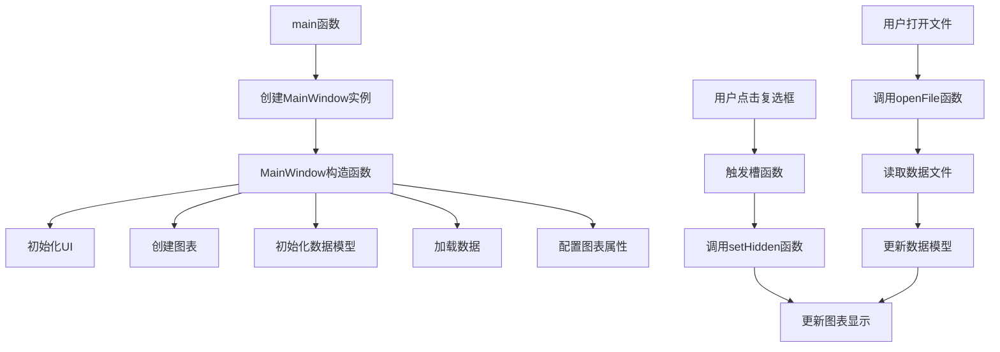

# ModelView HidingData 项目说明

## 项目概述

本项目是KD Chart库的示例，展示了如何使用模型视图架构实现数据可视化，并支持动态隐藏/显示数据集的功能。通过复选框控制，可以灵活地显示或隐藏不同产品的数据系列，便于数据对比分析。

## 文件结构

- `CMakeLists.txt`: 项目构建配置文件
- `ModelView.qrc`: 资源文件配置
- `main.cpp`: 程序入口文件
- `mainwindow.h`: 主窗口类头文件
- `mainwindow.cpp`: 主窗口类实现文件
- `mainwindow.ui`: 主窗口UI设计文件
- `qtdata.cht`: 示例数据文件

## 类功能说明

### MainWindow 类

继承自QWidget，实现了UI::MainWindow接口，是应用程序的主窗口。

#### 成员变量
- `m_chart`: KDChart::Chart对象，用于显示图表
- `m_lines`: KDChart::LineDiagram对象，线图图表组件
- `m_model`: QAbstractItemModel对象，数据模型

#### 成员函数
- `MainWindow(QWidget *parent = nullptr)`: 构造函数，初始化界面、图表和数据模型
- `on_showDataset1CB_toggled(bool checked)`: 数据集1显示/隐藏槽函数
- `on_showDataset2CB_toggled(bool checked)`: 数据集2显示/隐藏槽函数
- `on_showDataset3CB_toggled(bool checked)`: 数据集3显示/隐藏槽函数
- `setHidden(int dataset, bool hidden)`: 设置数据集隐藏状态
- `openFile(const QString &path)`: 打开文件并加载数据

## 代码执行逻辑

1. 程序启动，执行main函数
2. 创建QApplication实例
3. 创建MainWindow实例并显示
4. MainWindow构造函数执行
   - 调用setupUi初始化UI组件
   - 创建图表布局和Chart对象
   - 初始化数据模型QStandardItemModel
   - 从资源文件加载数据
   - 创建LineDiagram并设置数据模型
   - 添加X轴和Y轴
   - 设置线条宽度
   - 将图表添加到坐标系
   - 创建并配置图例
5. 用户与界面交互，点击复选框
6. 触发相应的槽函数(on_showDataset1CB_toggled等)
7. 调用setHidden函数设置数据集隐藏状态
8. 更新图表显示
9. 用户可以通过菜单打开其他数据文件
10. 调用openFile函数加载新数据
11. 更新数据模型
12. 图表自动更新显示新数据

## 类关系图

```mermaid
classDiagram
    QWidget <|-- MainWindow
    MainWindow ..> KDChart::Chart : 包含
    MainWindow ..> KDChart::LineDiagram : 包含
    MainWindow ..> QAbstractItemModel : 包含
    KDChart::LineDiagram --> KDChart::CartesianAxis : 使用
    KDChart::Chart --> KDChart::Legend : 包含
```

## 函数执行逻辑图



## Qt 5.15.2 和 C++17 兼容性说明

### Qt 5.15.2 升级
- 检查KDChart::Legend在Qt5.15.2中的兼容性
- 验证QFileDialog和QTextStream在Qt5.15.2中的行为变化
- 确认KDChart库与Qt5.15.2的兼容性

### C++17 升级
- 考虑使用文件系统库(std::filesystem)替代QFile
- 考虑使用结构化绑定优化数据处理
- 可以使用constexpr优化常量表达式
- 考虑使用std::optional处理可能为空的值

## TODO 项

1. `// TODO: Qt5.15.2升级 检查QApplication在Qt5.15.2中的行为变化` - main.cpp
2. `// TODO: C++17升级 考虑使用constexpr优化常量表达式` - main.cpp
3. `// TODO: Qt5.15.2升级 检查KDChart相关类在Qt5.15.2中的兼容性` - mainwindow.h
4. `// TODO: Qt5.15.2升级 验证QAbstractItemModel使用规范` - mainwindow.h
5. `// TODO: C++17升级 考虑使用std::optional优化可能为空的值` - mainwindow.h
6. `// TODO: Qt5.15.2升级 检查KDChart::Legend在Qt5.15.2中的兼容性` - mainwindow.cpp
7. `// TODO: Qt5.15.2升级 验证QFileDialog和QTextStream在Qt5.15.2中的行为变化` - mainwindow.cpp
8. `// TODO: C++17升级 考虑使用文件系统库(std::filesystem)替代QFile` - mainwindow.cpp
9. `// TODO: C++17升级 考虑使用结构化绑定优化数据处理` - mainwindow.cpp