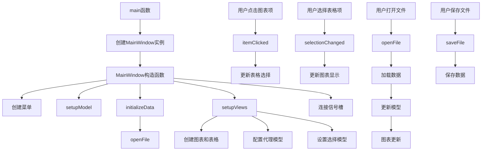

# ModelView TableView 项目说明

## 项目概述

本项目是KD Chart库的示例，展示了如何将KD Chart图表与QTableView结合使用，实现数据的可视化展示、编辑和选择交互。用户可以在表格中编辑数据，图表会实时更新，同时支持通过鼠标选择表格或图表中的项，实现双向选择同步。

## 文件结构

- `CMakeLists.txt`: 项目构建配置文件
- `ModelView.qrc`: 资源文件配置
- `main.cpp`: 程序入口文件
- `mainwindow.h`: 主窗口类头文件
- `mainwindow.cpp`: 主窗口类实现文件
- `qtdata.cht`: 示例数据文件

## 类功能说明

### MainWindow 类

继承自QMainWindow，实现了将KD Chart图表与QTableView结合使用的功能。

#### 成员变量
- `m_chart`: KDChart::Chart对象，用于显示图表
- `m_datasetProxy`: KDChart::DatasetProxyModel对象，数据集代理模型
- `m_model`: QStandardItemModel对象，数据模型
- `m_diagramView`: KDChart::BarDiagram对象，柱状图视图
- `m_tableView`: QTableView对象，表格视图
- `m_selectionModel`: QItemSelectionModel对象，选择模型

#### 成员函数
- `MainWindow()`: 构造函数，初始化界面、模型和视图
- `setupModel()`: 设置数据模型
- `initializeData()`: 初始化数据
- `setupViews()`: 设置视图
- `itemClicked(const QModelIndex &index)`: 图表项点击槽函数
- `selectionChanged(const QItemSelection &selected, const QItemSelection &deselected)`: 选择变化槽函数
- `openFile(const QString &path = QString())`: 打开文件
- `saveFile()`: 保存文件

## 代码执行逻辑

1. 程序启动，执行main函数
2. 创建QApplication实例
3. 创建MainWindow实例并显示
4. MainWindow构造函数执行
   - 创建文件菜单和动作
   - 调用setupModel设置数据模型
   - 调用initializeData初始化数据
   - 调用setupViews设置视图
   - 连接信号和槽
   - 设置窗口标题和大小
5. setupModel函数执行，创建并配置QStandardItemModel
6. initializeData函数执行，从资源文件加载数据
7. setupViews函数执行
   - 创建图表和表格视图
   - 配置分割器布局
   - 创建柱状图和数据集代理模型
   - 配置图表页眉
   - 设置表格和图表的模型
   - 设置选择模型
8. 用户与界面交互
   - 点击图表项，触发itemClicked槽函数，更新表格选择
   - 选择表格项，触发selectionChanged槽函数，更新图表显示
   - 通过菜单打开或保存文件
9. openFile函数执行，加载数据文件并更新模型
10. saveFile函数执行，将当前数据保存到文件

## 类关系图

```mermaid
classDiagram
    QMainWindow <|-- MainWindow
    MainWindow ..> KDChart::Chart : 包含
    MainWindow ..> KDChart::DatasetProxyModel : 包含
    MainWindow ..> QStandardItemModel : 包含
    MainWindow ..> KDChart::BarDiagram : 包含
    MainWindow ..> QTableView : 包含
    MainWindow ..> QItemSelectionModel : 包含
    KDChart::BarDiagram --> KDChart::DatasetProxyModel : 使用
    QTableView --> QStandardItemModel : 使用
    QTableView --> QItemSelectionModel : 使用
```

## 函数执行逻辑图



## Qt 5.15.2 和 C++17 兼容性说明

### Qt 5.15.2 升级
- 检查KDChart相关类在Qt5.15.2中的兼容性
- 验证QItemSelectionModel使用规范
- 检查KDChart::HeaderFooter在Qt5.15.2中的兼容性
- 验证QFileDialog和QTextStream在Qt5.15.2中的行为变化
- 确认KDChart库与Qt5.15.2的兼容性

### C++17 升级
- 考虑使用constexpr优化常量表达式
- 考虑使用std::optional优化可能为空的值
- 考虑使用文件系统库(std::filesystem)替代QFile
- 考虑使用结构化绑定优化数据处理
- 确保所有代码符合C++17标准规范

## TODO 项

1. `// TODO: Qt5.15.2升级 检查QApplication在Qt5.15.2中的行为变化` - main.cpp
2. `// TODO: C++17升级 考虑使用constexpr优化常量表达式` - main.cpp
3. `// TODO: Qt5.15.2升级 检查KDChart相关类在Qt5.15.2中的兼容性` - mainwindow.h
4. `// TODO: Qt5.15.2升级 验证QItemSelectionModel使用规范` - mainwindow.h
5. `// TODO: C++17升级 考虑使用std::optional优化可能为空的值` - mainwindow.h
6. `// TODO: Qt5.15.2升级 检查KDChart::HeaderFooter在Qt5.15.2中的兼容性` - mainwindow.cpp
7. `// TODO: Qt5.15.2升级 验证QFileDialog和QTextStream在Qt5.15.2中的行为变化` - mainwindow.cpp
8. `// TODO: C++17升级 考虑使用文件系统库(std::filesystem)替代QFile` - mainwindow.cpp
9. `// TODO: C++17升级 考虑使用结构化绑定优化数据处理` - mainwindow.cpp