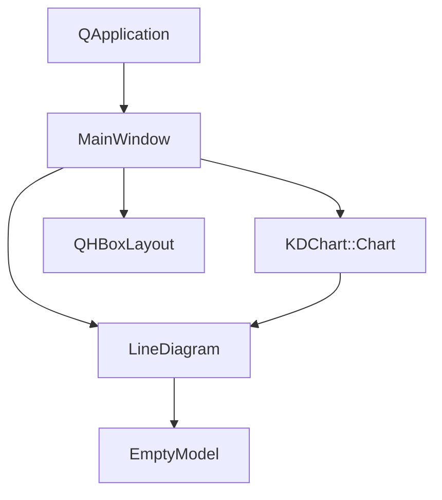
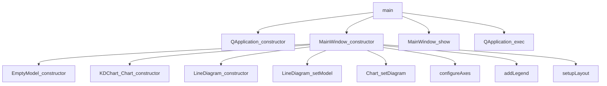

# NoValues 项目说明

## 项目概述

NoValues项目是KD Chart库的一个示例，展示了如何在没有数据的情况下显示图表。该示例创建了一个空的数据模型，并演示了KDChart如何优雅地处理无数据状态，仍然能够显示完整的图表框架、坐标轴和图例。

## 文件结构

- `CMakeLists.txt`: 项目构建配置文件
- `main.cpp`: 应用程序入口点，创建主窗口
- `mainwindow.h`: MainWindow类头文件
- `mainwindow.cpp`: MainWindow类实现文件

## 类功能说明

### MainWindow 类

继承自QWidget，是应用程序的主窗口。负责创建和配置图表，包括：
- 初始化KDChart::Chart对象
- 创建LineDiagram图表类型
- 设置空数据模型
- 配置图表坐标轴和图例
- 布局管理

### EmptyModel 类

继承自QAbstractItemModel，实现了一个空数据模型。特点包括：
- 重写rowCount()和columnCount()方法返回0
- 提供空的头部数据
- 支持Qt的模型视图架构

## 代码执行逻辑

1. 程序入口main()函数创建QApplication实例
2. 创建MainWindow实例并显示
3. MainWindow构造函数中：
   - 创建EmptyModel实例
   - 初始化KDChart::Chart对象
   - 创建LineDiagram并关联到空数据模型
   - 配置X轴和Y轴
   - 添加图例
   - 设置图表布局
4. 运行应用程序事件循环

## 类关系图

## 函数执行逻辑图

## Qt 5.15.2 兼容性说明

- 检查MainWindow类在Qt5.15.2中的兼容性
- 验证QHBoxLayout在Qt5.15.2中的行为
- 确认QApplication在Qt5.15.2中的行为变化
- 验证QObject::tr在Qt5.15.2中的国际化行为

## C++17 兼容性说明

- 考虑使用final修饰符优化EmptyModel类
- 使用结构化绑定优化变量声明
- 使用std::make_unique管理动态内存
- 考虑使用constexpr优化常量表达式

## TODO项

- // TODO: Qt5.15.2升级 检查MainWindow类在Qt5.15.2中的兼容性
- // TODO: Qt5.15.2升级 验证QHBoxLayout在Qt5.15.2中的行为
- // TODO: Qt5.15.2升级 检查QApplication在Qt5.15.2中的行为变化
- // TODO: Qt5.15.2升级 验证QObject::tr在Qt5.15.2中的国际化行为
- // TODO: C++17升级 考虑使用final修饰符优化EmptyModel类
- // TODO: C++17升级 使用结构化绑定优化变量声明
- // TODO: C++17升级 使用std::make_unique管理动态内存
- // TODO: C++17升级 考虑使用constexpr优化常量表达式