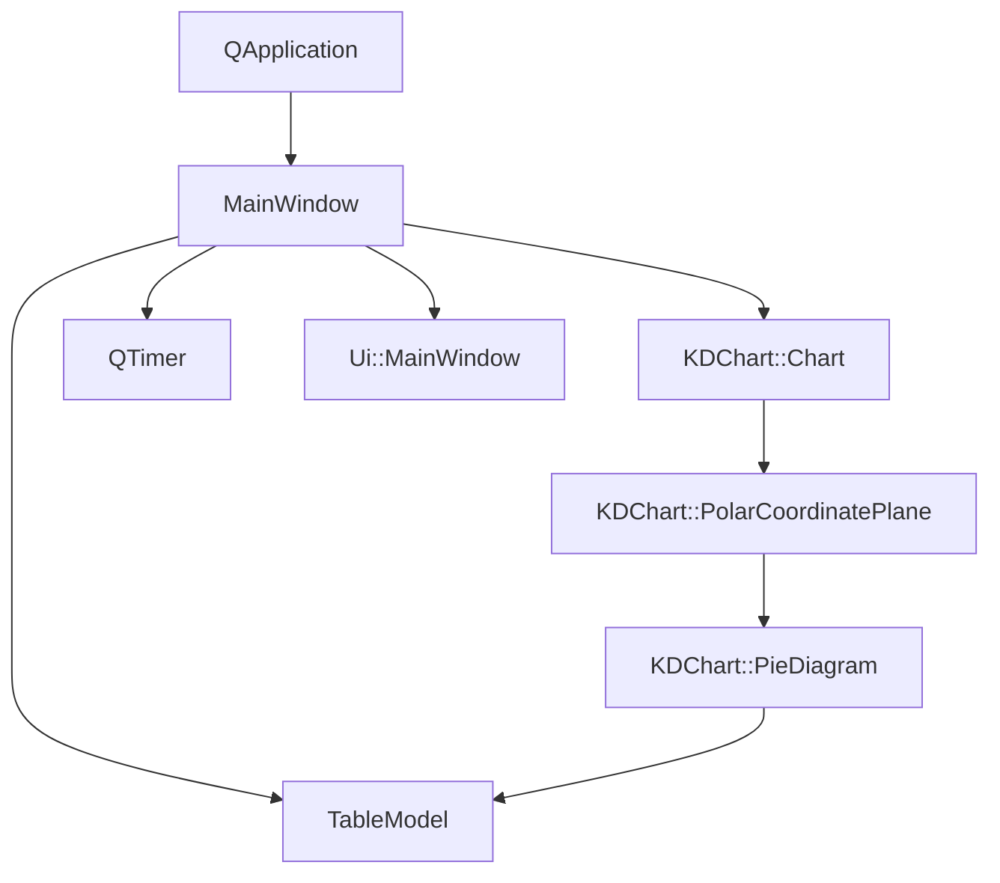
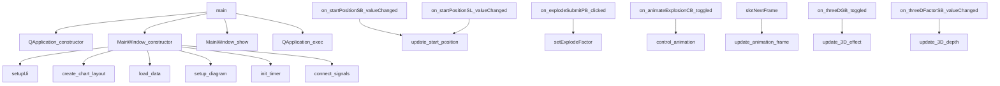

# Pie/Advanced 项目说明

## 项目概述

Pie/Advanced项目是KD Chart库的一个高级饼图示例，展示了饼图的高级功能。该示例实现了具有交互式控制界面的饼图，支持扇区爆炸效果、动画和3D视图切换，演示了KDChart库的强大功能和灵活性。

## 文件结构

- `CMakeLists.txt`: 项目构建配置文件
- `Pie.qrc`: 资源文件
- `main.cpp`: 应用程序入口点
- `mainwindow.h`: MainWindow类头文件
- `mainwindow.cpp`: MainWindow类实现文件
- `mainwindow.ui`: UI设计文件

## 类功能说明

### MainWindow 类

继承自QWidget，是应用程序的主窗口。主要功能包括：
- 初始化UI组件和图表对象
- 加载和管理数据模型
- 提供交互式控制界面（滑动条、按钮、复选框等）
- 实现饼图的起始位置调整
- 实现扇区爆炸效果和动画
- 支持3D视图切换和深度调节
- 处理用户交互事件

## 代码执行逻辑

1. 程序入口main()函数创建QApplication实例
2. 创建MainWindow实例并显示
3. MainWindow构造函数中：
   - 初始化UI组件
   - 创建图表布局和图表对象
   - 从CSV文件加载数据
   - 设置极坐标平面和饼图
   - 初始化动画定时器
4. 用户通过UI控件与图表交互：
   - 调整起始位置滑动条/输入框改变饼图起始角度
   - 设置爆炸因子并提交以应用到指定扇区
   - 启用/禁用爆炸动画
   - 切换3D视图并调整深度
5. 定时器触发动画帧更新，实现扇区爆炸动画
6. 运行应用程序事件循环

## 类关系图

## 函数执行逻辑图

## Qt 5.15.2 兼容性说明

- 检查MainWindow类在Qt5.15.2中的兼容性
- 验证QHBoxLayout在Qt5.15.2中的行为
- 检查PolarCoordinatePlane::setStartPosition在Qt5.15.2中的行为
- 验证PieAttributes在Qt5.15.2中的API变化
- 检查QTimer在Qt5.15.2中的行为
- 验证ThreeDPieAttributes在Qt5.15.2中的API变化
- 确认QApplication在Qt5.15.2中的行为变化

## C++17 兼容性说明

- 考虑使用智能指针管理成员变量
- 考虑使用std::make_unique管理动态内存
- 考虑使用结构化绑定优化变量
- 考虑使用constexpr优化常量表达式

## TODO项

- // TODO: Qt5.15.2升级 检查MainWindow类在Qt5.15.2中的兼容性
- // TODO: Qt5.15.2升级 检查QHBoxLayout在Qt5.15.2中的行为
- // TODO: Qt5.15.2升级 验证PolarCoordinatePlane::setStartPosition在Qt5.15.2中的行为
- // TODO: Qt5.15.2升级 检查PieAttributes在Qt5.15.2中的API变化
- // TODO: Qt5.15.2升级 验证QTimer在Qt5.15.2中的行为
- // TODO: Qt5.15.2升级 检查ThreeDPieAttributes在Qt5.15.2中的API变化
- // TODO: Qt5.15.2升级 检查QApplication在Qt5.15.2中的行为变化
- // TODO: C++17升级 考虑使用智能指针管理成员变量
- // TODO: C++17升级 考虑使用std::make_unique管理动态内存
- // TODO: C++17升级 考虑使用结构化绑定优化变量
- // TODO: C++17升级 考虑使用constexpr优化常量表达式