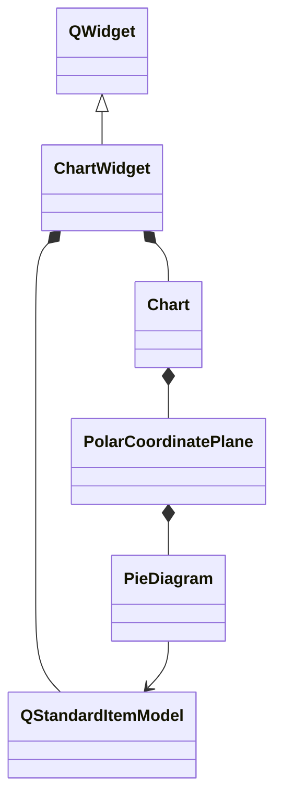
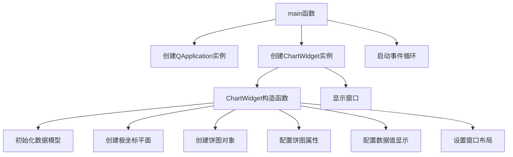

# 饼图参数配置示例项目

## 项目概述

此项目展示了如何使用KD Chart库配置饼图的各种参数，包括扇区爆炸效果、自定义画笔样式、数据值显示和背景属性设置。通过这个示例，您可以学习如何精细化控制饼图的外观和行为。

## 文件结构

- `CMakeLists.txt`: 项目构建配置文件
- `main.cpp`: 主要源代码文件，包含ChartWidget类定义和main函数

## 类功能说明

### ChartWidget类

继承自QWidget，用于展示具有高级参数配置的饼图：

- 初始化数据模型并填充示例数据
- 创建极坐标平面和饼图对象
- 配置扇区爆炸效果（第二个扇区）
- 设置自定义扇区画笔（虚线、洋红色）
- 配置数据值显示（字体、颜色、位置和背景）
- 管理图表布局

## 代码执行逻辑

1. 程序启动，创建QApplication实例
2. 创建ChartWidget窗口实例
3. 在ChartWidget构造函数中：
   - 初始化QStandardItemModel数据模型
   - 创建PolarCoordinatePlane极坐标平面
   - 创建PieDiagram饼图对象并关联数据模型
   - 配置饼图属性（爆炸效果、画笔样式）
   - 配置数据值显示属性
   - 设置窗口布局
4. 显示ChartWidget窗口
5. 启动应用程序事件循环

## 执行逻辑关系

### 类关系图

### 函数执行逻辑图

## Qt 5.15.2和C++17兼容性说明

### Qt 5.15.2升级

- 检查PolarCoordinatePlane在Qt5.15.2中的API变化
- 验证PieAttributes在Qt5.15.2中的行为
- 检查QApplication在Qt5.15.2中的行为变化

### C++17升级

- 考虑使用std::make_unique管理动态内存
- 考虑使用final修饰符
- 考虑使用constexpr优化常量表达式

## TODO项列表

1. // TODO: Qt5.15.2升级 检查PolarCoordinatePlane在Qt5.15.2中的API变化
2. // TODO: Qt5.15.2升级 验证PieAttributes在Qt5.15.2中的行为
3. // TODO: Qt5.15.2升级 检查QApplication在Qt5.15.2中的行为变化
4. // TODO: C++17升级 考虑使用std::make_unique管理动态内存
5. // TODO: C++17升级 考虑使用final修饰符
6. // TODO: C++17升级 考虑使用constexpr优化常量表达式