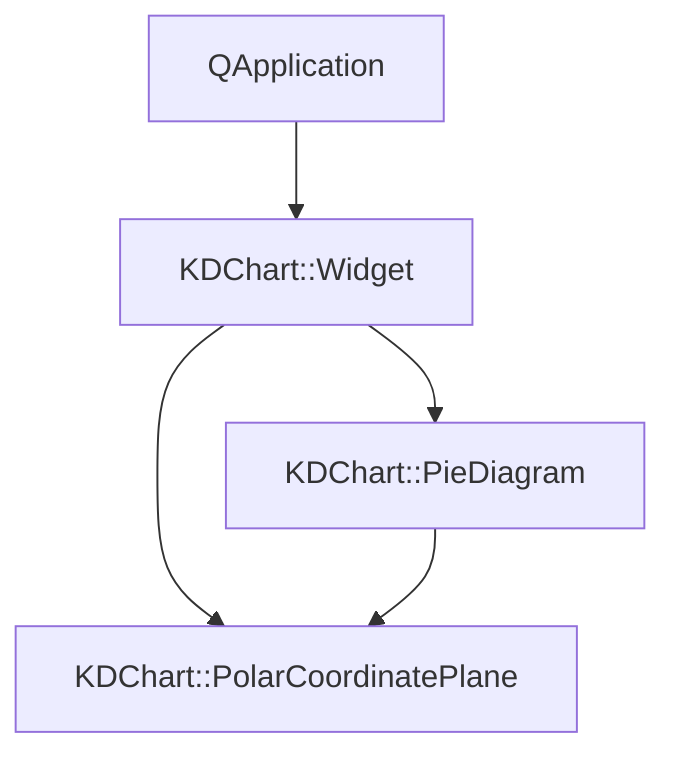
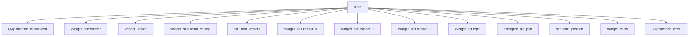

# Pie/Simple 项目说明

## 项目概述

Pie/Simple项目是KD Chart库的一个基础饼图示例，展示了如何创建和自定义饼图。该示例创建了三个不同的数据集，并将它们可视化为饼图，同时演示了如何设置饼图的起始位置和扇区样式。

## 文件结构

- `CMakeLists.txt`: 项目构建配置文件
- `main.cpp`: 应用程序入口点，创建并配置饼图

## 代码功能说明

本项目虽然没有自定义类，但演示了KDChart库的核心功能：
- 使用KDChart::Widget作为图表容器
- 创建PieDiagram饼图类型
- 配置PolarCoordinatePlane极坐标平面
- 添加多个数据集
- 自定义饼图扇区的画笔样式
- 设置饼图的起始角度

## 代码执行逻辑

1. 程序入口main()函数创建QApplication实例
2. 创建KDChart::Widget控件并设置其大小和边距
3. 定义三个数据向量并初始化数据
4. 向图表控件添加数据集并设置图表类型为饼图
5. 配置饼图的画笔样式（为第三个扇区设置白色宽边）
6. 设置极坐标平面的起始位置为90度（顶部）
7. 显示图表控件
8. 运行应用程序事件循环

## 类关系图

## 函数执行逻辑图

## Qt 5.15.2 兼容性说明

- 检查KDChart::Widget在Qt5.15.2中的兼容性
- 验证QPen在Qt5.15.2中的行为变化
- 确认PolarCoordinatePlane::setStartPosition在Qt5.15.2中的行为

## C++17 兼容性说明

- 考虑使用结构化绑定优化变量声明
- 考虑使用std::optional处理可能的空指针
- 可以使用std::initializer_list简化数据向量的初始化

## TODO项

- // TODO: Qt5.15.2升级 检查KDChart::Widget在Qt5.15.2中的兼容性
- // TODO: Qt5.15.2升级 验证QPen在Qt5.15.2中的行为变化
- // TODO: C++17升级 考虑使用结构化绑定优化变量声明
- // TODO: C++17升级 考虑使用std::optional处理可能的空指针