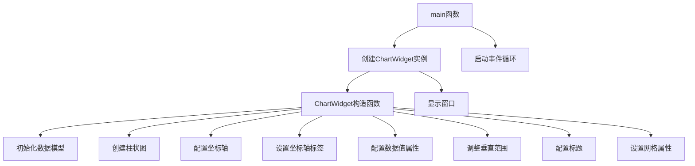

# Plane/AdjustedBoundaries 项目说明

## 项目概述

本项目展示了如何在KD Chart库中调整图表平面的垂直范围边界。通过自定义坐标轴、数据值属性、网格和标题等视觉元素，实现了一个具有调整垂直范围功能的柱状图。核心功能是演示如何使用`KDChart::CartesianCoordinatePlane`类的`setVerticalRange`方法来设置图表的垂直显示范围。

## 文件结构

```
Plane/AdjustedBoundaries/
├── CMakeLists.txt    # 构建配置文件
├── main.cpp          # 主程序文件，包含ChartWidget类和main函数
└── README.md         # 项目说明文档
```

## 类功能说明

### ChartWidget类

**核心功能**：创建并配置具有调整垂直范围的柱状图，展示如何自定义图表的各种视觉属性。

**关键方法**：
- `ChartWidget(QWidget *parent = nullptr)`: 构造函数，初始化数据模型，创建图表元素并配置其属性。
  - 初始化数据模型并填充示例数据
  - 创建柱状图并设置数据模型
  - 配置X轴和Y轴
  - 设置坐标轴标签
  - 配置数据值显示属性
  - 调整图表平面的垂直范围
  - 配置标题、背景和边框
  - 设置网格属性

**成员变量**：
- `m_chart`: 图表对象，用于显示和管理图表及其所有元素
- `m_model`: 数据模型，存储和管理图表要显示的数据
- `pixmap`: 背景图片（本示例未使用）

### main函数

**功能**：初始化Qt应用程序，创建并显示ChartWidget窗口部件，启动应用程序事件循环。

## 代码执行逻辑

1. 执行`main`函数，初始化Qt应用程序
2. 创建`ChartWidget`实例
3. 在`ChartWidget`构造函数中：
   - 初始化数据模型并填充示例数据
   - 创建柱状图并设置数据模型
   - 创建并配置X轴和Y轴
   - 设置坐标轴标签
   - 配置数据值显示属性
   - 调整图表平面的垂直范围（核心功能）
   - 配置标题、背景和边框
   - 设置网格属性
   - 创建布局并添加图表
4. 显示`ChartWidget`窗口
5. 启动应用程序事件循环

## 执行逻辑关系

### 类关系图

```mermaid
erDiagram
    QWidget <|-- ChartWidget : 继承
    ChartWidget ||-- Chart : 包含
    ChartWidget ||-- QStandardItemModel : 包含
    ChartWidget ||-- QPixmap : 包含
    Chart ||-- CartesianCoordinatePlane : 包含
    CartesianCoordinatePlane ||-- BarDiagram : 包含
    BarDiagram ||-- CartesianAxis : 包含
    BarDiagram ||-- CartesianAxis : 包含
    Chart ||-- HeaderFooter : 包含
```

### 函数执行逻辑图



## Qt5.15.2升级说明

### 主要变更点及影响范围

1. **KDChart::CartesianCoordinatePlane兼容性检查**
   - 需要验证`setVerticalRange`方法在Qt5.15.2中的行为是否有变化
   - 检查`coordinatePlane()`方法返回值的类型转换是否仍然有效

2. **其他潜在兼容性问题**
   - 需要确认`KDChart::BackgroundAttributes`、`KDChart::FrameAttributes`等类在Qt5.15.2中的API是否有变化
   - 验证`QVBoxLayout`和其他Qt布局类的行为是否有变化

### TODO项

```
// TODO: Qt5.15.2升级 检查KDChart::CartesianCoordinatePlane在Qt5.15.2中的兼容性
```

## C++17升级说明

### 主要调整点

1. **使用constexpr优化常量表达式**
   - 可以将`main`函数中的一些常量声明为`constexpr`

2. **其他C++17特性应用**
   - 考虑使用结构化绑定优化多变量赋值
   - 可以使用`std::optional`处理可能为空的指针
   - 考虑使用`std::string_view`优化字符串处理

### TODO项

```
// TODO: C++17升级 使用constexpr优化常量表达式
```