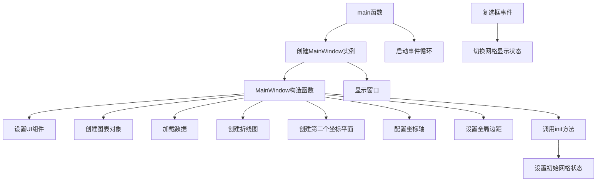

# Plane/OverlayedPlanes 项目说明

## 项目概述

本项目展示了如何在KD Chart库中创建叠加的图表平面。通过在同一个图表中添加多个坐标平面并在其上绘制不同的数据，实现了数据的分层显示。核心功能是演示如何使用`KDChart::CartesianCoordinatePlane`类来创建和管理多个叠加的坐标平面。

## 文件结构

```
Plane/OverlayedPlanes/
├── CMakeLists.txt         # 构建配置文件
├── OverlayedPlanes.qrc    # 资源文件
├── main.cpp               # 程序入口文件
├── mainwindow.cpp         # 主窗口实现文件
├── mainwindow.h           # 主窗口头文件
├── mainwindow.ui          # UI设计文件
└── README.md              # 项目说明文档
```

## 类功能说明

### MainWindow类

**核心功能**：创建并配置具有叠加坐标平面的图表，展示如何在同一个图表中显示多个数据集。

**关键方法**：
- `MainWindow(QWidget *parent = nullptr)`: 构造函数，初始化UI组件，创建图表和数据模型，配置图表属性。
  - 设置UI组件
  - 创建图表布局和图表对象
  - 从CSV文件加载数据
  - 创建两个折线图对象
  - 创建第二个坐标平面并设置参考平面
  - 配置坐标轴并添加到图表
  - 设置全局边距
  - 调用init()方法

- `init()`: 初始化方法，设置初始网格状态。
  - 初始时不显示第二个平面的网格

- `on_displayGrid1CB_toggled(bool checked)`: 切换第一个网格显示状态的槽函数。
  - 响应UI中displayGrid1CB复选框的状态变化
  - 控制第一个平面的网格显示

- `on_displayGrid2CB_toggled(bool checked)`: 切换第二个网格显示状态的槽函数。
  - 响应UI中displayGrid2CB复选框的状态变化
  - 控制第二个平面的网格显示

**成员变量**：
- `m_chart`: 图表对象，用于显示和管理图表及其所有元素
- `m_model`: 第一个数据模型，存储第一条数据集
- `m_model2`: 第二个数据模型，存储第二条数据集
- `m_datasetProxy`: 数据集代理模型，用于处理数据显示
- `m_lines`: 第一个折线图对象，用于在第一个平面上显示数据
- `m_lines2`: 第二个折线图对象，用于在第二个平面上显示数据
- `plane2`: 第二个坐标平面，用于叠加显示不同的数据

### main函数

**功能**：初始化Qt应用程序，创建并显示MainWindow窗口，启动应用程序事件循环。

## 代码执行逻辑

1. 执行`main`函数，初始化Qt应用程序
2. 创建`MainWindow`实例
3. 在`MainWindow`构造函数中：
   - 设置UI组件
   - 创建图表布局和图表对象
   - 从CSV文件加载数据
   - 创建两个折线图对象
   - 创建第二个坐标平面并设置参考平面
   - 配置坐标轴并添加到图表
   - 设置全局边距
   - 调用init()方法
4. 在`init`方法中：
   - 设置初始网格状态
5. 显示`MainWindow`窗口
6. 启动应用程序事件循环
7. 响应UI事件（如复选框状态变化）

## 执行逻辑关系

### 类关系图

```mermaid
erDiagram
    QWidget <|-- MainWindow : 继承
    MainWindow |o-- Ui::MainWindow : 实现
    MainWindow ||-- KDChart::Chart : 包含
    MainWindow ||-- TableModel : 包含
    MainWindow ||-- TableModel : 包含
    MainWindow ||-- KDChart::DatasetProxyModel : 包含
    MainWindow ||-- KDChart::LineDiagram : 包含
    MainWindow ||-- KDChart::LineDiagram : 包含
    MainWindow ||-- KDChart::CartesianCoordinatePlane : 包含
    KDChart::Chart ||-- KDChart::CartesianCoordinatePlane : 包含
    KDChart::LineDiagram ||-- KDChart::CartesianAxis : 包含
    KDChart::LineDiagram ||-- KDChart::CartesianAxis : 包含
```

### 函数执行逻辑图



## Qt5.15.2升级说明

### 主要变更点及影响范围

1. **KDChart::CartesianCoordinatePlane兼容性检查**
   - 需要验证`setReferenceCoordinatePlane`方法在Qt5.15.2中的行为是否有变化
   - 检查坐标平面叠加显示的功能是否正常工作

2. **QApplication构造函数参数验证**
   - 需要确认在Qt5.15.2中QApplication构造函数的参数要求是否有变化

### TODO项

```
// TODO: Qt5.15.2升级 检查KDChart::CartesianCoordinatePlane在Qt5.15.2中的兼容性
// TODO: Qt5.15.2升级 验证QApplication构造函数参数要求变更
```

## C++17升级说明

### 主要调整点

1. **使用constexpr优化常量表达式**
   - 可以将`main`函数中的一些常量声明为`constexpr`

2. **其他C++17特性应用**
   - 考虑使用智能指针(`std::unique_ptr`, `std::shared_ptr`)管理动态分配的对象
   - 可以使用`std::optional`处理可能为空的指针
   - 考虑使用结构化绑定优化多变量赋值

### TODO项

```
// TODO: C++17升级 使用constexpr优化常量表达式
```