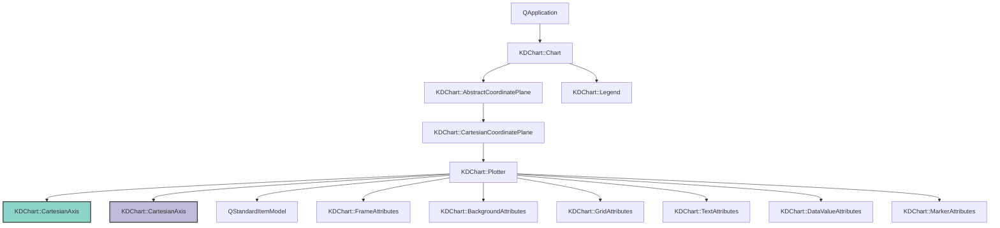
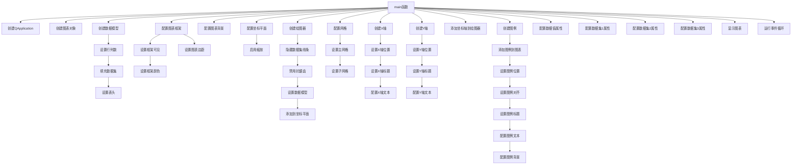

# Plotter/Advanced 项目说明

## 项目概述

本项目展示了如何使用KD Chart库创建一个高级绘图图表应用。该应用程序绘制三个不同数据集的图形，并自定义了它们的样式、标记和线条属性。还演示了如何配置图表的框架、背景、网格、坐标轴和图例等高级特性。

应用展示了三个不同的数学函数图形：
- 数据集1: y = i^2 (绿色环形标记，无线条)
- 数据集2: y = i^2 - i (红色菱形标记，无线条)
- 数据集3: y = i^2 + i (黄色圆形标记，蓝色线条)

## 文件结构

```
Plotter/Advanced/
├── CMakeLists.txt  # 构建配置文件
├── main.cpp        # 程序入口文件
└── README.md       # 项目说明文档
```

## 代码功能说明

### main函数

**核心功能**：初始化Qt应用程序，创建高级绘图图表，展示三个数据集的图形，并自定义图表的各种属性。

**参数**：
- `argc`: 命令行参数数量
- `argv`: 命令行参数数组

**返回值**：程序退出码

**实现细节**：
1. 创建Qt应用程序实例和图表对象
2. 创建数据模型并填充三个数据集：
   - 数据集1: y = i^2 (X值为i，Y值为i²)
   - 数据集2: y = i^2 - i (X值为2i，Y值为i² - i)
   - 数据集3: y = i^2 + i (X值为i/2，Y值为i² + i)
3. 配置图表框架、背景和边距
4. 配置坐标平面并启用橡皮筋缩放功能
5. 创建绘图器图表并设置数据模型
6. 自定义网格样式（垂直网格线）
7. 创建并配置X轴和Y轴，设置标题和文本属性
8. 创建并配置图例，设置位置、对齐方式和标题
9. 自定义三个数据集的标记和线条属性：
   - 数据集1: 绿色，环形标记，无线条
   - 数据集2: 红色，菱形标记，无线条
   - 数据集3: 黄色，圆形标记，蓝色线条
10. 显示图表
11. 启动应用程序事件循环

### 使用的主要类

- **QApplication**: Qt应用程序类，管理应用程序的控制流和主要设置
- **KDChart::Chart**: 图表组件的主类，包含所有图表元素
- **QStandardItemModel**: 标准数据模型，用于存储图表数据
- **KDChart::AbstractCoordinatePlane**: 坐标平面抽象类
- **KDChart::CartesianCoordinatePlane**: 笛卡尔坐标平面类
- **KDChart::Plotter**: 绘图器图表类
- **KDChart::CartesianAxis**: 笛卡尔坐标轴类
- **KDChart::Legend**: 图例类
- **KDChart::FrameAttributes**: 框架属性类
- **KDChart::BackgroundAttributes**: 背景属性类
- **KDChart::GridAttributes**: 网格属性类
- **KDChart::TextAttributes**: 文本属性类
- **KDChart::DataValueAttributes**: 数据值属性类
- **KDChart::MarkerAttributes**: 标记属性类

## 代码执行逻辑

1. 执行`main`函数，初始化Qt应用程序
2. 创建`KDChart::Chart`图表对象
3. 创建`QStandardItemModel`数据模型并设置行列数（100行6列）
4. 填充数据模型：
   - 数据集1: 第一列(X值)和第二列(Y值)
   - 数据集2: 第三列(X值)和第四列(Y值)
   - 数据集3: 第五列(X值)和第六列(Y值)
5. 设置数据模型的列标题
6. 配置图表框架（显示框架，黑色边框）
7. 配置图表背景（白色背景）
8. 设置图表边距（上10，右0，下10，左10）
9. 配置坐标平面并启用橡皮筋缩放功能
10. 创建`KDChart::Plotter`绘图器图表
11. 设置绘图器的属性（隐藏第一个数据集线条，禁用抗锯齿）
12. 设置绘图器的数据模型
13. 将绘图器添加到坐标平面
14. 自定义网格样式（垂直网格线：主网格虚线，子网格点线）
15. 创建并配置X轴（底部位置，标题"X-Title"，粗体16号字体）
16. 创建并配置Y轴（左侧位置，标题"Y-Title"，粗体16号字体）
17. 将坐标轴添加到绘图器
18. 创建图例并添加到图表
19. 配置图例（右侧位置，居中对齐，标题"Curves"，非粗体16号字体）
20. 配置图例背景（白色背景）
21. 配置数据值属性（文本旋转角度为0）
22. 自定义三个数据集的标记和线条属性
23. 显示图表
24. 启动应用程序事件循环

## Mermaid思维导图

### 类关系图



### 函数执行逻辑图



## 版本升级说明

### Qt5.15.2升级
- **主要变更点**：
  1. 验证`QApplication`构造函数参数要求是否有变更
  2. 检查是否需要将`QtGui`头文件替换为`QtWidgets`头文件
  3. 检查`Chart`和`Plotter`相关API是否有变更
  4. 检查`BackgroundAttributes` API是否有变更
  5. 检查`DataValueAttributes` API是否有变更
  6. 检查`FrameAttributes` API是否有变更
  7. 检查`GridAttributes` API是否有变更
  8. 检查`Legend` API是否有变更
  9. 检查`MarkerAttributes` API是否有变更
  10. 检查`TextAttributes` API是否有变更
  11. 检查`QStandardItemModel` API是否有变更
  12. 检查`QApplication::exec()`返回值处理是否需要变更

- **影响范围**：
  1. 应用程序初始化部分
  2. GUI模块引入部分
  3. 图表创建和配置部分
  4. 数据模型管理部分

- **解决措施**：
  1. 检查Qt5.15.2文档中相关类的API变更
  2. 验证是否需要添加或替换GUI模块头文件
  3. 查阅KDChart库在Qt5.15.2环境下的API兼容性文档
  4. 测试`QApplication::exec()`返回值在不同场景下的行为

### C++17升级
- **主要调整点**：
  1. 使用结构化绑定简化循环
  2. 考虑使用`std::generate_n`填充数据模型
  3. 使用`constexpr`优化常量表达式
  4. 考虑使用范围for循环替代传统for循环
  5. 使用`std::optional`处理可能的错误情况

- **采用新特性**：
  1. C++17的结构化绑定特性
  2. `std::generate_n`算法
  3. `constexpr`增强功能
  4. 范围for循环
  5. `std::optional`类型

- **兼容性处理**：
  1. 确保编译器支持C++17标准
  2. 添加必要的头文件以支持新特性
  3. 测试代码在C++17标准下的编译和运行情况
  4. 逐步重构代码以使用C++17新特性

## TODO项列表
1. `main.cpp`: Qt5.15.2升级 验证QApplication构造函数参数要求是否有变更
2. `main.cpp`: Qt5.15.2升级 检查是否需要替换为QtWidgets头文件
3. `main.cpp`: Qt5.15.2升级 检查BackgroundAttributes API是否有变更
4. `main.cpp`: Qt5.15.2升级 检查Chart API是否有变更
5. `main.cpp`: Qt5.15.2升级 检查DataValueAttributes API是否有变更
6. `main.cpp`: Qt5.15.2升级 检查FrameAttributes API是否有变更
7. `main.cpp`: Qt5.15.2升级 检查GridAttributes API是否有变更
8. `main.cpp`: Qt5.15.2升级 检查Legend API是否有变更
9. `main.cpp`: Qt5.15.2升级 检查MarkerAttributes API是否有变更
10. `main.cpp`: Qt5.15.2升级 检查Plotter API是否有变更
11. `main.cpp`: Qt5.15.2升级 检查TextAttributes API是否有变更
12. `main.cpp`: Qt5.15.2升级 检查QApplication API是否有变更
13. `main.cpp`: Qt5.15.2升级 检查QStandardItemModel API是否有变更
14. `main.cpp`: Qt5.15.2升级 检查Chart和Plotter相关API是否有变更
15. `main.cpp`: Qt5.15.2升级 检查QApplication::exec()返回值处理是否需要变更
16. `main.cpp`: C++17升级 考虑使用结构化绑定简化循环
17. `main.cpp`: C++17升级 考虑使用std::generate_n填充数据
18. `main.cpp`: C++17升级 使用constexpr优化常量表达式
19. `main.cpp`: C++17升级 考虑使用范围for循环替代传统for循环
20. `main.cpp`: C++17升级 考虑使用std::optional处理可能的错误情况
21. `main.cpp`: C++17升级 考虑使用结构化绑定和范围for循环简化代码