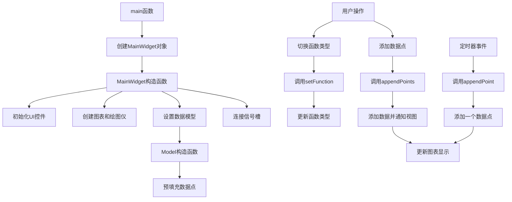

# BigDataset 项目说明

## 项目概述
BigDataset项目展示了KD Chart库处理和可视化大型数据集的能力。该项目支持多种函数类型数据生成（正弦函数、三角波函数、方波函数等），并允许用户手动或自动添加大量数据点，以测试和展示KD Chart库的性能和灵活性。

## 文件结构
- `CMakeLists.txt`: 项目构建配置文件
- `Controls.ui`: UI控件设计文件
- `MainWidget.cpp`: 主窗口部件实现文件
- `MainWidget.h`: 主窗口部件头文件
- `Model.cpp`: 数据模型实现文件
- `Model.h`: 数据模型头文件
- `main.cpp`: 应用程序入口文件
- `README.md`: 项目说明文档

## 类功能说明

### MainWidget 类
继承自QWidget，负责创建和管理应用程序的主窗口界面。

**核心方法**: 
- `MainWidget()`: 构造函数，初始化UI控件、图表、绘图仪，并设置它们之间的关联
- `functionToggled(bool checked)`: 槽函数，处理函数类型切换事件
- `addPointsButtonClicked()`: 槽函数，处理添加数据点按钮点击事件

**成员变量**: 
- `m_controlsContainer`: UI控件容器
- `m_controls`: UI对象
- `m_functionSelector`: 函数选择单选按钮向量
- `m_addPointsButtons`: 添加数据点按钮向量
- `m_plotter`: 绘图仪对象
- `m_model`: 数据模型对象

### Model 类
继承自QAbstractItemModel，为KD Chart库提供大数据集的数据支持。

**核心方法**: 
- `Model()`: 构造函数，初始化成员变量，设置定时器间隔，连接信号槽
- `columnCount()`: 返回模型列数（固定为2）
- `rowCount()`: 返回模型行数（数据点数量）
- `index()`: 创建索引
- `parent()`: 获取父索引
- `data()`: 获取数据
- `setFunction(Function f)`: 设置函数类型
- `setRunning(bool running)`: 控制定时器是否启动
- `appendPoint()`: 追加一个数据点
- `appendPoints(int numPoints)`: 追加多个数据点
- `nextFunctionValue()`: 计算下一个函数值

**成员变量**: 
- `m_x`: 当前x值
- `m_function`: 当前函数类型
- `m_data`: 存储y值的QVector
- `m_appendTimer`: 自动添加数据的定时器

### Function 枚举
定义了6种函数类型: 
- `SineFunction`: 正弦函数
- `TriangleFunction`: 三角波函数
- `SquareFunction`: 方波函数
- `NoiseFunction`: 噪声函数
- `SineOneDivFunction`: sin(1/x)函数
- `OneDivSineFunction`: 1/sin函数

## 代码执行逻辑
1. 应用程序启动，执行main.cpp中的main函数
2. 创建QApplication对象
3. 创建MainWidget对象并显示
4. MainWidget构造函数初始化UI控件、图表、绘图仪和数据模型
5. 数据模型预填充100个数据点
6. 用户可以切换函数类型或添加数据点
7. 绘图仪实时更新显示大数据集

## 类关系图
```mermaid
classDiagram
    QWidget <|-- MainWidget
    QAbstractItemModel <|-- Model
    MainWidget o-- Model
    MainWidget o-- KDChart::Plotter
    KDChart::Chart o-- KDChart::Plotter
    KDChart::CartesianCoordinatePlane o-- KDChart::Chart
    KDChart::CartesianAxis <-- KDChart::Plotter
```

## 函数执行流程图


## Qt5.15.2升级说明
1. **MainWidget类API变更检查**
2. **QApplication构造函数参数验证**
3. **exec()返回值处理**
4. **QTimer::setInterval API变更检查**
5. **QObject::connect API变更检查**
6. **QModelIndex API变更检查**
7. **QAbstractItemModel::beginInsertRows/endInsertRows API变更检查**
8. **QRandomGenerator API变更检查**

## C++17升级说明
1. **使用std::optional处理初始化错误**
2. **使用std::optional优化返回值**
3. **使用std::chrono替代QElapsedTimer**
4. **使用std::generate_n和std::back_inserter优化数据添加**
5. **使用结构化绑定简化代码**
6. **使用std::pow替代pow**
7. **使用std::uniform_real_distribution替代自定义随机数生成**
8. **使用constexpr优化数学计算**

## 升级代码标记汇总
### Qt5.15.2升级标记
- `MainWidget.h`: // TODO: Qt5.15.2升级 检查MainWidget.h中使用的Qt API是否有变更
- `MainWidget.cpp`: // TODO: Qt5.15.2升级 检查MainWidget.h中使用的Qt API是否有变更
- `MainWidget.cpp`: // TODO: Qt5.15.2升级 检查KDChartAbstractDiagram_p.h是否有API变更
- `MainWidget.cpp`: // TODO: Qt5.15.2升级 检查KDChartChart类API是否有变更
- `MainWidget.cpp`: // TODO: Qt5.15.2升级 检查KDChartPlotter类API是否有变更
- `MainWidget.cpp`: // TODO: Qt5.15.2升级 检查QHBoxLayout相关API是否有变更
- `MainWidget.cpp`: // TODO: Qt5.15.2升级 检查QWidget相关API是否有变更
- `MainWidget.cpp`: // TODO: Qt5.15.2升级 检查KDChartAbstractDiagram::Private::get方法是否有变更
- `MainWidget.cpp`: // TODO: Qt5.15.2升级 检查QObject::connect API是否有变更
- `Model.cpp`: // TODO: Qt5.15.2升级 检查QAbstractItemModel相关API是否有变更
- `Model.cpp`: // TODO: Qt5.15.2升级 检查QRandomGenerator API是否有变更
- `Model.cpp`: // TODO: Qt5.15.2升级 检查QTimer::setInterval API是否有变更
- `Model.cpp`: // TODO: Qt5.15.2升级 检查QModelIndex API是否有变更
- `Model.cpp`: // TODO: Qt5.15.2升级 检查QAbstractItemModel::beginInsertRows/endInsertRows API变更检查

### C++17升级标记
- `MainWidget.cpp`: // TODO: C++17升级 考虑使用结构化绑定简化变量声明
- `MainWidget.cpp`: // TODO: C++17升级 考虑使用std::optional处理可能的空指针
- `MainWidget.cpp`: // TODO: C++17升级 使用std::pow替代pow
- `MainWidget.cpp`: // TODO: C++17升级 考虑使用std::as_const来避免不必要的拷贝
- `Model.cpp`: // TODO: C++17升级 使用std::optional优化可能的空值返回
- `Model.cpp`: // TODO: C++17升级 考虑使用std::chrono替代QElapsedTimer
- `Model.cpp`: // TODO: C++17升级 考虑使用std::optional优化返回值
- `Model.cpp`: // TODO: C++17升级 考虑使用std::generate_n和std::back_inserter优化数据添加
- `Model.cpp`: // TODO: C++17升级 考虑使用结构化绑定优化调试输出
- `Model.cpp`: // TODO: C++17升级 考虑使用constexpr优化数学计算
- `Model.cpp`: // TODO: C++17升级 考虑使用std::optional处理可能的除以零情况
- `Model.cpp`: // TODO: C++17升级 使用std::uniform_real_distribution替代自定义随机数生成
- [ ] C++17升级 使用std::pow替代pow
- [ ] C++17升级 使用constexpr优化常量定义
- [ ] C++17升级 使用std::as_const避免拷贝
- [ ] C++17升级 使用override关键字明确标记重写函数
- [ ] C++17升级 使用std::uniform_real_distribution替代自定义随机数生成
- [ ] C++17升级 使用std::pow替代pow
- [ ] C++17升级 使用constexpr优化常量定义
- [ ] C++17升级 使用std::as_const避免拷贝
- [ ] C++17升级 使用override关键字明确标记重写函数