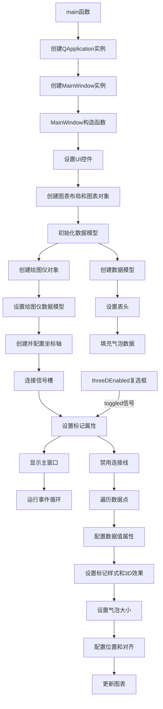

# BubbleChart项目说明

## 项目概述
BubbleChart项目是KD Chart库的一个示例，展示了如何创建和配置气泡图。气泡图是一种特殊类型的散点图，通过不同大小的圆形标记展示三个维度的数据：X坐标、Y坐标和气泡大小。该应用支持3D效果切换，可直观展示数据分布和关系。

## 文件结构
```
BubbleChart/
├── CMakeLists.txt       # CMake构建配置文件
├── README.md            # 项目说明文档
├── main.cpp             # 应用程序入口文件
├── mainwindow.h         # MainWindow类头文件
├── mainwindow.cpp       # MainWindow类实现文件
└── mainwindow.ui        # UI设计文件
```

## 类结构说明

### MainWindow类
- **功能**：应用程序的主窗口，负责创建和管理气泡图图表
- **继承**：QWidget, Ui::MainWindow
- **主要成员函数**：
  - `MainWindow(QWidget *parent = nullptr)`：构造函数，初始化UI、创建图表和绘图仪
  - `initializeDataModel()`：初始化数据模型，填充气泡图数据
  - `setMarkerAttributes()`：设置气泡标记的样式、大小和3D效果
- **成员变量**：
  - `m_model`：QStandardItemModel，数据模型，存储气泡图的X、Y坐标和气泡大小数据
  - `m_chart`：KDChart::Chart，图表对象，用于显示绘图仪和坐标轴
  - `m_plotter`：KDChart::Plotter，绘图仪对象，用于绘制气泡图

### DataType结构体
- **功能**：存储气泡图中每个数据点的信息
- **成员变量**：
  - `x`：X坐标值
  - `y`：Y坐标值
  - `size`：气泡大小值

## 代码执行逻辑

### 应用程序启动流程
1. 执行`main`函数，创建QApplication实例
2. 创建MainWindow实例并显示
3. 启动应用程序事件循环

### 图表创建和配置流程
1. 在MainWindow构造函数中，设置UI控件
2. 创建图表布局和图表对象
3. 初始化数据模型
4. 创建绘图仪对象并设置数据模型
5. 创建并配置X轴和Y轴
6. 连接3D效果复选框信号到槽函数
7. 设置图表全局边距
8. 配置标记属性

### 数据模型初始化过程
1. 创建QStandardItemModel实例，7行2列
2. 设置表头
3. 遍历气泡数据数组，填充数据模型
   - 列0：X坐标
   - 列1：Y坐标
   - 自定义角色ROLE_SIZE：气泡大小

### 标记属性设置过程
1. 禁用连接线
2. 遍历所有数据点
3. 获取并配置数据值属性
4. 设置标记样式为圆形
5. 根据复选框状态设置3D效果
6. 根据ROLE_SIZE设置气泡大小
7. 配置标记位置和对齐方式
8. 更新图表

### 用户交互流程
1. 用户勾选/取消勾选"3D Enabled"复选框
2. 触发toggled信号
3. 调用setMarkerAttributes()槽函数
4. 更新气泡的3D效果
5. 重绘图表

## 版本升级说明

### Qt5.15.2升级
- **主要变更点**：
  - 在`main.cpp`中添加了TODO项，需要验证`QApplication`构造函数参数要求是否有变更
  - 在`mainwindow.h`中添加了TODO项，需要检查`QWidget`和`QStandardItemModel`相关API是否有变更
  - 在`mainwindow.cpp`中添加了TODO项，需要检查`KDChart::Chart`、`KDChart::Plotter`、`KDChart::DataValueAttributes`、`KDChart::MarkerAttributes`等相关API是否有变更
  - 检查信号槽连接方式是否有变更
- **影响范围**：
  - 应用程序初始化部分
  - 主窗口类的定义和实现
  - 图表创建和配置部分
  - 数据模型管理部分
- **解决措施**：
  - 检查Qt5.15.2文档中相关类的构造函数和方法参数要求
  - 验证KDChart库在Qt5.15.2下的兼容性
  - 确保UI文件(`mainwindow.ui`)中的控件与Qt5.15.2兼容

### C++17升级
- **主要调整点**：
  - 考虑使用C++17的`std::array`容器替代C风格数组存储气泡数据
  - 考虑使用结构化绑定简化复杂数据结构的访问
  - 考虑使用范围for循环优化数据填充
  - 考虑使用`std::optional`处理可能的错误情况
- **采用的新特性**：
  - `std::array`：类型安全、边界检查的固定大小数组
  - 结构化绑定：简化多返回值的访问
  - 范围for循环：更简洁的遍历语法
- **兼容性处理**：
  - 添加必要的头文件（如`#include <array>`、`#include <optional>`）
  - 确保编译器支持C++17标准
  - 逐步迁移现有代码以利用C++17特性

## Mermaid思维导图

### 类关系图
```mermaid
classDiagram
    class QWidget {
        +QWidget()
        +show()
        +setupUi()
    }
    class Ui::MainWindow {
        +chartFrame
        +threeDEnabled
        +setupUi()
    }
    class QStandardItemModel {
        +setHeaderData()
        +setData()
        +index()
    }
    class KDChart::Chart {
        +coordinatePlane()
        +setGlobalLeading()
        +update()
    }
    class KDChart::Plotter {
        +setModel()
        +addAxis()
        +setPen()
        +dataValueAttributes()
        +setDataValueAttributes()
    }
    class KDChart::CartesianAxis {
        +setPosition()
    }
    class DataType {
        +x: qreal
        +y: qreal
        +size: qreal
    }
    MainWindow --|> QWidget
    MainWindow --|> Ui::MainWindow
    MainWindow o-- QStandardItemModel
    MainWindow o-- KDChart::Chart
    MainWindow o-- KDChart::Plotter
    KDChart::Plotter o-- KDChart::CartesianAxis
    MainWindow o-- DataType
```

### 函数执行流程图


## TODO项列表
1. `main.cpp`: Qt5.15.2升级 检查是否需要添加其他Qt模块头文件
2. `main.cpp`: Qt5.15.2升级 验证QApplication构造函数参数要求是否有变更
3. `main.cpp`: Qt5.15.2升级 检查QApplication初始化是否需要适配新版本
4. `main.cpp`: Qt5.15.2升级 检查QApplication::exec()返回值处理是否需要变更
5. `main.cpp`: C++17升级 考虑使用std::optional处理可能的错误情况
6. `mainwindow.h`: Qt5.15.2升级 检查ui_mainwindow.h是否需要适配新版本
7. `mainwindow.h`: Qt5.15.2升级 检查QWidget相关API是否有变更
8. `mainwindow.h`: Qt5.15.2升级 检查构造函数中使用的API是否需要适配
9. `mainwindow.h`: Qt5.15.2升级 检查QStandardItemModel API是否有变更
10. `mainwindow.h`: Qt5.15.2升级 检查KDChart::MarkerAttributes API是否有变更
11. `mainwindow.h`: C++17升级 考虑使用override关键字明确标识重写的方法
12. `mainwindow.h`: C++17升级 考虑使用结构化绑定和范围for循环优化数据生成
13. `mainwindow.cpp`: Qt5.15.2升级 检查KDChartChart API是否有变更
14. `mainwindow.cpp`: Qt5.15.2升级 检查KDChartDataValueAttributes API是否有变更
15. `mainwindow.cpp`: Qt5.15.2升级 检查KDChartMarkerAttributes API是否有变更
16. `mainwindow.cpp`: Qt5.15.2升级 检查KDChartPlotter API是否有变更
17. `mainwindow.cpp`: Qt5.15.2升级 检查KDChartTextAttributes API是否有变更
18. `mainwindow.cpp`: Qt5.15.2升级 检查QStandardItemModel API是否有变更
19. `mainwindow.cpp`: Qt5.15.2升级 检查信号槽连接方式是否有变更
20. `mainwindow.cpp`: C++17升级 考虑使用std::array替代C风格数组
21. `mainwindow.cpp`: C++17升级 考虑使用结构化绑定优化数据访问
22. `mainwindow.cpp`: C++17升级 考虑使用范围for循环优化数据填充
23. `mainwindow.cpp`: C++17升级 考虑使用结构化绑定和范围for循环优化代码