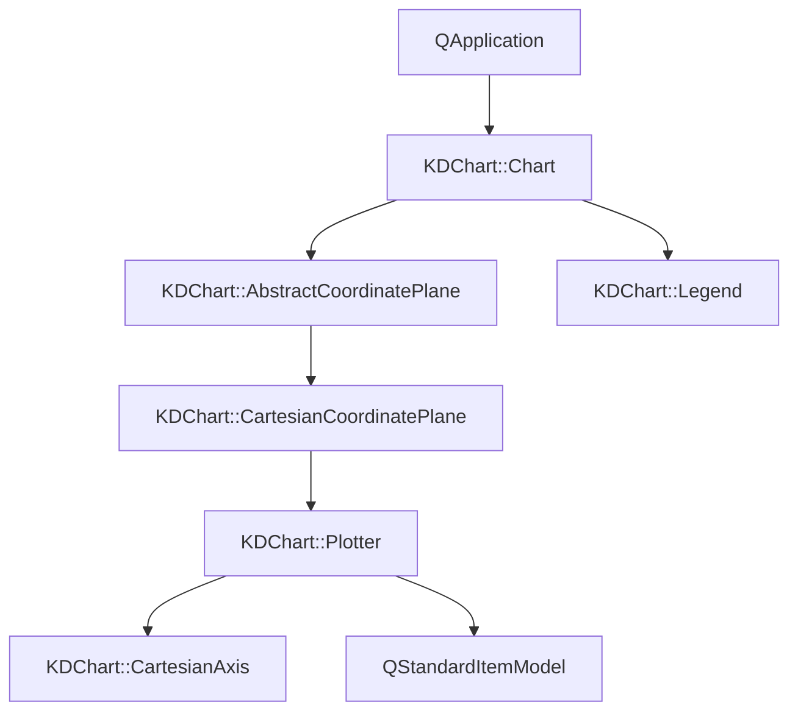
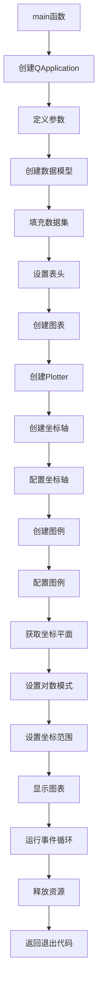

# Logarithmic项目说明

## 项目概述
Logarithmic项目是KD Chart库的一个示例应用，展示了如何创建具有对数坐标的图表。该应用包含三个数据集：100*sin(x)、x和x^3，演示了对数坐标在不同类型数据可视化中的特性。

## 文件结构
```
Logarithmic/
├── CMakeLists.txt  # CMake构建配置文件
└── main.cpp        # 应用程序主文件
```

## 功能说明
该项目没有自定义类，所有功能都在main函数中实现：
- 创建QApplication实例
- 初始化KDChart::Chart对象
- 创建和配置QStandardItemModel数据模型，包含三个数据集
- 创建和配置Plotter绘图仪
- 添加和配置X轴、Y轴
- 创建和配置图例
- 设置坐标平面为对数坐标模式
- 配置坐标范围
- 显示图表并运行事件循环
- 释放资源

## 代码执行逻辑
1. 程序启动，执行`main`函数
2. 创建`QApplication`实例
3. 定义数据点数量、范围和步长
4. 创建`QStandardItemModel`数据模型
5. 填充三个数据集：100*sin(x)、x和x^3
6. 设置数据集标题
7. 创建`KDChart::Chart`图表对象
8. 创建`Plotter`绘图仪并设置数据模型
9. 创建和配置X轴、Y轴
10. 创建和配置图例
11. 获取笛卡尔坐标平面并设置为对数模式
12. 设置坐标范围
13. 显示图表
14. 运行应用程序事件循环
15. 释放图表对象内存
16. 程序退出，返回退出代码

## 执行逻辑关系
### 类关系图


### 函数执行逻辑图


## Qt5.15.2/C++17升级说明
### Qt5.15.2升级
- **变更点**：
  - 在`main.cpp`中添加了TODO项，需要验证`QApplication`构造函数参数要求是否有变更
  - 在`main.cpp`中添加了TODO项，需要检查QtGui头文件是否需要替换为QtWidgets
  - 在`main.cpp`中添加了TODO项，需要检查`Chart`构造函数参数是否有变更
  - 在`main.cpp`中添加了TODO项，需要检查`setAxesCalcModeX`方法是否有变更
  - 在`main.cpp`中添加了TODO项，需要检查`setAxesCalcModeY`方法是否有变更
  - 在`main.cpp`中添加了TODO项，需要检查`setHorizontalRange`方法参数是否有变更
- **影响范围**：
  - 应用程序初始化部分
  - 图表创建和配置部分
  - 坐标平面和坐标轴设置部分
- **解决措施**：
  - 检查Qt5.15.2文档中`QApplication`构造函数的参数要求
  - 验证Qt5.15.2中GUI模块的头文件是否有变化
  - 检查`KDChart::Chart`类的API是否有变更
  - 确认坐标平面相关方法在Qt5.15.2下的兼容性

### C++17升级
- **变更点**：
  - 在`main.cpp`中添加了TODO项，建议使用结构化绑定简化循环
  - 在`main.cpp`中添加了TODO项，建议使用std::generate_n填充数据
  - 在`main.cpp`中添加了TODO项，建议使用智能指针管理内存
- **采用新特性**：
  - 考虑使用C++17的结构化绑定特性
  - 考虑使用C++17的std::generate_n算法
  - 考虑使用C++17的智能指针（如std::unique_ptr、std::shared_ptr）
- **兼容性处理**：
  - 若使用C++17新特性，需要确保编译器支持C++17标准
  - 为使用的新特性添加相应的头文件（如#include <memory>、#include <algorithm>）

## 执行逻辑关系
### 类关系图
```mermaid
classDiagram
    class QApplication {}
    class KDChart::Chart {}
    class KDChart::AbstractCoordinatePlane {}
    class KDChart::CartesianCoordinatePlane {}
    class KDChart::Plotter {}
    class KDChart::CartesianAxis {}
    class KDChart::Legend {}
    class QStandardItemModel {}

    QApplication --> KDChart::Chart
    KDChart::Chart --> KDChart::AbstractCoordinatePlane
    KDChart::AbstractCoordinatePlane --> KDChart::CartesianCoordinatePlane
    KDChart::CartesianCoordinatePlane --> KDChart::Plotter
    KDChart::Plotter --> KDChart::CartesianAxis
    KDChart::Chart --> KDChart::Legend
    KDChart::Plotter --> QStandardItemModel
```

### 函数执行逻辑图


## TODO项列表
1. `main.cpp`: Qt5.15.2升级 验证QApplication构造函数参数要求是否有变更
2. `main.cpp`: Qt5.15.2升级 检查QApplication初始化是否需要适配新版本
3. `main.cpp`: Qt5.15.2升级 检查QtGui头文件是否需要替换为QtWidgets
4. `main.cpp`: Qt5.15.2升级 检查Chart构造函数是否有变更
5. `main.cpp`: Qt5.15.2升级 检查setAxesCalcModeX方法是否有变更
6. `main.cpp`: Qt5.15.2升级 检查setAxesCalcModeY方法是否有变更
7. `main.cpp`: Qt5.15.2升级 检查setHorizontalRange方法参数是否有变更
8. `main.cpp`: C++17升级 考虑使用结构化绑定简化循环
9. `main.cpp`: C++17升级 考虑使用std::generate_n填充数据
10. `main.cpp`: C++17升级 考虑使用智能指针管理内存