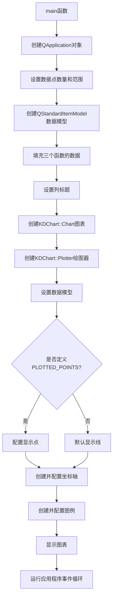

# Simple 项目说明

## 项目概述
Simple项目是KD Chart库的一个基础示例应用程序，展示了如何使用KD Chart库创建简单的绘图图表。该项目绘制了三个数学函数的图形：100 * sin(x)、x和x^3，通过这个示例可以了解KD Chart库的基本使用方法，包括数据模型设置、图表配置、坐标轴和图例添加等。

## 文件结构
- `CMakeLists.txt`: 项目构建配置文件
- `main.cpp`: 应用程序入口文件，包含所有图表创建和配置逻辑
- `README.md`: 项目说明文档

## 代码功能说明
`main.cpp`文件实现了以下功能：
1. 初始化Qt应用程序
2. 创建数据模型并填充三个函数（100 * sin(x)、x和x^3）的数据
3. 创建图表和绘图器
4. 配置图表的坐标轴和图例
5. 根据定义的宏决定是显示点还是线
6. 显示图表并运行应用程序事件循环

## 代码执行逻辑
1. 应用程序启动，执行main函数
2. 创建QApplication对象
3. 根据是否定义PLOTTED_POINTS宏决定数据点数量（60或1000）
4. 计算x轴范围和步长
5. 创建QStandardItemModel数据模型并填充三个函数的数据
6. 设置数据模型的列标题
7. 创建KDChart::Chart图表对象
8. 创建KDChart::Plotter绘图器并设置数据模型
9. 如果定义了PLOTTED_POINTS宏，则配置图表显示点而不是线
10. 创建并配置X轴和Y轴
11. 创建并配置图例
12. 显示图表
13. 运行应用程序事件循环

## 类关系图
```mermaid
classDiagram
    QApplication <-- main
    QStandardItemModel <-- main
    KDChart::Chart <-- main
    KDChart::Plotter <-- main
    KDChart::CartesianAxis <-- main
    KDChart::Legend <-- main
    KDChart::AbstractCartesianDiagram <|-- KDChart::Plotter
    KDChart::CartesianCoordinatePlane <-- KDChart::Chart
    KDChart::CartesianAxis <-- KDChart::Plotter
    KDChart::Legend <-- KDChart::Chart
```

## 函数执行流程图


## Qt5.15.2升级说明
1. **QApplication API变更检查**
2. **QStandardItemModel API变更检查**
3. **KDChart库API变更检查**
   - KDChartCartesianAxis
   - KDChartCartesianCoordinatePlane
   - KDChartChart
   - KDChartDataValueAttributes
   - KDChartLegend
   - KDChartLineDiagram
   - KDChartMarkerAttributes
   - KDChartPlotter
   - KDChartTextAttributes
4. **QApplication::exec()返回值处理**

## C++17升级说明
1. **使用std::optional处理初始化错误**
2. **使用std::cmath替代cmath**
3. **使用constexpr优化常量定义**
4. **使用结构化绑定简化变量声明和数据模型操作**

## 升级代码标记汇总
### Qt5.15.2升级标记
- `main.cpp`: // TODO: Qt5.15.2升级 检查KDChart库相关API是否有变更
- `main.cpp`: // TODO: Qt5.15.2升级 检查KDChartCartesianAxis API是否有变更
- `main.cpp`: // TODO: Qt5.15.2升级 检查KDChartCartesianCoordinatePlane API是否有变更
- `main.cpp`: // TODO: Qt5.15.2升级 检查KDChartChart API是否有变更
- `main.cpp`: // TODO: Qt5.15.2升级 检查KDChartDataValueAttributes API是否有变更
- `main.cpp`: // TODO: Qt5.15.2升级 检查KDChartLegend API是否有变更
- `main.cpp`: // TODO: Qt5.15.2升级 检查KDChartLineDiagram API是否有变更
- `main.cpp`: // TODO: Qt5.15.2升级 检查KDChartMarkerAttributes API是否有变更
- `main.cpp`: // TODO: Qt5.15.2升级 检查KDChartPlotter API是否有变更
- `main.cpp`: // TODO: Qt5.15.2升级 检查KDChartTextAttributes API是否有变更
- `main.cpp`: // TODO: Qt5.15.2升级 检查QApplication API是否有变更
- `main.cpp`: // TODO: Qt5.15.2升级 检查QStandardItemModel API是否有变更
- `main.cpp`: // TODO: Qt5.15.2升级 验证QApplication构造函数参数要求是否有变更
- `main.cpp`: // TODO: Qt5.15.2升级 检查QStandardItemModel构造函数是否有变更
- `main.cpp`: // TODO: Qt5.15.2升级 检查Chart构造函数是否有变更
- `main.cpp`: // TODO: Qt5.15.2升级 检查QApplication::exec()返回值处理是否需要变更

### C++17升级标记
- `main.cpp`: // TODO: C++17升级 考虑使用std::optional处理可能的初始化错误
- `main.cpp`: // TODO: C++17升级 考虑使用std::cmath替代cmath
- `main.cpp`: // TODO: C++17升级 考虑使用结构化绑定简化数据模型操作
- `main.cpp`: // TODO: C++17升级 使用constexpr优化常量定义
- `main.cpp`: // TODO: C++17升级 考虑使用结构化绑定简化变量声明
- `main.cpp`: // TODO: C++17升级 考虑使用结构化绑定简化循环