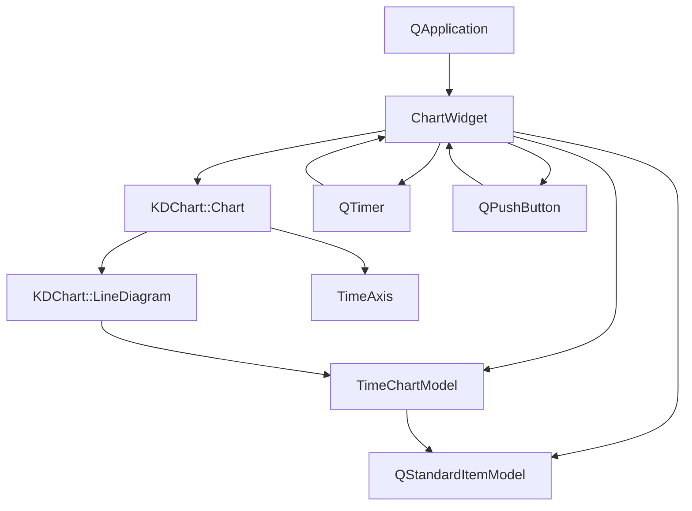
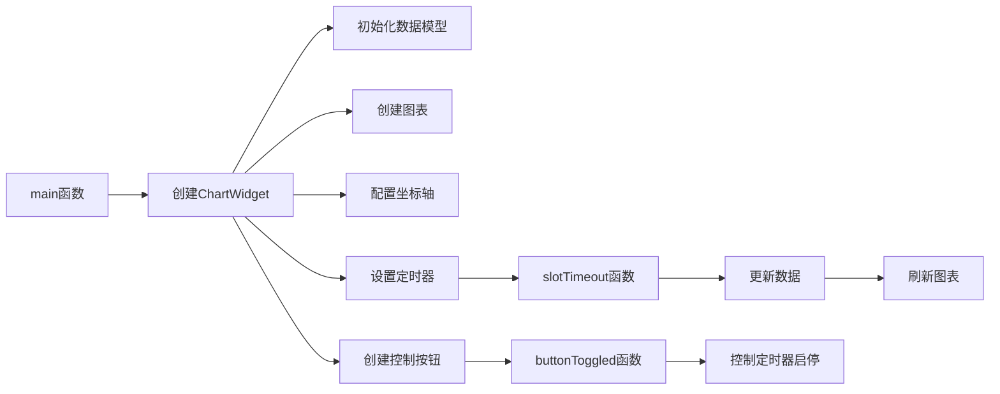

# Timeline 项目说明

## 项目概述

Timeline项目是KD Chart库的一个示例，展示了如何创建基于时间轴的图表。该项目实现了一个动态更新的时间轴图表，能够显示随时间变化的数据，并支持自定义时间轴和数据过滤。

## 文件结构

- `CMakeLists.txt`: 项目构建配置文件
- `main.cpp`: 项目入口文件，创建应用程序和主窗口
- `timeaxis.h/cpp`: 自定义时间轴类，继承自KDChart::CartesianAxis
- `timechartmodel.h/cpp`: 时间图表代理模型，继承自QSortFilterProxyModel
- `README.md`: 项目说明文档

## 类功能说明

### 1. TimeAxis类

```cpp
/**
 * @brief 自定义时间轴类
 * @details 继承自KDChart::CartesianAxis，用于在图表中显示时间相关的坐标轴
 *          提供了自定义标签显示的功能，可以将时间戳格式化为更友好的时间字符串
 */
```

**核心方法**: 
- `TimeAxis(KDChart::AbstractCartesianDiagram *parent)`: 构造函数，初始化时间轴对象
- `customizedLabel(const QString &label) const`: 重写方法，将时间戳格式化为日期字符串

### 2. TimeChartModel类

```cpp
/**
 * @brief 时间图表代理模型类
 * @details 继承自QSortFilterProxyModel，用于在图表中显示时间范围过滤后的数据
 *          提供了设置可见时间范围的功能，可以过滤出指定时间范围内的数据
 */
```

**核心方法**: 
- `TimeChartModel(QObject *parent = nullptr)`: 构造函数，初始化模型对象
- `visibleRange() const`: 获取当前可见时间范围
- `setVisibleRange(const QDateTime &start, const QDateTime &end)`: 设置可见时间范围
- `setVisibleStart(const QDateTime &start)`: 设置可见开始时间
- `setVisibleEnd(const QDateTime &end)`: 设置可见结束时间
- `data(const QModelIndex &index, int role = Qt::DisplayRole) const`: 重写方法，处理数据显示
- `filterAcceptsRow(int source_row, const QModelIndex &source_parent) const`: 重写方法，根据时间范围过滤数据行

### 3. ChartWidget类

```cpp
/**
 * @brief 图表窗口部件类
 * @details 创建并管理时间轴图表，处理数据更新和用户交互
 */
```

**核心方法**: 
- `ChartWidget(QWidget *parent = nullptr)`: 构造函数，创建图表和UI元素
- `slotTimeout()`: 定时器超时槽函数，更新数据
- `buttonToggled(bool checked)`: 按钮状态切换槽函数，控制动画

## 代码执行逻辑

1. 应用程序启动，创建`QApplication`对象
2. 创建`ChartWidget`对象，初始化图表和数据模型
3. `ChartWidget`构造函数中：
   - 创建主布局和分割器
   - 创建原始数据模型(`QStandardItemModel`)
   - 创建时间轴代理模型(`TimeChartModel`)
   - 创建图表(`KDChart::Chart`)
   - 配置坐标轴，使用自定义`TimeAxis`
   - 创建曲线数据集并添加到图表
   - 设置图表网格和背景
   - 创建定时器，每200ms更新一次数据
   - 创建控制按钮，控制动画启停
4. 显示主窗口
5. 定时器触发`slotTimeout()`槽函数：
   - 移除最早的数据点
   - 添加新的数据点（基于sin函数）
   - 更新图表范围
6. 用户点击按钮，触发`buttonToggled()`槽函数：
   - 启动或停止定时器
7. 应用程序进入事件循环

## 执行逻辑关系图

### 类关系图



### 函数执行流程图



## Qt5.15.2升级说明

### 主要变更点

1. **QApplication构造函数参数检查**
   - 检查`QApplication`构造函数参数是否符合Qt5.15.2要求
   - `// TODO: Qt5.15.2升级 检查QApplication构造函数参数是否需要调整`

2. **QApplication::exec()返回值处理**
   - Qt5.15.2中`exec()`返回值可能有变化，需要检查
   - `// TODO: Qt5.15.2升级 处理QApplication::exec()返回值`

3. **QDateTime API检查**
   - 检查`QDateTime::fromSecsSinceEpoch`在Qt5.15.2中的变更
   - `// TODO: Qt5.15.2升级 检查QDateTime::fromSecsSinceEpoch是否有变更`

4. **QSortFilterProxyModel API检查**
   - 检查`QSortFilterProxyModel`相关方法在Qt5.15.2中的变更
   - `// TODO: Qt5.15.2升级 检查QSortFilterProxyModel API是否有变更`

5. **KDChart库API检查**
   - 检查KDChart库相关类和方法在Qt5.15.2环境下的兼容性
   - `// TODO: Qt5.15.2升级 检查KDChartCartesianAxis API是否有变更`

## C++17升级说明

### 主要调整点

1. **使用结构化绑定**
   - 可以使用C++17的结构化绑定简化`QPair`等数据结构的使用
   - `// @todo C++17升级 使用结构化绑定简化代码`

2. **使用std::chrono处理时间**
   - 可以使用C++17的`std::chrono`库替代手动时间计算
   - `// @todo C++17升级 使用std::chrono替代手动时间计算`

3. **使用std::optional处理无效数据**
   - 可以使用C++17的`std::optional`更安全地处理可能无效的数据
   - `// @todo C++17升级 使用std::optional处理无效数据`

4. **使用std::from_chars提高性能**
   - 可以使用C++17的`std::from_chars`替代`toDouble`提高数值转换性能
   - `// @todo C++17升级 使用std::from_chars替代toDouble提高性能`

## 升级代码标记汇总

```cpp
// TODO: Qt5.15.2升级 检查QApplication构造函数参数是否需要调整
// TODO: Qt5.15.2升级 处理QApplication::exec()返回值
// TODO: Qt5.15.2升级 检查QDateTime API是否有变更
// TODO: Qt5.15.2升级 检查QSortFilterProxyModel API是否有变更
// TODO: Qt5.15.2升级 检查KDChartCartesianAxis API是否有变更
// TODO: Qt5.15.2升级 检查QDateTime::fromSecsSinceEpoch是否有变更
// TODO: Qt5.15.2升级 检查invalidateFilter是否有变更

// @todo C++17升级 使用结构化绑定简化代码
// @todo C++17升级 使用std::chrono替代手动时间计算
// @todo C++17升级 使用std::optional处理无效数据
// @todo C++17升级 使用std::from_chars替代toDouble提高性能
```